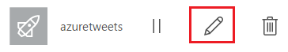
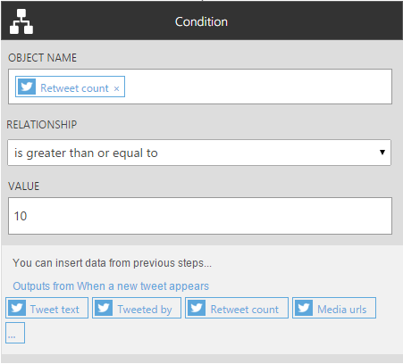
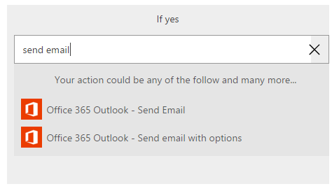

<properties
    pageTitle="Add a condition to a flow | Microsoft Flow"
    description="Specify that a flow performs one or more tasks only if a particular condition is true."
    services=""
    suite="flow"
    documentationCenter="na"
    authors="stepsic-microsoft-com"
    manager="dwrede"
    editor=""
    tags=""/>

<tags
   ms.service="flow"
   ms.devlang="na"
   ms.topic="article"
   ms.tgt_pltfrm="na"
   ms.workload="na"
   ms.date="04/08/2016"
   ms.author="stepsic"/>

# Add a condition to a flow #

Specify that a flow performs one or more tasks only if a particular condition is true. For example, specify that you'll get an email only if a tweet that contains a keyword is retweeted at least 10 times.

**Prerequisites**

- [Create a flow](get-started-logic-template.md) from a template

## Add a condition ##

1. In [flow.microsoft.com](https://flow.microsoft.com), select **My Flows** in the top navigation bar.

1. In the list of flows, select the edit icon next to the flow that you created from a template.

    

1. In the title bar of the action, select the ellipsis icon (...), and then select **Delete**.

1. Under the trigger, select the plus button.

    

1. Select **Add condition**.

    

1. Select an empty area of **OBJECT NAME**, and then select the **Retweet count** parameter to add it to the box.

1. In the **RELATIONSHIP** box, select **is greater than or equal to**.

1. In the **VALUE** box, type **10**.

    

1. Select **Add action inside**, and then type **send email**.

    

1. Specify what the email should contain, just as you did when you created the flow, and then select **Done**.
