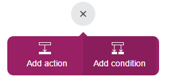
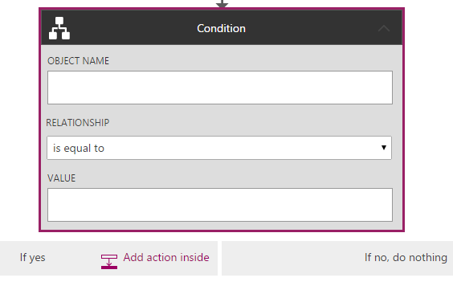

<properties
    pageTitle="PowerApps: Add a condition"
    description="Logic flows can run certain steps only if the condition you match is true."
    services="powerapps"
    documentationCenter="na"
    authors="stepsic-microsoft-com"
    manager="dwrede"
    editor=""
    tags=""/>

<tags
   ms.service="powerapps"
   ms.devlang="na"
   ms.topic="article"
   ms.tgt_pltfrm="na"
   ms.workload="na"
   ms.date="11/14/2015"
   ms.author="stepsic"/>

# Add a condition to a logic flow #

Logic flows can contain conditions, which means that they can check some value and execute steps only if that value is something you specifically want. 

**Prerequisites**

- An Office 365 account (from which you can send email)

## Adding the condition ##

1. In Chrome, open [the PowerApps portal](https://portal.kratosapps.com/), and then click **Flows** in the left navigation bar.

2. In the list of Logic Flows, click the edit icon, which looks like a pencil, next to the Logic Flow that you want to add a condition to.

3. At the bottom of the flow, click the plus button and select **Add Condition**.

    
    
4. In the top field in the condition, select a parameter that you want to check.

    

5. In the second field, enter the value that you want to compare it to.

6. Now, click **Add action inside** and search for the action you want.

    

7. Fill out the parameters inside the action and click **Done**

