<properties
	pageTitle="Add and configure a control | Microsoft PowerApps"
	description="Step-by-step instructions for adding and configuring controls directly, from the ribbon, or in the formula bar."
	services=""
	suite="powerapps"
	documentationCenter="na"
	authors="sarafankit"
	manager="erikre"
	editor=""
	tags=""/>

<tags
   ms.service="powerapps"
   ms.devlang="na"
   ms.topic="article"
   ms.tgt_pltfrm="na"
   ms.workload="na"
   ms.date="04/17/2016"
   ms.author="ankitsar"/>

# Add and configure a control in PowerApps #

Add a variety of controls to your app, and configure their properties directly, from the ribbon, or in the Formula Bar.

**Prerequisites**

1. [Sign up](signup-for-powerapps.md) for PowerApps, [install](http://aka.ms/powerappsinstall) it, open it, and then sign in by providing the same credentials that you used to sign up.
1. Select **New** on the **File** menu (near the left edge), and then select **Get started** under **Create from scratch**.

	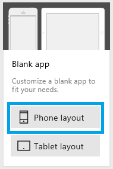

## Add a control ##
On the **Insert** tab, follow either of these steps:

- Select **Text box**, **Button**, or **Image**.
- Select any of these categories, and then select the control that you want to add:

	- **Text**

		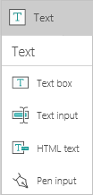

		**Tip:** [Write or draw](add-images-pictures-audio-video.md#write-or-draw-in-the-app) by using the pen input.

	- **Controls**

		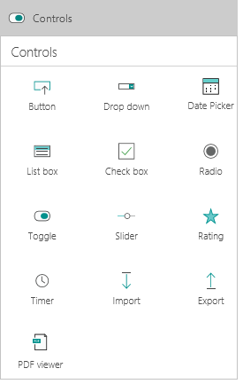

		**Tip:** Offer choices in your app by adding [a list box, a drop-down list, or radio buttons](add-list-box-drop-down-list-radio-button.md).

	- **Gallery**

		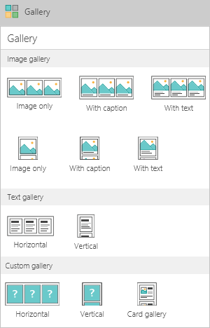

		**Tip:** Show a list of records from a table using a [gallery](./add-gallery.md).
	
	- **Forms**

		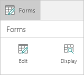

		**Tip:** Show or edit a record by using a [form](./add-form.md).
	
	- **Media**

		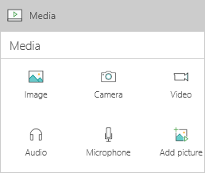

		**Tip:** Show data other than text by [adding multimedia](add-images-pictures-audio-video.md) to your app.

	- **Charts**

		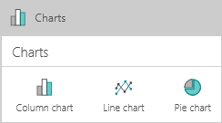

		**Tip:** [Configure a chart](add-images-pictures-audio-video.md) to showcase mission-critical data.

	- **Shapes**

		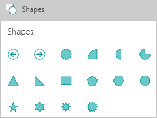

	- **Icons**

		

If you need more space for controls, [add a screen](add-screen-context-variables.md).

## Configure a control directly ##
1. Add a control, such as a text box.

	When you add a control, it's selected by default, which means that you can configure its properties. For example, a selected text box resembles this graphic.

	

	**Important:** If a control is selected when you select another control or a blank area of the screen, the first element is no longer selected.

1. Resize the control by dragging any handle of the selection box (or by modifying the **Height**, **Width**, or both properties, as this topic describes later).

	For example, make the text box shorter by dragging the middle handle on the right edge of the selection box.

	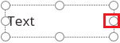

1. Move the control by dragging the selection box itself (or by modifying the **X**, **Y**, or both properties, as this topic describes later).

1. If a control such as a text box or a button shows text, modify that text by triple-clicking it and then typing the text that you want (or by setting the **Text** property, as this topic describes later).

	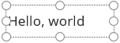

	**Note:** To delete a control, select it, and then press Delete.

## Configure a control from the ribbon ##

1. With the control selected, select **Fill** on the **Home** tab, and then select a color such as aquamarine.

	

1. On the **Home** tab, change the font family and the size of the text (for example, to 18 pt. Georgia).

	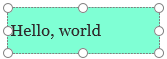

1. On the tab for the control you're configuring, select an option that's specific to that control, and modify the value.

	For example, select **VerticalAlign** on the **Text box** tab, and then select **Top**.

	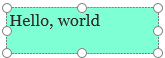

## Configure a control in the formula bar ##
Each change that you made earlier in this topic updated the value of a [property](reference-properties.md) for the control that you configured.

- When you resized the control, you changed its **Width** property.
- When you moved the control, you changed its **X** and **Y** properties.
- When you changed the text that the control displays, you changed its **Text** property.

Instead of configuring a control directly or from the ribbon, you can also update the value of a property by selecting it in the property list and then specifying a value in the formula bar. By taking this approach, you can search for a property alphabetically, and you can specify more types of values.

1. With the text box selected, select **Text** in the property list, and then type **"My Company Name"** (including the quotation marks) in the formula bar.

	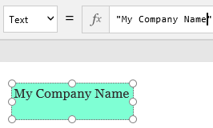

	When you surround a string of text with quotation marks, you specify that it should be treated exactly as you typed it. As an alternative, you can specify a formula that determines the value of a property.

1. With the text box selected, select **Text** in the property list, and then type **Today()** (without quotation marks) in the formula bar.

	The control shows the current date.

	**Tip:** You can [format dates and times](show-text-dates-times.md) in various ways, in addition to performing calculations on them.

	By using the formula bar, you can set properties that you can't set directly or from the ribbon. For example, you can set a tooltip that appears when a user points to the control but doesn't select it. You can also specify complicated formulas that increase the power of your app.

1. Add a checkbox, and set its **Text** property so that **Show text** appears.

1. Set the **Visible** property of the text box to this formula:

	**If(Checkbox1!Value = true, true, false)**

	**Note:** If you add a checkbox, remove it, and then add another checkbox, you might need to rename the checkbox that you're using for the formula to work. If the check box isn't named **Checkbox1**, rename it as this topic describes later.

1. Select the checkbox to show the text box.

	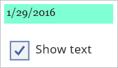

1. Clear the checkbox to hide the text box.

	

This example is basic, but you can configure the behavior and appearance of your app by building one or more [formulas](formula-reference.md) from simple to complex.

## Rename a control ##
1. Select the control that you want to rename, such as the checkbox that you added in the previous procedure.

1. On the **Home** tab, select the name of the control (to the right of **New screen**), and then type the name that you want.

	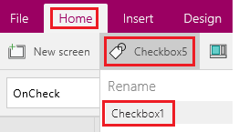