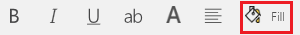
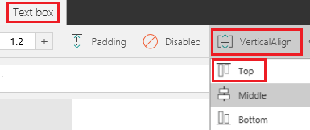
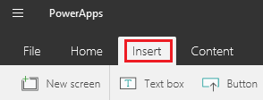
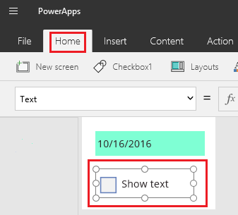
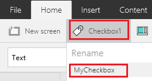
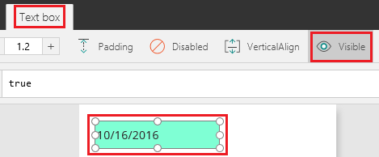
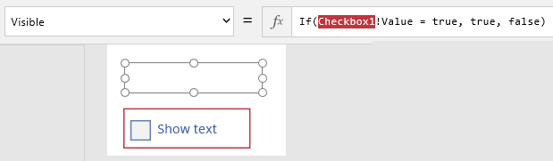

<properties
	pageTitle="Add and configure a control | Microsoft PowerApps"
	description="Step-by-step instructions for adding and configuring controls directly, from the toolbar, or in the formula bar."
	services=""
	suite="powerapps"
	documentationCenter="na"
	authors="aftowen"
	manager="anneta"
	editor=""
	tags=""/>

<tags
   ms.service="powerapps"
   ms.devlang="na"
   ms.topic="article"
   ms.tgt_pltfrm="na"
   ms.workload="na"
   ms.date="10/16/2016"
   ms.author="anneta"/>

# Add and configure a control in PowerApps #
Add a variety of UI elements to your app, and configure aspects of their appearance and behavior directly, from the toolbar, or in the formula bar. These UI elements are called controls, and the aspects that you configure are called properties.

**Prerequisites**

1. [Sign up](signup-for-powerapps.md) for PowerApps, [install](http://aka.ms/powerappsinstall) it, open it, and then sign in by providing the same credentials that you used to sign up.

1. In PowerApps Studio, click or tap **New** on the **File** menu (near the left edge).

	

1. On the **Blank app** tile, click or tap **Phone layout** .

	

1. If you're prompted to take the intro tour, click or tap **Next** to get familiar with key areas of the PowerApps interface (or click or tap **Skip**).

	

	You can always take the tour later by clicking or tapping the question-mark icon near the upper-right corner and then clicking or tapping **Take the intro tour**.

## Add a control ##
You can add any control in a variety of categories by clicking or tapping the **Insert** tab of the toolbar, clicking or tapping a category, and then clicking or tapping the control that you want. In this section, review the controls in each category to get familiar with the types of controls that you can add and where you might find each type.

- **Text**

	

	**Tip:** [Write or draw](add-images-pictures-audio-video.md#draw-a-picture) by using the pen input.

- **Controls**

	

	**Tip:** Offer choices in your app by adding [a list box, a drop-down list, or radio buttons](add-list-box-drop-down-list-radio-button.md).

- **Gallery**

	

	**Tip:** Show a list of records from a table using a [gallery](add-gallery.md).

- **Forms**

	

	**Tip:** Show or edit a record by using a [form](add-form.md).

- **Media**

	

	**Tip:** Show data other than text by [adding multimedia](add-images-pictures-audio-video.md) to your app.

- **Charts**

	

	**Tip:** [Configure a chart](use-line-pie-bar-chart.md) to showcase mission-critical data.

- **Icons**

	This category contains a variety of shapes, action icons, and symbol icons. Scroll through to review all the options.

If you need more space for controls, [add a screen](add-screen-context-variables.md).

## Configure a control directly ##
In this procedure, you'll add and configure a **Text box** control, but you can apply many of the same principles to other controls.

1. In the toolbar, click or tap the **Insert** tab, and then click or tap **Text box**.

	

	When you add a control, it's selected by default. You can also select an existing control by clicking or tapping it. When a control is selected, a selection box surrounds it, and other areas of the UI change so that you can configure the selected control. For example, a selected **Text box** control resembles this graphic.

	

	**Important:** If a control is selected when you select another control or a blank area of the screen, the first element is no longer selected.

1. Make the **Text box** control narrower by dragging a handle on the right edge of the selection box to the left. (The middle handle appears only if you zoom in.)

	

 	You can also resize a control by modifying its **[Height](controls/properties-size-location.md)**, **[Width](controls/properties-size-location.md)**, or both properties, as this topic describes later.

1. Move the **Text box** control by dragging the selection box itself (or by modifying the **[X](controls/properties-size-location.md)**, **[Y](controls/properties-size-location.md)**, or both properties, as this topic describes later).

1. Triple-click the text that appears in the **Text box** control, and then type **Hello, world**.

	

 	You can also modify this text by setting the **[Text](controls/properties-core.md)** property of this control, as this topic describes later.

1. Delete the **Text box** control by clicking or tapping it and then pressing Delete.

1. Restore the **Text box** control by pressing Ctrl-Z (or by repeating the first four steps in this procedure).

## Configure a control from the toolbar ##
By configuring a control from the toolbar, you can specify a wider variety of options than you can directly.

1. With the **Text box** control selected, click or tap the **Home** tab of the toolbar.

	

1. Click or tap **Fill**, and then click or tap a color such as aquamarine.

	

	The **Text box** control reflects your selection.

	

1. Change the font family and the size of the text (for example, to 18 pt. Georgia).

	

	The **Text box** control reflects your selection.

	

1. Click or tap the **Text box** tab, click or tap **VerticalAlign**, and then click or tap **Top**.

	

	The **Text box** control reflects your selection.

	

## Configure a control in the formula bar ##
By using the formula bar, you can set properties that you can't set directly or from the toolbar. For example, you can set a tooltip that appears when a user points to the control but doesn't click or tap it. You can also specify complicated formulas that increase the power of your app.

Each change that you made earlier in this topic updated the value of a [property](reference-properties.md) for the control that you configured.

- When you resized the control, you changed its **[Width](controls/properties-size-location.md)** property.
- When you moved the control, you changed its **[X](controls/properties-size-location.md)** and **[Y](controls/properties-size-location.md)** properties.
- When you changed the text that the control displays, you changed its **[Text](controls/properties-core.md)** property.

Instead of configuring a control directly or from the toolbar, you can also update the value of a property by selecting it in the property list and then specifying a value in the formula bar. By taking this approach, you can search for a property alphabetically, and you can specify more types of values.

1. With the **Text box** control selected, click or tap **[Text](controls/properties-core.md)** in the property list, and then type **"My Company Name"** (including the quotation marks) in the formula bar.

	

	When you surround a string of text with quotation marks, you specify that it should be treated exactly as you typed it. As an alternative, you can set the value of a property to a formula.

1. With the **Text box** control selected, click or tap **[Text](controls/properties-core.md)** in the property list, and then type **Today()** (without quotation marks) in the formula bar.

	The control shows the current date.

	

	**Tip:** You can [format dates and times](show-text-dates-times.md) in various ways, in addition to performing calculations on them.

## Configure two controls to interact with each other ##
In this procedure, you'll add a check box and then configure the text box that you already have to appear only when the check box is selected.

1. Click or tap the **Insert** tab.

	

1. Click or tap **Controls**, and then click or tap **Check box**.

	

1. Move the **Check box** control so that it appears below the **Text box** control, and set the **[Text](controls/properties-core.md)** property of the **Check box** control so that **Show text** appears.

	

1. With the **Check box** control still selected, click or tap the **Home** tab.

	

1. Click or tap the current name of the **Check box** control (to the right of **New screen**), and then type **MyCheckbox**.

	

1. Click or tap the **Text box** control to select it, click or tap the **Text box** tab, and then click or tap the **Visible** option.

	

1. In the formula bar, delete **true**, and then type or paste this formula:

	**If(MyCheckbox!Value = true, true, false)**

	This **[If function](function-if.md)** states that the text box should appear only when the check box is selected. Because the check box is cleared, the **Text box** control disappears (except for the selection box).

	

1. Click or tap the **Check box** control to add the selection box to it, and then click or tap it again to add a check mark.

	The **Text box** reappears:

	

1. Clear the **Check box** control to hide the **Text box** control.

	

This example is basic, but you can configure the behavior and appearance of your app by building one or more [formulas](formula-reference.md) from simple to complex.

## Rename a screen or a control ##
By renaming a screen or control, you can build formulas that are easier to read and maintain.

1. Click or tap the screen or the control that you want to rename.

1. On the **Home** tab, click or tap the name of the control (to the right of **New screen**), and then type the name that you want.

	
