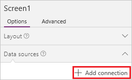

<properties	pageTitle="Add a data connection in an app | Microsoft PowerApps"
	description="Add a data connection in an existing app or a blank app"
	services=""
	suite="powerapps"
	documentationCenter="na"
	authors="archnair"
	manager="anneta"
	editor=""
	tags=""/>

<tags
   ms.service="powerapps"
   ms.devlang="na"
   ms.topic="article"
   ms.tgt_pltfrm="na"
   ms.workload="na"
   ms.date="06/23/2016"
   ms.author="archanan"/>

# Add a data connection in PowerApps #
In PowerApps, add a connection in an existing app or an app that you're building from scratch. Connect to SharePoint, Salesforce, OneDrive, or [another data source](connections-list.md), and then display and manage data in that source from your app, as in these examples:

- Connect to OneDrive, and manage data in an Excel workbook in your app.
- Connect to Twilio, and send an SMS message from your app.
- Connect to SQL Server, and update a table from your app.

You can add a connection in PowerApps, as this topic describes, or on [powerapps.com](https://web.powerapps.com), as [Manage connections](add-manage-connections.md) describes.

## Background on data connections-list

Most PowerApps apps use external information stored in cloud services called Data Sources. A common example is a table in an Excel file stored in OneDrive for Business. Apps are able to access these data sources by using **Connectors**.

Data sources can be connected to a cloud service, or local to an app.

### Connected data sources

The commonest data sources are tables with which you can use to retrieve and store information. You can use connectors to data sources to read and write data in Microsoft Excel workbooks, SharePoint lists, SQL tables, and many other formats, which can be stored in cloud services like OneDrive for Business, DropBox, SQL Server, etc.

There are other kinds of data sources that are not tables, such as email, calendars, twitter, and (coming soon) notifications.

### Local data sources

Using the Gallery, Display form, and Edit form controls, it is easy to create an app that reads and writes data from a data source. To get started, read the article Understand data forms.

When you ask PowerApps to create an app from data, these controls are used. Behind the scenes, the app uses an internal table to store and manipulate the data that comes from the data source.

## Prerequisites

[Sign up](signup-for-powerapps.md) for PowerApps, [install](http://aka.ms/powerappsinstall) it, open it, and then sign in by providing the same credentials that you used to sign up.

## Add a connection ##
1. Click or tap **New** on the **File** menu (near the left edge).

	

1. On the **Blank app** tile, click or tap **Phone layout** .

	

1. Near the lower-right corner, click or tap **Data sources** to open the **Data sources** tab of the right-hand pane.

	

	**Note**: If you're updating an existing app and the right-hand pane doesn't show the **Data sources** tab, select any screen by clicking or tapping it in the left navigation bar.

1. In the **Data sources** tab, click or tap **Add data source**.

	

1. To use an existing connection, click or tap it to add it to the app.

	You can use that connection without performing additional steps.

1. To create a connection, follow these steps:

	1. Click or tap **Add connection** to display a list of connectors.

		

	1. Scroll through the list of connectors until the type of connection that you want to create appears (for example, **Office 365 Outlook**), and then click or tap it.

		

	1. Click or tap **Connect** to both create the connection and add it to your app.

		

	Some connectors, such as **Microsoft Translator**, require no additional steps, and you can show data from them immediately. Other connectors prompt you to provide credentials, specify a particular set of data, or perform other steps. For example, [SharePoint](connection-sharepoint-online.md) and [SQL Server](connection-azure-sqldatabase.md) require additional information before you can use them.

## Next steps ##
- To show and update data in a source such as Excel, SharePoint, or SQL Server, [add a gallery](add-gallery.md), and [add a form](add-form.md).
- For data in other sources, use connector-specific functions such as those for [Office 365 Outlook](connection-office365-outlook.md), [Twitter](connection-twitter.md), and [Microsoft Translator](connection-microsoft-translator.md).
