<properties	pageTitle="Add a new data connection | Microsoft PowerApps"
	description="Add a new data connection to an existing app or when building a new blank app"
	services=""
	suite="powerapps"
	documentationCenter="na"
	authors="archnair"
	manager="erikre"
	editor=""
	tags=""/>

<tags
   ms.service="powerapps"
   ms.devlang="na"
   ms.topic="get-started-article"
   ms.tgt_pltfrm="na"
   ms.workload="na"
   ms.date="04/13/2016"
   ms.author="archanan"/>

# Add a new data connection #
In this tutorial, you will learn how to add a new data connection to an existing app or when you are building a new app from blank.

**Prerequisites**

- Learn how to build an [app from blank](get-started-create-from-blank.md) in PowerApps
- Account information for the service you want to connect to

## Add datasource to your app  ##
1. In PowerApps, select the **Content** tab in the ribbon.

	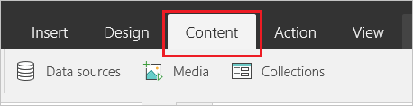

1. Select **Data sources**.

	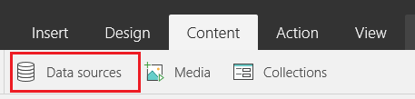

1. The Data sources pane will slide out on the right. Select **Add data source**.

	

1. You can select an existing connection OR choose to add a new connection. Let's go through the flow of adding a new connection. Select **Add connection**

	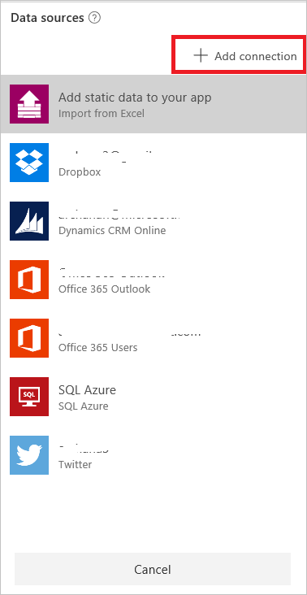

1. From the list of available connections, choose the data source you want to connect to, such as **SharePoint Online** and select it.

	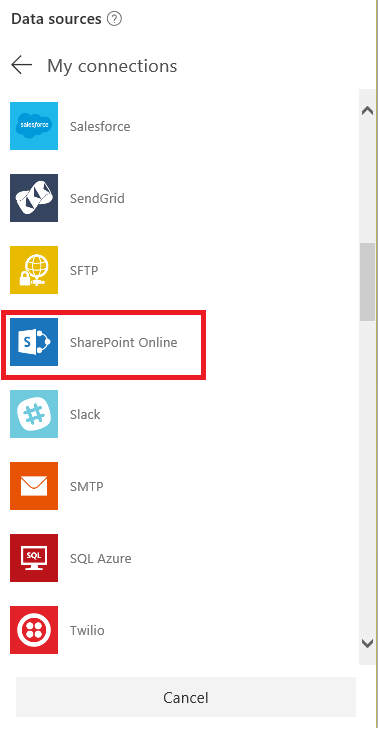

1. Click **Connect** and provide your credentials for SharePoint Online.

   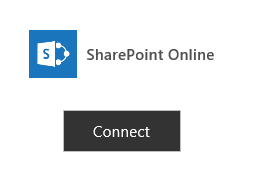

1. Once the connection is established, select a site from the list of **Recent Sites** OR enter a **New Site**.

	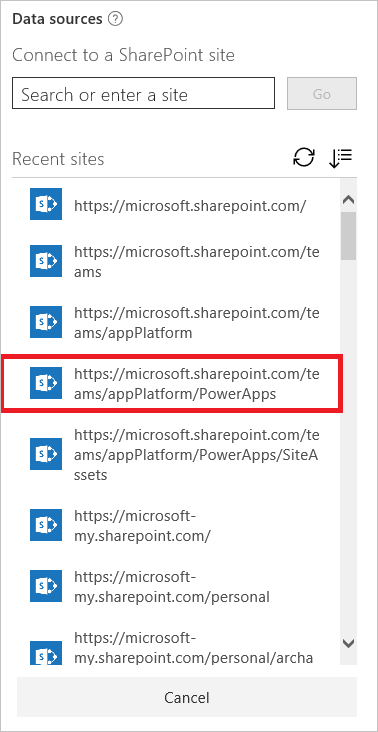

1. Select the table you want to use in your app using the checkbox. You can also select multiple tables. Select **Connect**.

	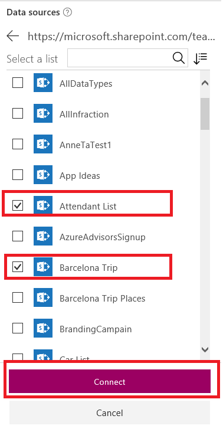

1. The data sources are now added to your app and ready to be consumed.

	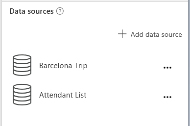

## Consume the datasource in your app ##

1. For tabular datasources such as SharePoint, SQL, Dynamics CRM or Excel, you will be able to consume the data in the app by binding the imported table to the controls in the app. See how to [show list of items in your app](add-gallery.md) or how to [show, add or edit a record from a table](add-form.md) for more details.

1. For non-tabular datasources such as Twitter, Microsoft Translator, you can consume it in your app by calling functions supported by that service.

	 For example, once you import Microsoft Translator as a datasource in your app (by following steps called out in the previous section), it will show up in the data source pane.

	 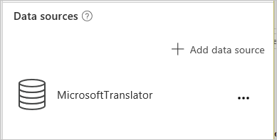

	 You can add a Text box to your app and bind the "Text" property of the Text box to MicrosoftTranslator.Translate("Hello","fr"). This function will translate the text "Hello" to French and you will see it in the text box.

  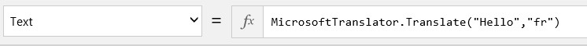

	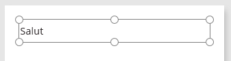
