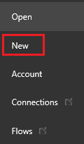
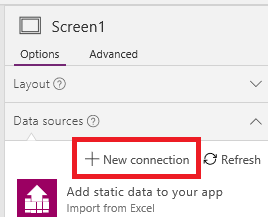
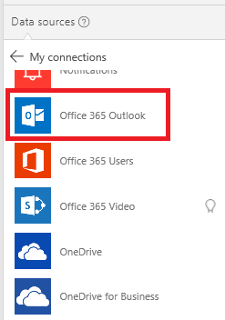
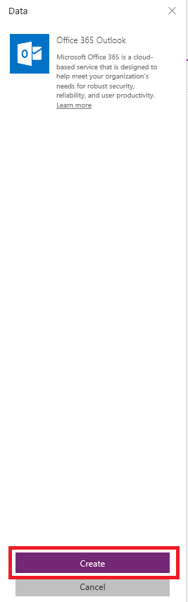

<properties	pageTitle="Add a data connection in an app | Microsoft PowerApps"
	description="Add a data connection in an existing app or a blank app"
	services=""
	suite="powerapps"
	documentationCenter="na"
	authors="archnair"
	manager="anneta"
	editor=""
	tags=""/>

<tags
   ms.service="powerapps"
   ms.devlang="na"
   ms.topic="article"
   ms.tgt_pltfrm="na"
   ms.workload="na"
   ms.date="03/09/2017"
   ms.author="archanan"/>

# Add a data connection in PowerApps #
In PowerApps, add a data connection to an existing app or to an app that you're building from scratch. In this topic, you use PowerApps Studio, but you can also use [powerapps.com](https://web.powerapps.com), as the [Manage connections](add-manage-connections.md) topic describes.

Your app's data connection can connect to SharePoint, Salesforce, OneDrive, or [one of many other data sources](connections-list.md).

Your [next step](#next-steps) after this article is to display and manage data from that data source in your app, as in these examples:

- Connect to OneDrive, and manage data in an Excel workbook in your app.
- Connect to Twilio, and send an SMS message from your app.
- Connect to SQL Server, and update a table from your app.

## Prerequisites ##
[Sign up](signup-for-powerapps.md) for PowerApps, [install](http://aka.ms/powerappsinstall) it, open it, and then sign in by providing the same credentials that you used to sign up.

## Background on data connections ##
Most PowerApps apps use external information called **Data Sources** that is stored in cloud services. A common example is a table in an Excel file stored in OneDrive for Business. Apps are able to access these data sources by using **Connectors**.

The most common data sources are tables, which you can use to retrieve and store information. You can use connectors to data sources to read and write data in Microsoft Excel workbooks, SharePoint lists, SQL tables, and many other formats, which can be stored in cloud services such as OneDrive for Business, DropBox, SQL Server, etc.

Data sources other than tables include email, calendars, Twitter, and notifications.

Using the **[Gallery](controls/control-gallery.md)**, **[Display form](controls/control-form-detail.md)**, and **[Edit form](controls/control-form-detail.md)** controls, it's easy to create an app that reads and writes data from a data source. To get started, read the article [Understand data forms](working-with-forms.md).

## Add a connection ##
1. Click or tap **New** on the **File** menu (near the left edge).

	

1. On the **Blank app** tile, click or tap **Phone layout** .

	

1. In the right-hand pane, click or tap the **Data** tab, and then click or tap **Add data source**.

	**Note**: If you're updating an existing app and **Add data source** doesn't appear in the right-hand pane, click or tap **Data sources** on the **View** tab of the ribbon.

1. If the list of connections includes the one that you want, click or tap it to add it to the app. Otherwise, skip to the next step.

	

1. Click or tap **New connection** to display a list of connectors.

	

1. Scroll through the list of connectors until the type of connection that you want to create appears (for example, **Office 365 Outlook**), and then click or tap it.

	

1. Click or tap **Create** to both create the connection and add it to your app.

	

	Some connectors, such as **Microsoft Translator**, require no additional steps, and you can show data from them immediately. Other connectors prompt you to provide credentials, specify a particular set of data, or perform other steps. For example, [SharePoint](connection-sharepoint-online.md) and [SQL Server](connection-azure-sqldatabase.md) require additional information before you can use them.

## Next steps ##
- To show and update data in a source such as Excel, SharePoint, or SQL Server, [add a gallery](add-gallery.md), and [add a form](add-form.md).
- For data in other sources, use connector-specific functions such as those for [Office 365 Outlook](connection-office365-outlook.md), [Twitter](connection-twitter.md), and [Microsoft Translator](connection-microsoft-translator.md).
