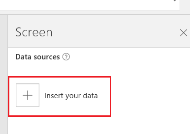

<properties	pageTitle="Add a new data connection | Microsoft PowerApps"
	description="Add a new data connection to an existing app or when building a new blank app"
	services=""
	suite="powerapps"
	documentationCenter="na"
	authors="archnair"
	manager="erikre"
	editor=""
	tags=""/>

<tags
   ms.service="powerapps"
   ms.devlang="na"
   ms.topic="get-started-article"
   ms.tgt_pltfrm="na"
   ms.workload="na"
   ms.date="04/18/2016"
   ms.author="mandia"/>

# Add a new data connection #

You can add a connection to a data source, including SharePoint Online, Salesforce, Dropbox, Twitter, and more. In your app, you "connect" to the data source, and then display the data within your app. For example, you can connect to OneDrive to display Excel data in your app, you can connect to Twilio to send an SMS message from your app, you can connect to SQL Azure and update a table from your app, and so on.

This topic shows you how to create a data connection within PowerApps. [Connections list](connections-list.md) lists all the available connections you can add. 

## What you need to get started ##

- [Build an app](get-started-create-from-blank.md)
- Account and sign-in details for the service you are connecting to

## Add datasource  ##
1. In PowerApps, select the **Content** tab:  

	

1. Select **Data sources**:  

	

1. The Data sources pane slides out on the right. Select **Insert your data**:  

	

1. Select an existing connection OR choose to add a new connection:  

	

1. To add a new connection, select **Add**:  

	

1. From the list of available connections:  

	

1.  Choose the data source you want to connect to, such as **SharePoint Online**, and select **Connect**:  

	

1. Select site from the list of **Recent Sites** OR enter a **New Site**:  

	

1. Select the table you want to use in your app using the checkbox. You can also select multiple tables. Select **Connect**:  

	

1. The data sources are now added to your app and ready to be consumed:  

	

## More good stuff
For some examples of adding connections, take a look at these:  
Create an app from Salesforce  **--> NEED LINK**  
Create an app from Dynamics  **--> NEED LINK**  
[Create an app using Excel data](get-started-create-from-data.md)
