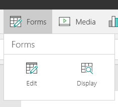
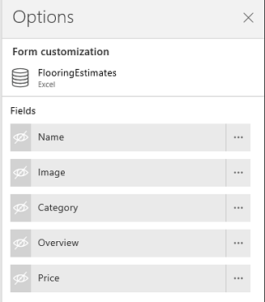
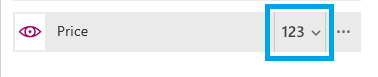
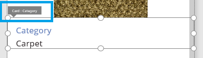

<properties
    pageTitle="Show, edit or add a record from a table | Microsoft PowerApps"
    description="Use Forms to show, edit, or add a record from a table from your data source."
    services=""
    suite="powerapps"
    documentationCenter="na"
    authors="sarafankit"
    manager="erikre"
    editor=""
    tags=""/>
<tags
    ms.service="powerapps"
    ms.devlang="na"
    ms.topic="article"
    ms.tgt_pltfrm="na"
    ms.workload="na"
    ms.date="04/13/2016"
    ms.author="ankitsar"/>

# Show, edit or add a record from a table#

Use [Forms](./controls/control-form-detail.md) to show, edit, or add a record from a table from your data source.

There are two types of **Forms** available in **PowerApps**:



| Activity | Control | Description |
|---------|------------|---------|
| **Viewing a record** | **[Display form](controls/control-form-detail.md)** control | See all the details or fields of a record.|
| **Editing a record** | **[Edit form](controls/control-form-detail.md)** control | Updating the fields of a record and saving those changes back to the underlying data source.  Facilities for editing are often used to create new records too. |

### Prerequisites

- Create an app or open an existing app in PowerApps.
- Learn how to [configure a control](./add-configure-controls.md) in PowerApps.
- A [connection](./add-data-connection.md) to **FlooringEstimates** table from [this Excel file](https://az787822.vo.msecnd.net/documentation/get-started-from-data/FlooringEstimates.xlsx), which contains sample data for this tutorial. 

## Add a Form and bind to data##

1. On the **Insert Tab**, select **Controls**, and then add a **Drop down** to the form.

1. On the **Formula Bar**, set the **DataSource** property of the dorp down to:

	```
	FlooringEstimates.Name
	``` 

1. On the **Insert Tab**. select **Forms**, add a **Display form** or **Edit form**, and adjust it on the screen to cover most of the screen

    

1.  On the **Formula Bar**, set the **DataSource** property of the form to:

	```
	FlooringEstimates
	```
1. Set the **Item** property of the form to:
	```
	First(Filter(FlooringEstimates,Name=Dropdown1.Selected.Value))
	```
    This formula shows the details for the selected item in the drop down from the **FlooringEstimates** table.

##Show or hide fields on Form##

1. On the design workspace, select the **Form**, and then select **Options** (near the lower-right corner).

	

	The **Form** tab of the **Options** pane appears.
    
    
    
1. In the **Options** pane, select show field option for all the fields 
	
	

## Set the card type for a field##
1. In the **Options** pane, select the card selector for **Price**.

    

1. Select the **View text** option.

    

## Arrange cards on the form##
1. Select **Category**, and then drag the field's title bar above **Image**.

    

    

## Submit changes for an Edit form##
1. Add a button to the bottom of the form, and set its **Text** property to **Save**

	  

1.  On the **Formula Bar**, set the **OnSelect** property of the **Save** button to [submit the form](./functions/function-form.md") to save the changes to the record:

	```
	SubmitForm(Form1);
	``` 
    
## Next steps ##
- Learn more about [working with Forms](./working-with-forms.md)
- Learn more about [formulas](./working-with-formulas.md) in PowerApps