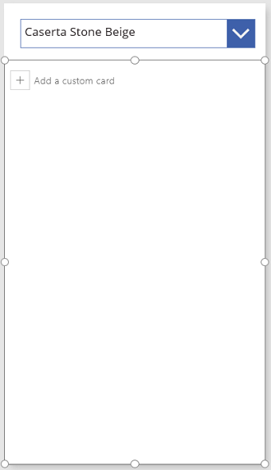
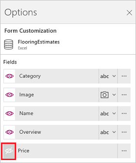
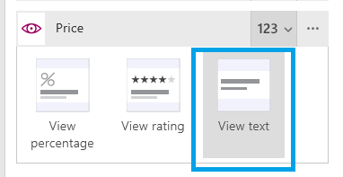
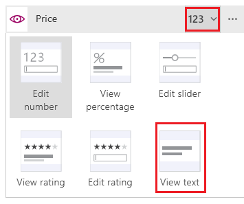
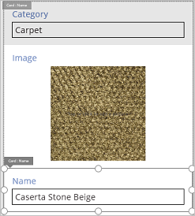
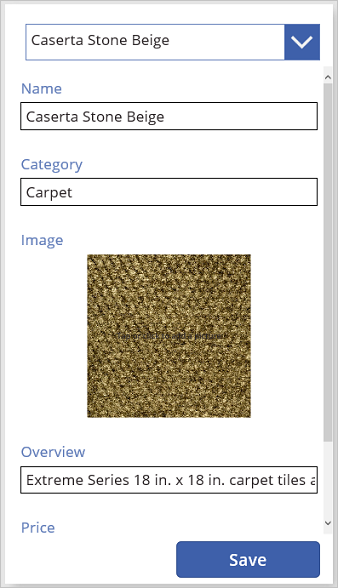
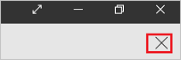

<properties
    pageTitle="Show, edit, or add a record from a table | Microsoft PowerApps"
    description="Use a form to show, edit, or add a record from a table in your data source."
    services=""
    suite="powerapps"
    documentationCenter="na"
    authors="sarafankit"
    manager="erikre"
    editor=""
    tags=""/>
<tags
    ms.service="powerapps"
    ms.devlang="na"
    ms.topic="article"
    ms.tgt_pltfrm="na"
    ms.workload="na"
    ms.date="04/13/2016"
    ms.author="ankitsar"/>

# Show, edit, or add a record from a table in Microsoft PowerApps #
To show all fields in a record, add and configure a **[Display form](controls/control-form-detail.md)** control. To edit any field in a record (or to add a record) and save your changes back to a data source, add and configure an **[Edit form](controls/control-form-detail.md)** control.

**Prerequisites**

- Create an app, or add a screen to an app.
- Learn how to [configure a control](add-configure-controls.md) in PowerApps.
- A [connection](add-data-connection.md) to **FlooringEstimates** table from [this Excel file](https://az787822.vo.msecnd.net/documentation/get-started-from-data/FlooringEstimates.xlsx), which contains sample data for this tutorial.

## Add a form, and show data ##
1. Add a **[Drop down](controls/control-drop-down.md)** control, name it **ChooseProduct**, and set its **[Items](controls/properties-core.md)** property to this value:

	**FlooringEstimates.Name**

	The list shows names of flooring products from the data source.

1. Add a form, move it below **ChooseProduct**, and resize the form to cover most of the screen.

    

1.  Set the **[DataSource](controls/control-form-detail.md)** property of the form to **FlooringEstimates** and the **[Item](controls/control-form-detail.md)** property of the form to this formula:

	**First(Filter(FlooringEstimates, Name=ChooseProduct.Selected.Value))**

    This formula specifies that, after you finish configuring the form, it will show the record that the user selects in **ChooseProduct**.

1. If the **Options** pane isn't open, make sure that the form is still selected, and then select **Options** near the lower-right corner.

	

1. For each field in the **Options** pane, select the option to show that field.

	

## Set the card type for a field ##
1. In the **Options** pane, select the card selector for **Price**, and the select the **View text** option.

	If you added a **[Display form](controls/control-form-detail.md)** control, you have these options, and this step changes the display from a percentage to a decimal number.

    

	If you added an **[Edit form](controls/control-form-detail.md)** control, you have these options, and this step makes the field read-only.

    

## Arrange cards on the form ##
1. Select **Name**, and then drag the field's title bar above **Category**.

    

## (Edit form only) Save changes ##
1. Name the form **EditForm**.

	**Tip:** Select the form, not any of the cards, by clicking or tapping its scrollbar.

1. Add a **[Button](controls/control-button.md)** control, and set its **[Text](controls/properties-core.md)** property to **Save**.

	  

1.  Set the **[OnSelect](controls/properties-core.md)** property of the **Save** button to this formula:

	**SubmitForm(EditForm)**

1. Open Preview by selecting the play button near the upper-right corner (or by pressing F5), change the name of a product, and then select **Save**.

	The **[SubmitForm](functions/function-form.md)** function saves your changes to the data source with which you configured the form.

1. (optional) Select the icon to close Preview (or press Esc).

	

## Next steps ##
- Learn more about working with [forms](working-with-forms.md) and [formulas](working-with-formulas.md).
