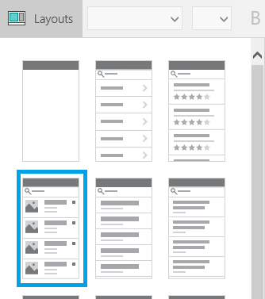
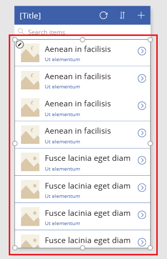
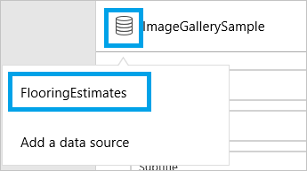

<properties
    pageTitle="Show a list of items | Microsoft PowerApps"
    description="Use a gallery to show a list of items in your app, and filter the list by specifying a criterion."
    services=""
    suite="powerapps"
    documentationCenter="na"
    authors="RickSaling"
    manager="anneta"
    editor=""
    tags=""/>
<tags
    ms.service="powerapps"
    ms.devlang="na"
    ms.topic="article"
    ms.tgt_pltfrm="na"
    ms.workload="na"
    ms.date="02/15/2017"
    ms.author="ricksal"/>

# Show a list of items in PowerApps  #

Show a list of items from any data source by adding a **[Gallery](controls/control-gallery.md)** control to your app. This topic uses Excel as the data source. Filter the list by configuring the gallery to show only those items that match the filter criterion in a **[Text input](controls/control-text-input.md)** control.

**Prerequisites**

- Learn how to [add and configure a control](add-configure-controls.md) in PowerApps.
- Download [this Excel file](https://az787822.vo.msecnd.net/documentation/get-started-from-data/FlooringEstimates.xlsx), which contains sample data for this tutorial.
- Upload the Excel file to a [cloud-storage account](cloud-storage-blob-connections.md), such as OneDrive for Business.
- In a new or existing app, [add a connection](add-data-connection.md) to the **FlooringEstimates** table in the Excel file.
- If you're using an existing app, [add a screen](add-screen-context-variables.md) to it.

## Add a gallery ##

1. In the **Options** tab of the right-hand pane, click or tap the **Layout** tab to open it. Then click or tap the option that contains a thumbnail image, a header, and a description.

	

2. Select the gallery by clicking or tapping any item in it except the first one.

	

3. In the right-hand pane, click or tap the data-source icon, and then click or tap the **FlooringEstimates** data source.

	

	The gallery shows the data from the source that you specified.

	

## Add a control to the gallery ##

1. To edit the gallery template, select the gallery, and click or tap the pencil icon in its upper-left corner.

    

2. Add a **[Text box](controls/control-text-box.md)** control to the gallery template, and then move and resize the new control so that it doesn't overlap with other controls in the template.

	

3. With the **Text box** control still selected, open the highlighted list in the right-hand pane.

	

4. In the list of fields that you just opened, click or tap **Price**.  

    

    The gallery shows the new values

    

## Filter the gallery ##

The **[Items](controls/properties-core.md)** property of a gallery determines which items it shows. You configure that property so that the gallery shows only those items for which the product name contains the text in **TextSearchBox1**.

1. Set the **[Items](controls/properties-core.md)** property of the gallery to this formula:

        If(IsBlank(TextSearchBox1.Text), FlooringEstimates, Filter(FlooringEstimates, TextSearchBox1.Text in Text(Name)))

2. Type part or all of a product name in the search box.

	The gallery shows only those items that meet the filter criterion.

## Sort the gallery ##

The **[Items](controls/properties-core.md)** property of a gallery determines the order of items that it shows. You configure that property so that the gallery shows the order of items as set by **ImageSortUpDown1**.

1. Set the **[Items](controls/properties-core.md)** property of the gallery to this formula:

        Sort(If(IsBlank(TextSearchBox1.Text), FlooringEstimates, Filter(FlooringEstimates, TextSearchBox1.Text in Text(Name))), Name, If(SortDescending1, SortOrder.Descending, SortOrder.Ascending))

2. Select the sort icon to change the sorting order of the gallery by the names of the products.

To sort and filter your gallery, replace both instances of *DataSource* in this formula with name of your data source. Replace both instances of *ColumnName* with the name of the column by which you want to sort and filter.

    Sort(If(IsBlank(TextSearchBox1.Text),** *DataSource*, **Filter(** *DataSource*, **TextSearchBox1.Text in Text(** *ColumnName* **))),** *ColumnName*, **If(SortDescending1, SortOrder.Descending, SortOrder.Ascending))

## Next steps ##
- Learn more about working with a [gallery](working-with-forms.md) and [formulas](working-with-formulas.md).
