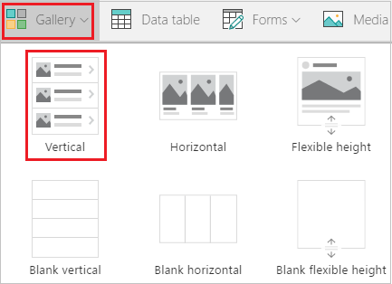
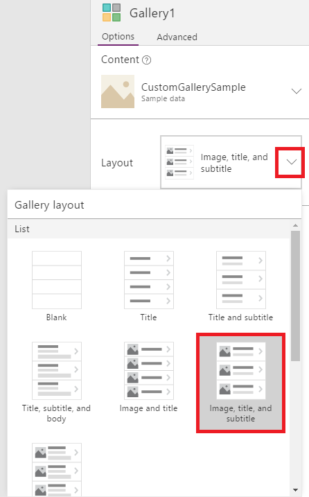
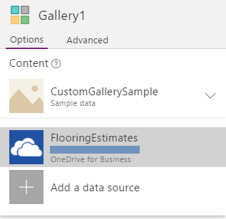
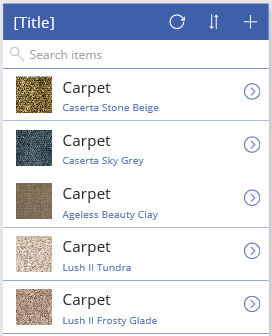
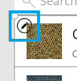
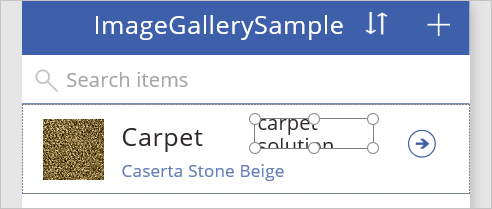
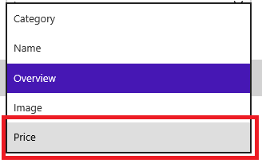
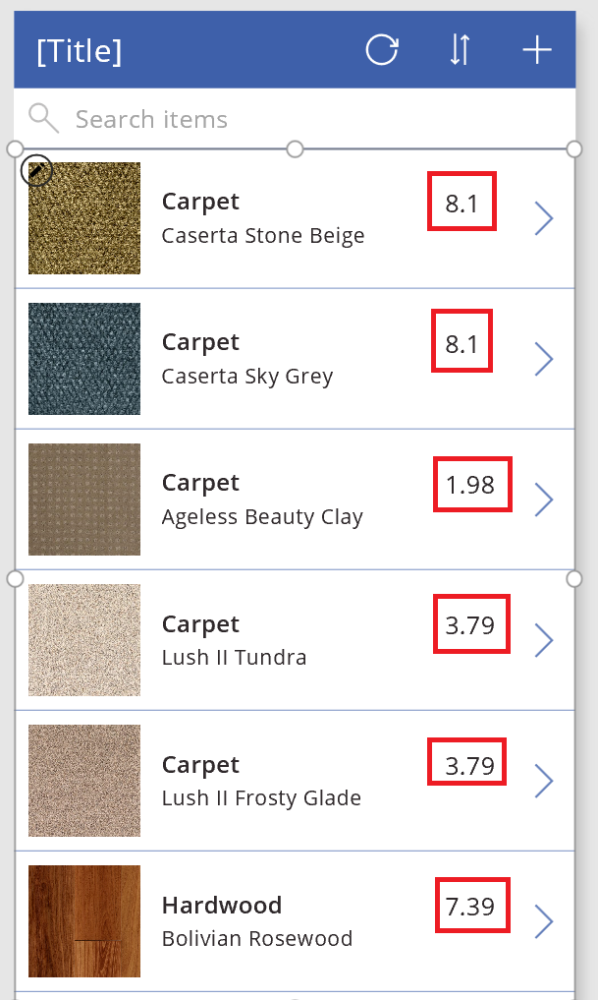
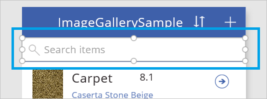
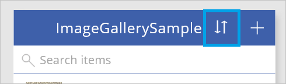

<properties
    pageTitle="Show a list of items | Microsoft PowerApps"
    description="Use a gallery to show a list of items in your app, and filter the list by specifying a criterion."
    services=""
    suite="powerapps"
    documentationCenter="na"
    authors="karthik-1"
    manager="anneta"
    editor=""
    tags=""/>
<tags
    ms.service="powerapps"
    ms.devlang="na"
    ms.topic="article"
    ms.tgt_pltfrm="na"
    ms.workload="na"
    ms.date="05/03/2017"
    ms.author="karthikb"/>

# Show a list of items in PowerApps  #
Show a list of items from any data source by adding a **[Gallery](controls/control-gallery.md)** control to your app. This topic uses Excel as the data source. Filter the list by configuring the gallery to show only those items that match the filter criterion in a **[Text input](controls/control-text-input.md)** control.

## Prerequisites ##
- Learn how to [add and configure a control](add-configure-controls.md) in PowerApps.
 - Set up the sample data:

	1. Download [this Excel file](https://az787822.vo.msecnd.net/documentation/get-started-from-data/FlooringEstimates.xlsx), which contains sample data for this tutorial.
	1. Upload the Excel file to a [cloud-storage account](cloud-storage-blob-connections.md), such as OneDrive for Business.

## Add a gallery ##
1. Open PowerApps, and then click or tap **New** near the left edge.

1. On the **Blank app** tile, click or tap **Phone layout**.

1. [Add a connection](add-data-connection.md) to the **FlooringEstimates** table in the Excel file.

1. (optional) Add a gallery to the default screen by clicking or tapping the **Insert** tab, clicking or tapping **Gallery**, and then clicking or tapping a gallery that's empty (blank) or that contains a default set of controls.

	These options include galleries that scroll horizontally or vertically. You can also add a gallery that automatically bases its size on the amount of content in each item.

	

1. On the **Home** tab, click or tap **New screen**.

	You can add a screen that's empty, that scrolls, that contains a gallery, or that contains a form.

1. Click or tap **List screen** to add a screen that contains a gallery and other controls such as a search bar.

	**Note**: Whether you add a gallery to a new screen or an existing one, you can click or tap near the bottom of the gallery to select it and then choose a different layout in the right-hand pane. For this tutorial, leave the default layout.

	

1. Click or tap on the gallery control you just added. In the right-hand pane, click or tap **Data**, and then click or tap **FlooringEstimates**.

	

	The gallery shows the sample data.

	

	 You'll configure sort and search later in this topic.

## Add a control to the gallery ##
Before you do any customization, decide on a gallery layout. The first set of controls in a gallery is the template, which determines how all data in the gallery appears.

1. Select the template by clicking or tapping near the bottom of the gallery and then clicking or tapping the pencil icon in the upper-left corner of the gallery.

    

2. Add a **[Label](controls/control-text-box.md)** control to the gallery template, and then move and resize the new control so that it doesn't overlap with other controls in the template. Be sure to keep only the first gallery cell highlighted, otherwise the Label control will not be added to the gallery control and will not be linked to the flooring estimates data source.

	

3. With the **Label** control still selected, open the highlighted list in the right-hand pane. If the Data pane is closed, reopen it by clicking or tapping on the gallery control in the left pane, then click or tap **FlooringEstimates** Data in the right pane to reopen the Data pane.

	

4. In the list of fields that you just opened, click or tap **Price**.  

    

    The gallery shows the new values

    

## Filter the gallery ##
The **[Items](controls/properties-core.md)** property of a gallery determines which items it shows. In this procedure, you configure that property so that the gallery shows only those items for which the product name contains the text in **TextSearchBox1**.

1. Select the template by clicking or tapping near the bottom of the gallery control.

1. Set the Advanced tab **[Items](controls/properties-core.md)** property of the gallery to this formula:

	**If(IsBlank(TextSearchBox1.Text), FlooringEstimates, Filter(FlooringEstimates, TextSearchBox1.Text in Text(Name)))**

	For more information about the functions in this formula, see the [formula reference](formula-reference.md).

1. Type part or all of a product name in the search box.

	The gallery shows only those items that meet the filter criterion.

## Sort the gallery ##
The **[Items](controls/properties-core.md)** property of a gallery determines the order in which it shows items. In this procedure, you configure that property so that the gallery shows the order of items as set by **ImageSortUpDown1**.

1. Set the **[Items](controls/properties-core.md)** property of the gallery to this formula:

    **Sort(If(IsBlank(TextSearchBox1.Text), FlooringEstimates, Filter(FlooringEstimates, TextSearchBox1.Text in Text(Name))), Name, If(SortDescending1, SortOrder.Descending, SortOrder.Ascending))**

2. Select the sort icon to change the sorting order of the gallery by the names of the products.

To sort *and* filter your gallery:
- Replace both instances of *DataSource* in this formula with name of your data source
- Replace both instances of *ColumnName* with the name of the column by which you want to sort and filter

**Sort(If(IsBlank(TextSearchBox1.Text),** *DataSource*, **Filter(** *DataSource*, **TextSearchBox1.Text in Text(** *ColumnName* **))),** *ColumnName*, **If(SortDescending1, SortOrder.Descending, SortOrder.Ascending))**

## Highlight the selected item ##
Set the gallery's **TemplateFill** property to a formula that's similar to this example:

**If(ThisItem.IsSelected, LightCyan, White)**

## Change the default selection ##
Set the gallery's **Default** property to the record that you want to select by default. For example, specify the fifth item in the **FlooringEstimates** data source:

**Last(FirstN(FlooringEstimates, 5))**

In this example, you specify the first item in the **Hardwood** category of the **FlooringEstimates** data source:

**First(Filter(FlooringEstimates, Category = "Hardwood"))**

## Next steps ##
- Learn how to work with [forms](working-with-forms.md) and [formulas](working-with-formulas.md).
