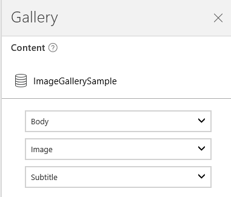

<properties
    pageTitle="Show a list of items in your app | Microsoft PowerApps"
    description="Use a Gallery to show a list of records on your app."
    services=""
    suite="powerapps"
    documentationCenter="na"
    authors="sarafankit"
    manager="erikre"
    editor=""
    tags=""/>
<tags
    ms.service="powerapps"
    ms.devlang="na"
    ms.topic="article"
    ms.tgt_pltfrm="na"
    ms.workload="na"
    ms.date="04/18/2016"
    ms.author="ankitsar"/>

# Show a list of items in your app  #

Use a [Gallery](./controls/control-gallery.md) to show a list of records on your app. In this topic, we will add a gallery control and configure it to show the list of records from an Excel file.

### Prerequisites

- Create an app or open an existing app in PowerApps.
- Learn how to [configure a control](./add-configure-controls.md) in PowerApps.
- A [connection](./add-data-connection.md) to **FlooringEstimates** table from [this Excel file](https://az787822.vo.msecnd.net/documentation/get-started-from-data/FlooringEstimates.xlsx), which contains sample data for this tutorial. 

## Add a Gallery ##

1. On the **Home** tab of the ribbon, select **Layouts**, and then select the option that contains a thumbnail image,  header and description.

	
    
1. On the design workspace, select the **Gallery**, and then select **Options** (near the lower-right corner).

	

	The **Gallery** tab of the **Options** pane appears.
    
    

1. In the **Options** pane, select the **Data source** icon, and then select the **FlooringEstimates** data source.

    
    
1. The **Gallery** will update to show the data from the new data source.

## Add controls to the Gallery ##

1. In the **Gallery**, select the **Edit Gallery** option on the top-left corner to edit the first item of the gallery.

    
    
1. Add a **Text box** to the gallery item, and style it as following:

    

1. Select the new **Text box** on the screen, and then select **Price** from the drop down on the **Options** pane.  

    
    
    The Gallery will update to show the new values 
    
    
    
## Set filter on the Gallery ##
The list of items shown in **Gallery** is defined by its **Items** property. We will now use a text input  box to set filter on the **Gallery**. We will use the **TextSearchBox1** added to the screen by the Layout for filtering.
   

    
1. On the **Formula Bar**, set the **Items** property of the gallery to this formula:

	```
	If(IsBlank(TextSearchBox1.Text), FlooringEstimates, Filter(FlooringEstimates, TextSearchBox1.Text in Text(Category)))
	```
	This formula shows the data from the **FlooringEstimates** table. If the user types in the search box, the gallery shows only those records in which the **Category** column contains the search text.

## Next steps ##
- Learn more about [working with Gallery](./working-with-forms.md)
- Learn more about [formulas](./working-with-formulas.md) in PowerApps