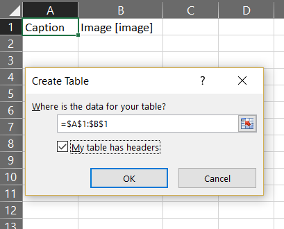
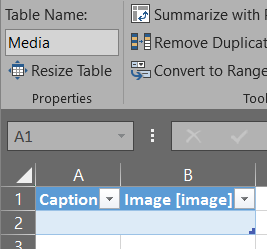
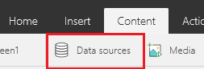
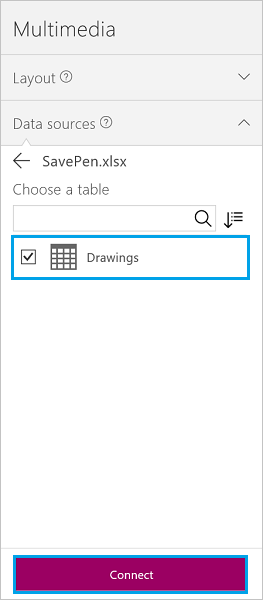

<properties
	pageTitle="Embed multimedia files into a PowerApps app and upload | Microsoft PowerApps"
	description="Show multimedia files in an app, and upload them to a data source"
	services=""
	suite="powerapps"
	documentationCenter=""
	authors="RickSaling"
	manager="anneta"
	editor=""/>

<tags
   ms.service="powerapps"
   ms.devlang="na"
   ms.topic="article"
   ms.tgt_pltfrm="na"
   ms.workload="na"
   ms.date="12/28/2016"
   ms.author="ricksal"/>

# Show multimedia files in PowerApps

This topic shows you how to embed multimedia files in your app, upload pen drawings to a data source, and show images from a data source in your app. The data source used in this topic is an Excel file in OneDrive.

## Prerequisites

[Sign up](../articles/signup-for-powerapps.md) for PowerApps, and [install](http://aka.ms/powerappsinstall) it. When you open PowerApps, sign in using the same credentials that you used to sign up.

## Add media from a file ##
You can choose which kind of media file to add, for example, pictures, video, or audio.

1. On the **Content** tab, select **Media**.
2. Under **Media**, select **Images**, **Videos**, or **Audio**, and then select **Browse**:  
	![][1]  
3. Select the file that you want to add, and then select **Open**.
4. When you finish adding files, go back to the app designer. You can also press Esc.
5. On the **Insert** tab, select **Media**, and then select **Image**, **Video**, or **Audio**:  
	![][8]

	- If you added an image control, set its **[Image](controls/properties-visual.md)** property to the file that you added:  

		![Set Image property][9]

	- If you added a video or audio control, set its **Media** property to the file that you added:  

		![Set Media property][10]

	**Note** Play a YouTube video by setting the **Media** property of a video control to the appropriate URL, enclosed in double quotation marks.

## Add images in an Excel file to your app

In this scenario, you save images in a cloud storage account, OneDrive for Business, and then use an Excel table to display the images in your app. This scenario uses the [CreateFirstApp.zip](http://pwrappssamples.blob.core.windows.net/samples/CreateFirstApp.zip) that contains some .jpeg files.

	> [!NOTE]
	> When displaying images from an Excel file, the path to these images must use forward slashes. When PowerApps saves images to an Excel table (as with the previous steps), the path uses backslashes. So, you can also use the **SavePen_images** from the previous example. If you do, change the paths in the Excel table to use forward slashes instead of backslashes. Otherwise, the images will not display.  

1. Download [CreateFirstApp.zip](http://pwrappssamples.blob.core.windows.net/samples/CreateFirstApp.zip), and extract the **Assets** folder to your cloud storage account.

2. Rename the **Assets** folder to **Assets_images**.
3. In an Excel spreadsheet, create a one-column table and fill it with the following data:

	

4. Name the table **Jackets**. Name the Excel file **Assets.xlsx**.

5. In your app, add the **Jackets** table as a data source.  

6. Add an **Image only** control (**Insert** tab > **Gallery**), and set its **Items** property to `Jackets`:  

	

	The gallery is automatically updated with the images:  

	

	When you set the Items property, the Excel table is automatically updated with a new column named __PowerAppsId__.

	In the Excel table, the image path can also be the URL to an image. An example is the [Flooring Estimates](http://pwrappssamples.blob.core.windows.net/samples/FlooringEstimates.xlsx) sample file. You can download it to your cloud storage account, add the `FlooringEstimates` table as a data source in your app, and then set the gallery control to `FlooringEstimates`. The gallery is automatically updated with the images.

[!INCLUDE [testing-requirements](../includes/testing-requirements.md)]

## Upload pen drawings to OneDrive

In this scenario, you learn how to upload pen drawings to your data source, OneDrive for Business, and examine how the drawings are stored in OneDrive for Business.

1. In Excel, add **Image [image]** to cell A1.

2.	Create a table using the following steps:    

	a. Select cell A1.

	b. On the **Insert** ribbon, select **Table**.

	c. In the dialog window, select **My table has headers**, and select **OK**.

		

		Your Excel file is now in a table format. See [Format the data as a table](https://support.office.com/en-us/article/Format-an-Excel-table-6789619F-C889-495C-99C2-2F971C0E2370) for more information on table formatting in Excel.

	d. Name the table **Drawings**:  

		

3. Save the Excel file to OneDrive for Business as **SavePen.xlsx**.

2.	In PowerApps, create a [blank app](get-started-create-from-blank.md).

3.	In your app, add the cloud storage account as a [data source](add-data-connection.md):

	a.	Click or tap the **Content** tab and then click or tap **Data sources**.

		

	b.	Click or tap **Add data source** and click or tap one, OneDrive for Business in this case.

		

	c.	Click or tap **SavePen.xlsx**.

	d.	Select the **Drawings** table and click or tap **Connect**.

4. Once you've added the data source, add **SavePen.xlsx** as a connection, and then select the **Drawings** table:  

	  

	Now, the Drawings table is listed as a Data source.

5.  On the **Insert** tab, select **Text**, and then select **Pen input**. Rename it **MyPen**:  

	

6.	Add a **Button** control (**Insert** tab), and set its **OnSelect** property to the following formula:

			Patch(Drawings, Defaults(Drawings), {Image:MyPen.Image})

7.	Add an **Image gallery** control (**Insert** tab > **Gallery**), and set its **Items** property to `Drawings`. The **Image** property of the gallery control is automatically set to `ThisItem.Image`.

	Your screen should look similar to the following:  

	

8.	Press F5 or select Preview (  ).

9. Draw something in MyPen, and the select the button. The first image in the gallery control displays what you drew.

10. Add something else to your drawing, and select the button. The second image in the gallery control displays what you drew.

11.	Close the preview window by pressing the *ESC* key.

12. Go to your cloud storage account. There's a new **SavePen_images** folder that is automatically created. You may need to refresh to see the new folder. This folder contains your saved images with IDs for their file names.

10.	Open **SavePen.xlsx**. The *Image* column specifies the path to the new images.

[!INCLUDE [testing-requirements](../includes/testing-requirements.md)]

## For more information

For information on more advanced scenarios involving uploading multimedia directly to a different data source, see [image capture pro tips](https://powerapps.microsoft.com/blog/image-capture-pro-tips/) and [custom api for image upload](https://powerapps.microsoft.com/blog/custom-api-for-image-upload/).

Another way to upload files to a data source is to use the [Patch](functions/function-patch.md) function.

[1]: ./media/add-images-pictures-audio-video/add-image-video-audio-file.png
[3]: ./media/add-images-pictures-audio-video/add-intro-sound.png
[4]: ./media/add-images-pictures-audio-video/add-picture.png
[5]: ./media/add-images-pictures-audio-video/camera-gallery.png
[6]: ./media/add-images-pictures-audio-video/audio-gallery.png
[7]: ./media/add-images-pictures-audio-video/pen-gallery.png
[8]: ./media/add-images-pictures-audio-video/mediaoptions.png
[9]: ./media/add-images-pictures-audio-video/imageproperty.png
[10]: ./media/add-images-pictures-audio-video/mediaproperty.png
[11]: ./media/add-images-pictures-audio-video/renamecamera.png
