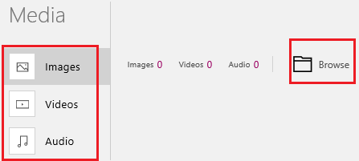
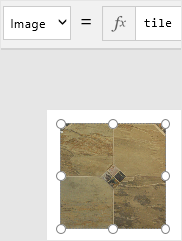
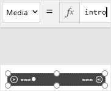
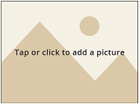

<properties
	pageTitle="Add an image, a video, or a sound | Microsoft PowerApps"
	description="Add an image file, play a video file, draw a picture with a pen, take a picture with a camera, or record and play an audio file"
	services=""
	suite="powerapps"
	documentationCenter=""
	authors="MandiOhlinger"
	manager="dwrede"
	editor=""/>

<tags
   ms.service="powerapps"
   ms.devlang="na"
   ms.topic="article"
   ms.tgt_pltfrm="na"
   ms.workload="na"
   ms.date="11/30/2015"
   ms.author="mandia"/>

# Add an image, a video, or a sound in PowerApps

Make your app stand out by adding multimedia elements such as images, videos, and sounds. Upload one or more existing files, create content on the fly by using your device's camera or microphone, or draw with a pen on a virtual whiteboard.

**Prerequisites**

Learn how to [add and configure controls](add-configure-controls.md).

## Add media from a file ##

1. On the **Content** tab, select **Media**.
1. Select **Images**, **Videos**, or **Audio**, and then select **Browse**.

	

1. Select the file you want to add, and then select **Open**.
1. When you finish adding files, press Esc to return to the default workspace.

1. Add an image, video, or audio control, and then follow either of these steps:
	- If you added an image control, set its **Image** property to the file that you added.

	

	- If you added a video or audio control, set its **Media** property to the file that you added.

	

## Add a user picture ##
When users run your app, they can add their own images from existing files. In a real-estate app, for example, users might upload pictures of houses they want to sell. In an insurance app, users might upload pictures of damage from car accidents so that estimators can respond.

1. Add an **Add Picture** control, and then press F5.

	

1. Tap or click the control, select the file that you want to add, and then select **Open**.
1. Press Esc to return to the default workspace.

## Take pictures by using a camera
Take multiple pictures with the camera on your computer or mobile device. Then, show the pictures in an image gallery. These steps use the camera on your computer. To follow these steps, start the camera on your computer or mobile device.

1. Add a camera control, rename it **MyCamera**, and set its **OnSelect** property to this formula:

	**Collect(MyImages, {SinglePicture:MyCamera!Photo})**

1. Add an image gallery, and set its **Items** property to **MyImages**.

1. Select the image control for the first item in the gallery, and set its **OnSelect** property to this formula:

	**Remove(MyImages, ThisItem)**

1. Press F5, and select **MyCamera** one or more times.

	Each time you select **MyCamera**, an image is added to the gallery.

1. Select an image in the gallery to remove that image.

1. When you finish adding and removing images from the gallery, press Esc to return to the default workspace.

## Add an audio file
Configure an audio control to play a file in any format that Internet Explorer supports, including the audio portion of a video file. For example, you can use a .wma file. If you don't have an audio recording, you can create your own using the **Sound Recorder** or **Voice Recorder** apps in Windows. Search for **Sound Recorder** or **Voice Recorder** to open it.

1. On the **Home** tab, select **New Screen**.
2. On the **Insert** tab, select **Media**, and then select **Audio**:  
![][10]  
3. On the **Content** tab, select **Media**, and then select **Add an audio file**.
4. Select **Media**, select **Audio**, and then select the **Upload** button to browse for the audio file that you want to play. Select **Open**. The file is now added to Media and can be used with your app:  
![][23]  
5. Go back to the app designer.  
5. Select the Audio control and set the **Media** property to the name of the file that you added. Select the play button to hear the recording:  
![][11]  

	The file plays. You can also use the audio control to play sounds that you record using the **Microphone** control (also on the **Insert** tab > **Media**).

## Add a video
Configure a video control to play a file in any format that Internet Explorer supports. For example, you can use a .wmv file. If you don't have a video, you can create your own using the video recording feature of your webcam.

The following steps assume you already uploaded the video to your app.

1. On the **Home** tab, select **New Screen**.
1. On the **Insert** tab, select **Media**, and then select **Video**:  
![][12]  
2. On the **Content** tab, select **Media**, and then select your video file from the list. The **Media** property is set to the name of the file that you added. Select the play button to watch your video:  
![][13]  


#### Play a YouTube video
You can also play videos from external sources, including YouTube.

Select the video control. Set its **Media** property to the URL of the video you want to show. For example, set it to the following video on the Microsoft YouTube channel:  

![][14]

**Note** Use double quotation marks around the URL.

Preview your app: ![][1]. Select the play button and watch the video:  
![][15]  

To return to the app designer, press the **ESC** key.


## Record and play a sound
Use the microphone to record sounds, and list them in a gallery.

1. On the **Home** tab, select **New Screen**.
1. On the **Insert** tab, select **Text**, select **Input Text**, and rename the new control **Description**:  
![][21]  
2. On the **Insert** tab, select **Media**, and select **Microphone**. If prompted for permissions, select **Allow**.
3. Rename the control to **MyMicrophone**, and set its **OnStop** property to the following function:  
```Collect(Interviews, {Recordings:MyMicrophone!Audio, Notes:Description!Text})```  

	![][16]  
	By using this function, you create a collection named **Interviews**, which contains a column named **Recordings** and a column named **Notes**. Each row contains a sound file that you create by using the microphone and any text that the Input Text control contains when you stop recording.

4. On the **Insert** tab, select **Gallery**, and under **Custom Galleries**, select **Portrait**. Set the Portrait gallery's **Items** property to **Interviews**.
5. Select the first item in the gallery, select the **Insert** tab, select **Media**, and then select **Audio**.
6. Set the **Media** property for the audio control to ```ThisItem!Recordings```.  
	**Note** You can save visual space by shrinking the audio control so that only the play button appears.
7. Add a label to the first item in that gallery, and set the label's **Text** property to  ```ThisItem!Notes```. Your gallery control looks similar to the following:  
![][17]
8. Preview your app: ![][1]. Type a phrase in the Description box, and then select **MyMicrophone** to start recording. When done recording, select **MyMicrophone** again to stop recording.

	Your description appears in the first item of the gallery, and your recording plays if you click the play button in the audio control.

	Type something else in the **Description** box, and make another recording. Repeat as many times as you want. Each description and recording appears in the gallery.

Press the **ESC** key to return to the app designer.

## Draw a picture ##
Create multiple drawings (or simulate a whiteboard), and show the results in a gallery.

1. On the **Home** tab, select **New Screen**.
1. On the **Insert** tab, select **Text**, select **Pen**, and then rename the new  pen control to **Sketches**.
2. On the **Pen** tab, select **Show Controls**:  
![][18]  
	Confirm that ```ShowControls``` is equal to ```true``` in the Function Bar.
3. Add a button, set its **Text** property to ```Add``` and set its **OnSelect** property to the following function:  
```Collect(Creativity, {Captures:Sketches!Image})```
4. On the **Insert** tab, select **Gallery**, and select the vertical **Image Only** gallery. Shrink the width of the gallery to show three items.
5. Set the gallery's **Items** property to ```Creativity```.  

	> [AZURE.NOTE] At anytime, you can resize and move the controls.

6. Preview (![][1]) to see what you created.

	Draw or write something in **Sketches**, and then select the **Add** button. The contents of the pen control appear in the first item of the gallery.

	Select the clear button (with the "x") in Sketches, write or draw something else in it, and then select the **Add** button again. The contents of the pen control appear in the second item in the gallery.

Repeat these steps as many times as you like. Press the **ESC** key to return to the designer.

You can also convert written text to typed text:

1. Add a label, and set its **Text** property to ```Sketches!RecognizedText```.
2. Preview your app: ![][1]. Write a word in the pen control. The label shows the word as typed text.

## Tips and tricks
- In the **File** tab > **Media**, you can also upload images, videos, and audio files. When you add one of these controls to your app, set the **Media** property to the name of the file. For example, you uploaded an audio file named MySuperAudio.wmv. In your app, set the **Media** property of the Audio control to ```MySuperAudio```.
- At anytime, you can select the preview button (![][1]) to see what you created and test it.
- When designing your app, you can resize the controls and move them around using click-and-drag.
- Press **ESC** to close the preview window.
- **Save** your work using the **File** menu, or press **Ctrl** + **S**.

## What you learned

In this topic, you:

- Learned the difference between adding an image control and adding a picture control to your app.
- Added single images and used the Camera control to take pictures. You used Excel-like functions to create a collection to display the pictures you took.
- Used the Audio and Video control to add sound and videos to your app, including playing a YouTube video.
- Additional multimedia options, including the Microphone and Pen controls, are available to make recordings, and write text directly in the app.


[1]: ./media/add-images-pictures-audio-video/preview.png
[2]: ./media/add-images-pictures-audio-video/insertimage.png
[3]: ./media/add-images-pictures-audio-video/imagecontrol.png
[4]: ./media/add-images-pictures-audio-video/camera.png
[5]: ./media/add-images-pictures-audio-video/renamecamera.png
[6]: ./media/add-images-pictures-audio-video/onselectfunction.png
[7]: ./media/add-images-pictures-audio-video/verticalimage.png
[8]: ./media/add-images-pictures-audio-video/threeitems.png
[9]: ./media/add-images-pictures-audio-video/itemsmyimages.png
[10]: ./media/add-images-pictures-audio-video/audio.png
[11]: ./media/add-images-pictures-audio-video/audiorecording.png
[12]: ./media/add-images-pictures-audio-video/video.png
[13]: ./media/add-images-pictures-audio-video/videorecording.png
[14]: ./media/add-images-pictures-audio-video/youtubemedia.png
[15]: ./media/add-images-pictures-audio-video/youtubevideo.png
[16]: ./media/add-images-pictures-audio-video/microphoneonstop.png
[17]: ./media/add-images-pictures-audio-video/gallery.png
[18]: ./media/add-images-pictures-audio-video/pentab.png
[19]: ./media/add-images-pictures-audio-video/allmedia.png
[20]: ./media/add-images-pictures-audio-video/addpicture.png
[21]: ./media/add-images-pictures-audio-video/renameinputtext.png
[22]: ./media/add-images-pictures-audio-video/media.png
[23]: ./media/add-images-pictures-audio-video/mediaaudio.png
[24]: ./media/add-images-pictures-audio-video/mediaoptions.png
