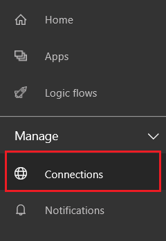
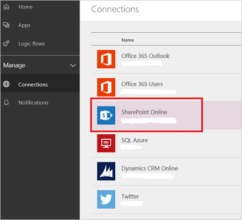
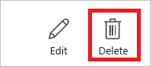

<properties
    pageTitle="Manage connections in PowerApps | Microsoft PowerApps"
    description="Add or manage connections to SharePoint, SQL, OneDrive for Business, Salesforce, Office 365, OneDrive, DropBox, Twitter, Google Drive, and more in PowerApps"
    services=""
    suite="powerapps"
    documentationCenter="na"
    authors="archnair"
    manager="erikre"
    editor=""
    tags=""/>

<tags
   ms.service="powerapps"
   ms.devlang="na"
   ms.topic="article"
   ms.tgt_pltfrm="na"
   ms.workload="na"
   ms.date="05/19/2016"
   ms.author="archanan"/>

# Manage your connections

[AZURE.VIDEO nb:cid:UUID:5bd6ea27-f8c0-41e0-a65b-34ca63a57d3e]

Connections in PowerApps allow you to easily access your data while building apps. PowerApps includes commonly-used connections, including SharePoint, SQL, Office 365, OneDrive for Business, Salesforce, Excel, Dropbox, Twitter, and more.

For example, you can use connections to:

- Update a list on a SharePoint site.
- Get Excel data from your OneDrive for Business or Dropbox account.
- Connect to Office 365 and send email.
- Create a Twitter connection to send a tweet.

You can create new connections in PowerApps in multiple scenarios, such as:

- Creating a new [app from data](get-started-create-from-data.md)

- Creating a new [app from blank](get-started-create-from-blank.md) or updating an existing app by [adding a new data source](add-data-connection.md)

- Opening an existing app that is shared with you, and creating connections required by the app

- Creating new connections at [powerapps.com][1]

> [AZURE.NOTE] To manage connections, such as deleting connections or updating connections, use [powerapps.com][1].

This topic shows you how to manage connections at [powerapps.com][1].

### What you need to get started

- Sign in to PowerApps or [powerapps.com][1].
- Create an app from a [template](get-started-test-drive.md), from [data](get-started-create-from-data.md), or from [scratch](get-started-create-from-blank.md).

## Add a new connection to PowerApps

1. In PowerApps or [powerapps.com][1], sign in with your work on organization account.

1. Select **Connections**:  
	

	> [AZURE.NOTE] When you select **Connections** in PowerApps, [PowerApps][1] automatically opens.

1. Select **Add a connection**:  

	

1. From the list of **Available connections**, select the connection you want to setup, such as SharePoint Online. Then, enter your credentials to setup the connection:  

	

1. Once the connection is setup, it's listed in **Connections**:  

	

## Delete a connection

1. Go to the **Connections** page, and select the connection you want to delete:  

	

1. In the details view of the connection, select **Delete**:  

	

## Update a connection

1. Go to the **Connections** page, and select the edit icon:  

	

2. When prompted, update your connection with new credentials.

## Summary and next steps
In this topic, you learned how to create, update, and delete connections, and authorized PowerApps to use this connection within any apps you create. Next, you can create apps using the connections you have just created.

- [Create an app from a set of data](get-started-create-from-data.md)
- [Create an app from a template](get-started-test-drive.md)
- [Add a new data source to an existing app](add-data-connection.md)

<!--Reference links in article-->
[1]: https://web.powerapps.com
