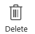

<properties
    pageTitle="Manage connections in PowerApps | Microsoft PowerApps"
    description="Add and manage connections from PowerApps to SharePoint Online, SQL Server, OneDrive for Business, Salesforce, Office 365, OneDrive, DropBox, Twitter, Google Drive, and more"
    services=""
    suite="powerapps"
    documentationCenter="na"
    authors="archnair"
    manager="erikre"
    editor=""
    tags=""/>

<tags
   ms.service="powerapps"
   ms.devlang="na"
   ms.topic="article"
   ms.tgt_pltfrm="na"
   ms.workload="na"
   ms.date="06/23/2016"
   ms.author="archanan"/>

# Manage your connections

[AZURE.VIDEO nb:cid:UUID:5bd6ea27-f8c0-41e0-a65b-34ca63a57d3e]

In [powerapps.com](https://web.powerapps.com), create a connection from PowerApps to one or more data sources, and then access that data from your app. Connect to SharePoint Online, SQL Server, Office 365, OneDrive for Business, Salesforce, Excel, and other [data sources](connections-list.md), and then use those connections as in these examples:

- Update a list on a SharePoint Online site.
- Get Excel data from your OneDrive for Business account.
- Send email in Office 365.
- Send a tweet.

In addition to creating and managing connections in [powerapps.com](https://web.powerapps.com), you can also create a connection when you perform these tasks:

- Create an [app from data](get-started-create-from-data.md).
- Update an existing app, or create one from scratch as [add a connection](add-data-connection.md) describes.
- Open an app that another user created and [shared with you](share-app.md).

**Note**: If you open PowerApps, open the **File** menu, and then click or tap **Connections**, [powerapps.com](https://web.powerapps.com) opens so that you can create and manage connections there.

**Prerequisites**

- [Sign up](signup-for-powerapps.md) for [powerapps.com](https://web.powerapps.com), and then sign in.

## Add a connection ##
1. In the left navigation bar, click or tap **Manage**, and then click or tap **Connections**.

	

1. In the upper-right corner, click or tap **New connection**, click or tap a connector in the list that appears, and then click or tap **Add connection**.

	Some connectors, such as **Microsoft Translator**, require no additional steps, and you show data from the connection immediately. Other connectors require steps such as providing credentials and specifying a particular set of data. For information about these types of connectors, see these topics:

	- [SharePoint Online](connection-sharepoint-online.md)
	- [SQL Server](connection-azure-sqldatabase.md)

The new connector appears under **Connections**, and you can [add it to an app](add-data-connection.md).

## Update or delete a connection ##
In the list of connections, click or tap the connection that you want to update or delete, and then perform either of these steps:

- To update the connection, click or tap the edit icon, and then provide credentials for that connection.

	

- To delete the connection, click or tap the delete icon.

	
