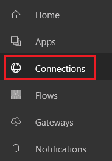

<properties
    pageTitle="Manage connections in PowerApps | Microsoft PowerApps"
    description="Add and manage connections from PowerApps to data sources such as SharePoint, SQL Server, OneDrive for Business, Salesforce, and Office 365"
    services=""
    suite="powerapps"
    documentationCenter="na"
    authors="archnair"
    manager="anneta"
    editor=""
    tags=""/>

<tags
   ms.service="powerapps"
   ms.devlang="na"
   ms.topic="article"
   ms.tgt_pltfrm="na"
   ms.workload="na"
   ms.date="10/16/2016"
   ms.author="archanan"/>

# Manage your connections in PowerApps #
In [powerapps.com](https://web.powerapps.com), create a connection from PowerApps to one or more data sources, and then access that data from your app. Connect to SharePoint, SQL Server, Office 365, OneDrive for Business, Salesforce, Excel, and other [data sources](connections-list.md), and then use those connections as in these examples:

- Update a list on a SharePoint site.
- Get Excel data from your OneDrive for Business account.
- Send email in Office 365.
- Send a tweet.

In addition to creating and managing connections in [powerapps.com](https://web.powerapps.com), you can also create a connection when you perform these tasks:

- Automatically generate an [app from data](app-from-sharepoint.md), such as a custom SharePoint list.
- Update an existing app, or create one from scratch as [add a connection](add-data-connection.md) describes.
- Open an app that another user created and [shared with you](share-app.md).

**Note**: If you open PowerApps Studio, open the **File** menu, and then click or tap **Connections**, [powerapps.com](https://web.powerapps.com) opens so that you can create and manage connections there.

**Prerequisites**

1. [Sign up](signup-for-powerapps.md) for PowerApps.
1. Sign in to [powerapps.com](https://web.powerapps.com) using the same credentials that you used to sign up.

## Add a connection ##
1. In the left navigation bar, click or tap **Manage**, and then click or tap **Connections**.

	

1. In the upper-right corner, click or tap **New connection**, click or tap a connector in the list that appears, and then follow the prompts.

	Some connectors, such as **Microsoft Translator**, require you only to click or tap the **Create** button. Other connectors prompt you to provide credentials, specify a particular set of data, or perform other steps. For example, [SharePoint](connection-sharepoint-online.md) and [SQL Server](connection-azure-sqldatabase.md) require additional information before you can use them.

The new connector appears under **Connections**, and you can [add it to an app](add-data-connection.md).

## Authorize or delete a connection ##
- In the list of connections, click or tap the connection that you want to authorize or delete, and then perform either of these steps:

	- To authorize the connection, click or tap the key icon, and then provide credentials for that connection.

	

	- To delete the connection, click or tap the trash-can icon.

	
