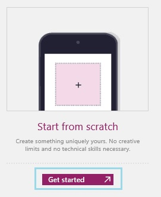

<properties
	pageTitle="Add a screen and navigate between screens | Microsoft PowerApps"
	description="In PowerApps, add a screen to an app and arrows to open one screen from another screen."
	services=""
	suite="powerapps"
	documentationCenter="na"
	authors="AFTOwen"
	manager="erikre"
	editor=""
	tags=""/>

<tags
   ms.service="powerapps"
   ms.devlang="na"
   ms.topic="article"
   ms.tgt_pltfrm="na"
   ms.workload="na"
   ms.date="10/21/2015"
   ms.author="anneta"/>

# Add a screen and navigate between screens #

Create an app with multiple screens, add ways for users to navigate between them, and manage data in your app by creating and updating one or more context variables. Store data in a context variable if a piece of information helps determine how the app appears or what it does but you don't need to retain the information after the app is closed.

**Prerequisites**

- [Sign up](signup-for-powerapps.md) for PowerApps, [install](http://aka.ms/powerappsinstall) it, open it, and then sign in by providing the same credentials that you used to sign up.
- Learn how to [configure a control](add-configure-controls.md) in PowerApps.

## Add and rename a screen ##
1. In PowerApps, select **New** in the **File** menu (near the left edge of the screen).

	

1. Leave the default option to create a phone app.

	

1. Under **Start from scratch**, select **Get Started**.

	

1. On the **Home** tab, rename the default screen by selecting **Screen1** near the left edge and then typing **Source**.

	

1. On the **Home** tab, select **New Screen** near the left edge of the ribbon.

	

	The navigation bar shows the default screen, which you renamed **Source**, and the screen that you just added.

	

1. Name the new screen **Target**.

## Add navigation ##
1. Follow the steps in the previous procedure.

1. On the **Source** screen, add a Next arrow by selecting **Shapes** on the **Insert** tab and then selecting the shape that you want to add.

	

1. (optional) Move the arrow you just added so it appears in the lower-left corner of the screen.

1. With the arrow still selected, select **Navigate** on the **Action** tab.

	

	The **OnSelect** property for the arrow is automatically set so that, when a user selects it, the **Target** screen fades in.

	

1. On the **Target** screen, add a Back arrow, and set its **OnSelect** property to this formula:

	**Navigate(Source, ScreenTransition.Fade)**

1. Open **Preview** by pressing F5, and then switch between the screens by selecting the arrows that you added.

1. Press Esc to return to the default workspace.

