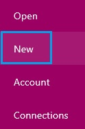
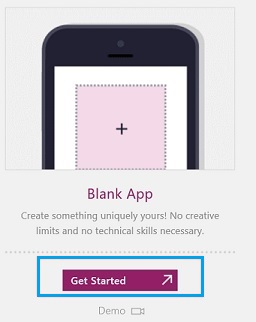
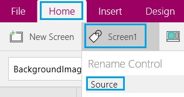
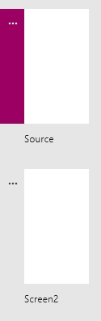
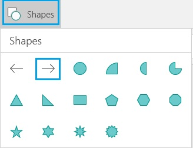

<properties
	pageTitle="Add a screen, navigation, and a context variable"
	description=""
	services="powerapps"
	authors="AFTOwen"
 />

<tags
   ms.service="powerapps"
   ms.devlang="na"
   ms.topic="article"
   ms.tgt_pltfrm="na"
   ms.workload="na"
   ms.date="10/20/2015"
   ms.author="anneta"/>

# Add a screen, navigation, and context variables #

Create an app with multiple screens, add ways for users to navigate between them, and manage data in your app by creating and updating one or more context variables. Store data in a context variable if a piece of information helps determine how the app appears or what it does but you don't need to retain the information after the app is closed.

[What is PowerApps?](http://www.kratosapps.com/en-us/tutorials)

**Prerequisites**

- Sign up for and install [PowerApps]()
- Familiarity with how to [configure a control](get-started-test-drive.md#configure-a-control) in PowerApps

## Add and rename a screen ##
1. Sign in to PowerApps, and then click **New** in the left navigation bar.

	

1. Leave the default option to create a phone app.

	

1. Under **Blank App**, click **Get Started**.

	

1. On the **Home** tab, rename the default screen by clicking **Screen1** near the left edge and then typing **Source**.

	

1. On the **Home** tab, click **New Screen** near the left edge of the ribbon.

	

	The navigation bar shows the default screen, which you renamed **Source**, and the screen that you just added.

	

1. Name the new screen **Target**.

## Add navigation ##
1. Follow the steps in the previous procedure.

1. On the **Source** screen, add a Next arrow by clicking **Shapes** on the **Insert** tab and then clicking the shape that you want to add.

	

1. (optional) Move the arrow you just added so it appears in the lower-left corner of the screen.

1. With the arrow still selected, click **Navigate** on the **Action** tab.

	

	The **OnSelect** property for the arrow is automatically set so that, when a user clicks it, the **Target** screen fades in.

	

1. On the **Target** screen, add a Back arrow, and set its **OnSelect** property to this expression:

	**Navigate(Source, ScreenTransition!Fade)**

1. Open **Preview** by pressing F5, and then switch between the screens by clicking the arrows that you added.

1. Press Esc to return to the default workspace.

## Add navigation with a context variable ##

You can use a context variable in many ways, but you'll perhaps most often use one to determine what a screen shows when you navigate to it. For example, users might click a button to add a record or update one. You can save time by configuring both buttons to open the same form but configure the form differently for either adding or updating a record.

1. Follow the steps in the previous two procedures.

1. (optional) On the **Source** screen, delete the **Next** button.

1. On the **Source** screen, add a button, configure its **Text** property to show **Add**, and set its **OnSelect** property to this expression:

	**Navigate(Target, ScreenTransition!Fade, {Mode:"Add"})**

1. On the **Source** screen, add a button, configure its **Text** property to show **Edit**, and set its **OnSelect** property to this expression:

	**Navigate(Target, ScreenTransition!Fade, {Mode:"Edit"})**

1. On the **Target** screen, add four labels, and configure their **Text** properties to show these strings:

	- **StartDay**
	- **StartTime**
	- **Staff1**
	- **Staff2**

1. Add four input-text controls, and arrange the elements so that each label appears over one input-text control.

1. Under the **StartDay** label, set the **Text** property of the input-text control to this expression:

	**If(Mode="Add", "", "Sunday")**

1. Under the **StartTime** label, set the **Text** property of the input-text control to this expression:

	**If(Mode="Add", "", "10a-noon")**

1. Under the **Staff1** label, set the **Text** property of the input-text control to this expression:

	**If(Mode="Add", "", "Kawasaki")**

1. Under the **Staff2** label, set the **Text** property of the input-text control to this expression:

	**If(Mode="Add", "", "Dubois")**

1. From the **Source** screen, press F5, and then click the **Add** button.

	The **Target** screen appears with the input-text controls blank so that you can easily add a record.

1. Click the Back arrow to return to the **Source** screen, and then click the **Edit** button.

	The **Target** screen appears with information in each input-text control so that you easily edit the record.
