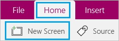
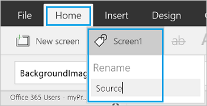
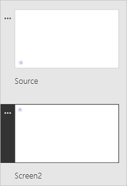
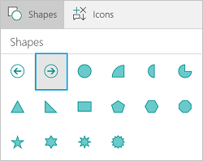

<properties
	pageTitle="Add a screen and navigate between screens | Microsoft PowerApps"
	description="Add a screen to an app and use next and back arrows to go between screens in PowerApps"
	services=""
	suite="powerapps"
	documentationCenter="na"
	authors="skjerland"
	manager="anneta"
	editor=""
	tags=""/>

<tags
   ms.service="powerapps"
   ms.devlang="na"
   ms.topic="article"
   ms.tgt_pltfrm="na"
   ms.workload="na"
   ms.date="07/10/2017"
   ms.author="sharik"/>

# Add a screen and navigate between screens #
Create an app with multiple screens, and add ways for users to navigate between them.

## Prerequisites ##
- Learn how to [configure a control](add-configure-controls.md).
- Create or open an app.

## Add and rename a screen ##
1. On the **Home** tab, click or tap **New screen**.

	

1. In the right-hand pane, click or tap the name of the screen (just above the **Properties** tab), and then type the new name **Source**.

	

1. Add another screen, and name it **Target**.

	

## Add navigation ##
1. With the **Source** screen selected, open the **Insert** tab, click or tap **Icons**, and then click or tap **Next arrow**.  

	

1. (optional) Move the arrow so that it appears in the lower-right corner of the screen.

1. With the arrow still selected, click or tap the **Action** tab, and then click or tap **Navigate**.

	The **[OnSelect](controls/properties-core.md)** property for the arrow is automatically set to a **Navigate** function.  

	

	When a user clicks or taps the arrow, the **Target** screen fades in.

1. On the **Target** screen, add a **Back arrow**, and set its **[OnSelect](controls/properties-core.md)** property to this formula:
 **Navigate(Source, ScreenTransition.Fade)**

1. Open Preview mode ( or press F5), and then switch between the screens by clicking or tapping the arrows that you added.

1. Press **Esc** to return to the default workspace.
