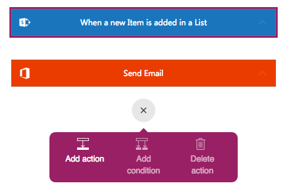
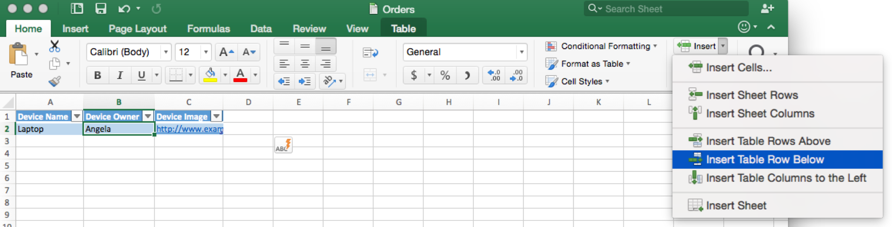
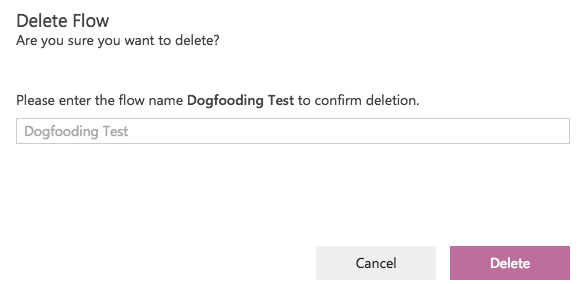

<properties
    pageTitle="Edit a PowerFlow"
    description="Edit a PowerFlow to use advanced parameters."
    services="powerapps"
    authors="aftowen"
 />

<tags
   ms.service="powerapps"
   ms.devlang="na"
   ms.topic="article"
   ms.tgt_pltfrm="na"
   ms.workload="na"
   ms.date="10/19/2015"
   ms.author="anneta"/>

# Edit a PowerFlow #
Add an advanced parameter to a PowerFlow.

**Prerequisites**

- [Create a PowerFlow](get-started-powerflow.md)

## Edit advanced parameters

1. In Chrome, open [the PowerApps portal](https://portal.kratosapps.com/), and then click **Flows** in the left navigation bar.

2. In the list of PowerFlows, find the PowerFlow that you want to edit, and then click the edit icon, which looks like a pencil, next to it.

3. Near the bottom of the **Send email** form, click the **...** icon to show advanced parameters.

    

4. In the **Importance** list, click **High**, and then click the **...** icon again to hide the advanced parameters.

6. Near the bottom of the screen, click **Done** to save your change.

    

## Add steps ##

In this procedure, you'll add an action in the middle of the flow. This action will save a file in your Dropbox, archiving the item in the list.

1. In your PowerFlow, click down arrows in the title bar of the trigger and the action to collapse them.

    

1. Click the **SharePoint** action to select it, click the "+" button, and then click **Add action**.

    

  An action is inserted between the trigger and the **Send email** step.

3. In the list of possible actions, search for **Create file**, and then click **Dropbox - Create File**.

1. If prompted, provide your Dropbox credentials.

4. In the form that appears, type or paste a path to a folder, or type a forward slash (**/**) to create files in the root of your account.

5. Give the file a name. To ensure that each file is specific to a list item, click a placeholder. (Otherwise each new file will override the existing one.)

6. Add whatever content you want in the file, selecting as many placeholders as you want, and then click **Done**.

    

8. To test the flow:
  1. Open the list in SharePoint Online and, on the main page for the list, click **new item**.

    

  1. Specify data in each field of the list item, and then click **Save**.

    Within a minute, you should see a new file in your Dropbox account.

## Delete your PowerFlow ##

Delete a PowerFlow from the portal if you're done with that PowerFlow and no longer want to get notifications from it.
1. Open PowerApps, and then click **Flows** in the right navigation.

2. In the list of PowerFlows, click the delete icon, which looks like a trash can, next to the PowerFlow that you created in the previous procedure.

    

3. In the confirmation dialog box, type the full name of your PowerFlow into the text box, and then click **Delete**.
