<properties
   pageTitle="Create an app to manage data from Dynamics CRM Online | Microsoft PowerApps"
   description="Create an app to manage data, such as account information, from Dynamics CRM Online"
   services=""
   suite="powerapps"
   documentationCenter="na"
   authors="aftowen"
   manager="dwrede"
   editor=""
   tags=""/>

<tags
   ms.service="powerapps"
   ms.devlang="na"
   ms.topic="article"
   ms.tgt_pltfrm="na"
   ms.workload="na"
   ms.date="01/26/2016"
   ms.author="anneta"/>

# Create an app to manage data from Dynamics CRM Online #

Create an app for adding, updating, and deleting data about your customers and other information in Dynamics CRM Online. Connect to your account, create the app automatically, and then specify which data you want to show. Test the app by displaying, sorting, filtering, and updating data.

**Prerequisites**

1. Install [PowerApps](http://aka.ms/powerappsinstall) on a tablet, a laptop, or a desktop computer that's running Windows.
1. Open PowerApps.
1. Sign in for the first time by selecting the arrow near the lower-right corner to advance through the welcome screens and then providing your credentials.

## Create an app ##
1. On the **File** menu, select **New**, and then select **Get started** under **Start from your data**.

	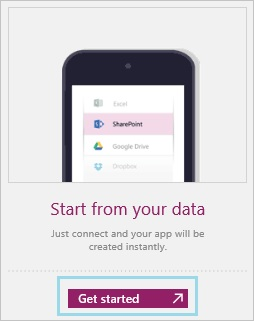

1. If you haven't already connected from PowerApps to your Dynamics CRM Online account, perform the following steps:

	1. Select **Available connections**, select **Dynamics CRM Online**, and then select **Connect**.

		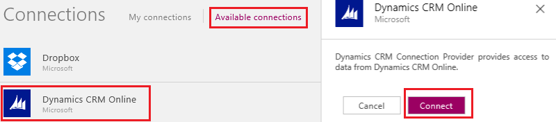

	1. Provide your credentials.

1. Under **Select a data set**, select the appropriate option for this app.

1. Under **Select a table**, select the appropriate option for this app (such as **Accounts**), and then select **Connect**.

	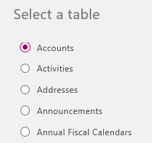

	The app is created with a default interface, which includes a screen for browsing data, a screen for showing details, and a screen for creating and editing data. As this graphic shows, the screen for browsing data needs some configuration to be useful.

	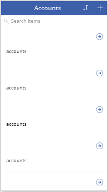

1. In the **Layout** tab of the **Quick tools** pane, select a layout that can highlight the types of data that you want to show.

	For example, select a layout that can show three strings of text in different sizes.

	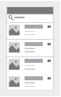

1. In the **Content** tab of the **Quick tools** pane, select the data that you want to show in each element. For example:

	- In the **Body1** list, select **websiteurl**.
	- In the **Heading1** list, select **accountnumber**.
	- In the **Subtitle1** list, select **name**.

	The browse screen of the app reflects your changes.

	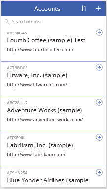

1. Select any item in the list except the first one, and then copy and paste this formula into the formula bar, which is to the right of the **fx** button:

	**Sort(If(IsBlank(TextSearchBox1!Text), Accounts, Filter(Accounts, TextSearchBox1!Text in Text(name))), name, If(SortDescending1, Descending, Ascending))**

	The data is sorted by the names of the accounts.

	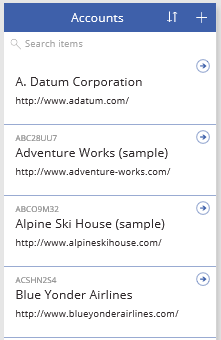

## Test the app ##
1. Press F5, and then select the sort icon multiple times.

	

 	The data is sorted in ascending or descending order by name, depending on how many times you selected the sort icon.

1. In the search box, type at least part of an account name.

	The screen shows only those accounts for which the name contains the text that you type, regardless of case.

	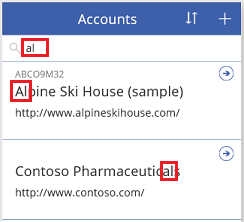

1. In the upper-right corner, select the plus icon.

	

	A screen appears in which you can specify a new account.

	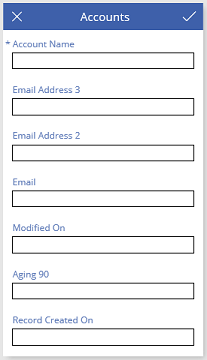

	- To save your changes and return to the browse screen, select the checkmark in the upper-right corner, and then select the back arrow in the upper-left corner.
	- To cancel your changes and return to the browse screen, select the close icon in the upper-left corner.

1. In the browse screen, select the arrow next to any account.

	

	The details screen shows more information about that account.

	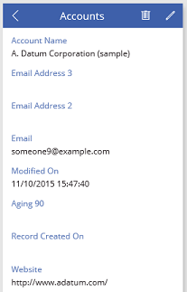

1. Select the pencil icon in the upper-right corner of the details screen.

	

	A screen appears in which you can edit the information about that account.

	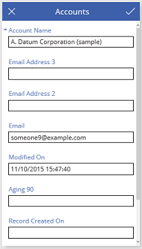

	- To save your changes and return to the browse screen, select the checkmark in the upper-right corner, and then select the back arrow in the upper-left corner.
	- To cancel your changes and return to the browse screen, select the close icon in the upper-left corner.

## Next steps ##
- Customize the default app by performing one or more of these tasks:
	- [add and configure controls](get-started-test-drive.md#configure-a-control)
	- [add a screen](add-screen-context-variables.md)
	- [build a formula](formula-reference.md)
- [Share the app](share-app.md) with others in your organization
