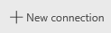
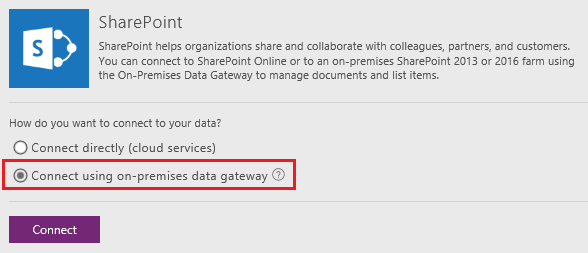

<properties
   pageTitle="Generate an app to manage data in a SharePoint list | Microsoft PowerApps"
   description="Generate a three-screen app to manage data in a SharePoint list, whether the site is on-premises or in the cloud."
   services=""
   suite="powerapps"
   documentationCenter="na"
   authors="aftowen"
   manager="erikre"
   editor=""
   tags=""/>

<tags
   ms.service="powerapps"
   ms.devlang="na"
   ms.topic="article"
   ms.tgt_pltfrm="na"
   ms.workload="na"
   ms.date="09/03/2016"
   ms.author="anneta"/>

# Generate an app to manage data in a SharePoint list #
In PowerApps, generate a three-screen app automatically to manage data in a SharePoint list, whether the site is on-premises or in the cloud.

If you're unfamiliar with PowerApps, see [Introduction to PowerApps](getting-started.md).

As of this writing, PowerApps supports lists but not libraries. In addition, you can show data in some types of columns, such as **Choice** and **Picture**, but you can't update that data. For more information, see [Known issues](connection-sharepoint-online.md#known-issues).

## Open PowerApps ##
If you haven't already, [sign up for PowerApps](signup-for-powerapps.md), and then open PowerApps in *either* of these ways:

- [Install PowerApps Studio for Windows](http://aka.ms/powerappsinstall), open it, and then sign in using the same credentials that you used to sign up. Near the left edge, click or tap **New**.

	

- [Open PowerApps Studio for the web](https://create.powerapps.com/api/start) in a browser.

	For a list of supported browsers and limitations in the preview release of PowerApps Studio for the web, see [Create or edit apps in a browser](create-app-browser.md).

## Specify a connection to SharePoint ##
1. If the SharePoint tile appears under **Create an app from your data**, click or tap **Phone layout**. Otherwise, skip to the next step.

1. Under **Create an app from your data**, click or tap the arrow to the right of the row of tiles.

	

1. Above the list of connectors, click or tap **New connection**.

	

1. Click or tap the **SharePoint** tile.

	

1. If you already have a connection to SharePoint, skip to the next procedure.

## Specify the type of SharePoint site ##
1. To connect to a SharePoint Online site, click or tap **Connect directly (cloud services)**, click or tap **Connect**, and then skip to the next procedure.

	

1. To connect to an on-premises SharePoint site, click or tap **Connect using on-premises data gateway**.

	

1. Specify **Windows** as the authentication type, and then specify your credentials. (If your credentials include a domain name, specify it as *domain\alias*.)

	

	**Note**: If you don't have an on-premises data gateway installed, [install one](gateway-reference.md), and then click or tap the icon to refresh the list of gateways.

1. Under **Choose a gateway**, click or tap the gateway that you want to use.

	

1. Click or tap **Connect**.

## Specify a site and a list ##

1. Under **Connect to a SharePoint site**, type or paste the URL to the site that contains the list that you want to use, and then click or tap **Go**.

	**Note**: Don't include a specific list in the URL.

	

1. Under **Choose a list**, click or tap the name of the list that you want to use.

	

	In the search box, you can type or paste at least one letter to show only those lists of which their names contain the letter or letters that you specify. You can also click or tap the sort-order icon to toggle between sorting the list in ascending or descending order.

	

1. Click or tap **Connect**.

## Next steps ##
If you haven't used PowerApps before, take the intro tour (or click or tap **Skip**).

You can always take the intro tour later by clicking or tapping the question-mark icon near the upper-right corner and then clicking or tapping **Take the intro tour**.

By default, every generated app has a screen for browsing records, a screen for showing details of a record, and a screen for creating or updating records. Heuristics suggest the best layout and content for each screen based on the types of columns in the SharePoint list, but you'll probably need to customize them to suit your needs.

- To customize the browse screen (which appears by default), see [Customize a gallery](customize-layout-sharepoint.md).
- To customize the details or edit screens, see [Customize a form](customize-form-sharepoint.md).
