<properties
   pageTitle="Create an app to manage data from SharePoint Online | Microsoft PowerApps"
   description="Create an app to manage data, such as account information, from SharePoint Online"
   services=""
   suite="powerapps"
   documentationCenter="na"
   authors="jamesol-msft"
   manager="darshand"
   editor=""
   tags=""/>

<tags
   ms.service="powerapps"
   ms.devlang="na"
   ms.topic="article"
   ms.tgt_pltfrm="na"
   ms.workload="na"
   ms.date="05/03/2016"
   ms.author="jamesol"/>

# Create an app to manage data from SharePoint Online #

Create an app for adding, updating, and deleting data in a SharePoint list. Specify the list, create the app automatically, and then specify which data you want to show. Test the app by displaying, sorting, filtering, and updating data.

For information about the types of SharePoint data from which you can create an app and other details/limitations, see [Common issues and resolutions](common-issues-and-resolutions.md#create-an-app-from-sharepoint).

## Prerequisites

- [Sign up](signup-for-powerapps.md) for PowerApps and [install](http://aka.ms/powerappsinstall) PowerApps. When you open PowerApps, sign in using the same credentials that you used to sign up.

## Create an app ##
1. In PowerApps, select **New** (near the left edge of the screen).  

	

2. Under **Create an app from your data**, select Phone layout on the **SharePoint Online** tile.  

	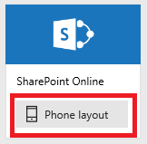

3. If you haven't connected to SharePoint Online before, select **Connect** when prompted, and then provide your credentials.  

	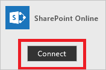

4. Under **Connect to a SharePoint site**, type or paste the URL of the SharePoint site that you want to use, and then select **Go**.  

	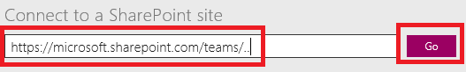

5. Under **Choose a list**, select the list that you want to use and then select **Connect**.  

	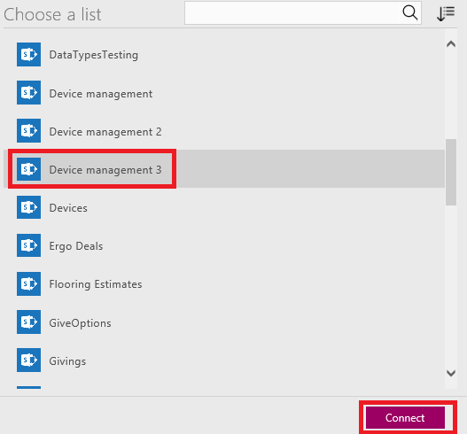

	Here are the columns of the SharePoint Online custom list that is used for the examples in this article:  
	

	PowerApps builds an app that has three screens:  
	<!-- **Edit form** control add-form.md -->

	- **BrowseScreen1** shows a list of all items and some information about the items, so that users can easily browse for the item they want.  
	- **DetailScreen1** shows all information about a single item.  
	- **EditScreen1** provides an **[Edit form](add-form.md)** control for adding an item or updating information about an item.  

## Customize the app ##
When an app is built automatically, heuristics suggest the best layout and content based on the data. You might need to change the app for your needs.

1. If you haven't used PowerApps before, take the intro tour by reading each description before selecting **Next** (and then selecting **Done**), or select **Skip**.

2. On the **Home** tab of the ribbon, select **Layouts**, and then select an option that includes images.  

	

	The layout of **BrowseScreen1** changes to reflect your selection.  

	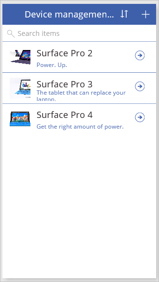

	**Note**: If you open the **Layout** tab with **DetailScreen1** or **EditScreen1** showing, you can choose different options, which reflect the data on that screen.

3. In the list of thumbnails, select **DetailScreen1**.  
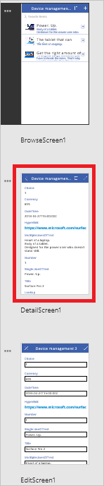

4. Select a field on the screen that you want to customize.  
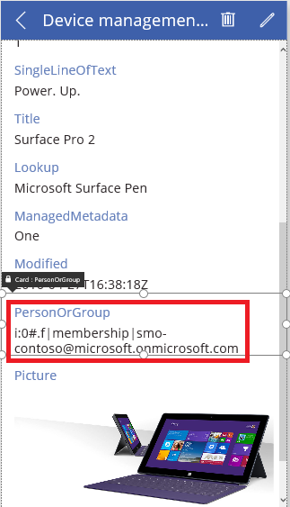

5. In the right-hand pane, use the card selector to change the control that's used to display this field in the **DetailsScreen1**.  
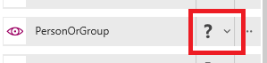  

	For information about which types of column support which types of cards, see [Common issues and resolutions](common-issues-and-resolutions.md#create-an-app-automatically-from-sharepoint).

6. If you select the **View lookup** card for a field, then you have the option to choose which property of the field is displayed in the card. To do so, select the **Ellipsis** next to the field in the right-hand pane and select **Advanced options**.  
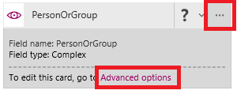

7. In the **Data** section, select the property of the field you want to be displayed using the **Value** dropdown.  
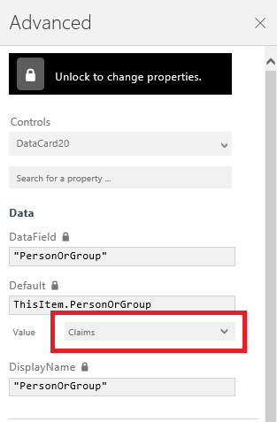

## Run the app ##
As you customize the app, you can test your changes by running the app in **Preview** mode.

1. In the list of thumbnails, select **BrowseScreen1**, and then open preview by selecting the **Preview** icon near the upper-right corner (or by pressing **F5**).  

	

2. On **BrowseScreen1**, select the arrow for a record to show details about that record.  

	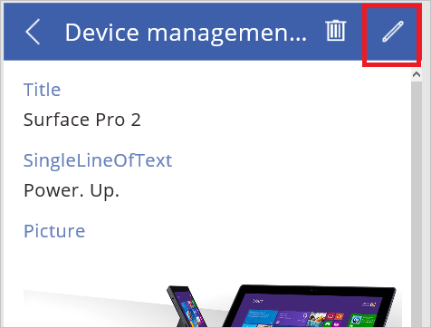

3. On **DetailsScreen1**, select the edit icon (in the upper-right corner) to edit the record.  

	

4. On **EditScreen1**, change the information in one or more fields, and then select the check mark in the upper-right corner to save your changes.  

	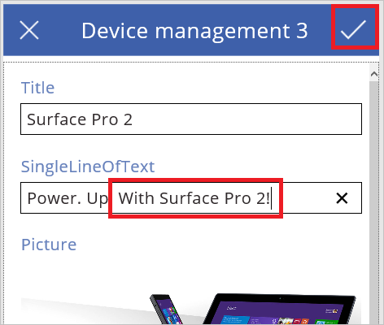

5. Editing the item in the app will update the record in the SharePoint Online list.  

	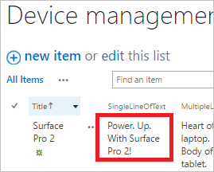

## Next steps ##
- Press Ctrl-S to save your app so that you can run it from other devices.
- Customize your app further, as [Create an app from scratch](get-started-create-from-blank.md) describes.
- [Share the app](share-app.md) so that other people can run it.
