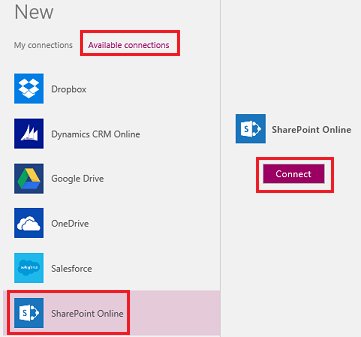
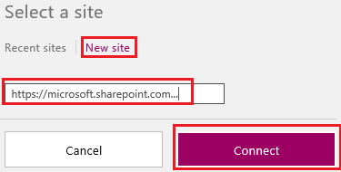
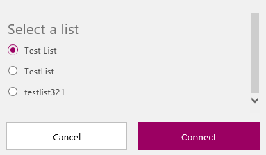
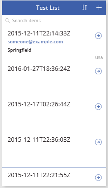
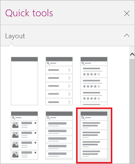
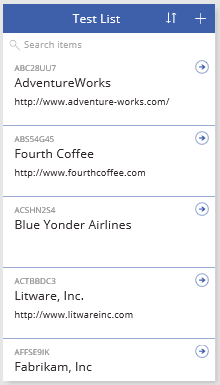
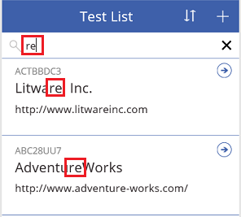
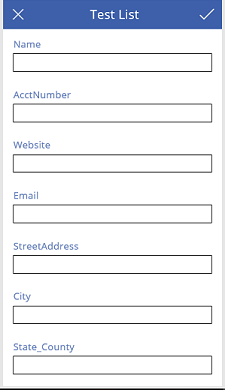
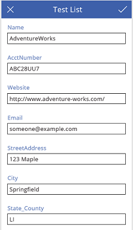

<properties
   pageTitle="Create an app to manage data from SharePoint Online | Microsoft PowerApps"
   description="Create an app to manage data, such as account information, from SharePoint Online"
   services=""
   suite="powerapps"
   documentationCenter="na"
   authors="aftowen"
   manager="dwrede"
   editor=""
   tags=""/>

<tags
   ms.service="powerapps"
   ms.devlang="na"
   ms.topic="article"
   ms.tgt_pltfrm="na"
   ms.workload="na"
   ms.date="02/10/2016"
   ms.author="anneta"/>

# Create an app to manage data from SharePoint Online #

Create an app for adding, updating, and deleting data in a SharePoint list. Specify the list, create the app automatically, and then specify which data you want to show. Test the app by displaying, sorting, filtering, and updating data.

**Prerequisites**

- [Sign up](signup-for-powerapps.md) for PowerApps, [install](http://aka.ms/powerappsinstall) it, open it, and then sign in by providing the same credentials that you used to sign up.

## Create an app ##
1. On the **File** menu, select **New**, and then select **Get started** under **Start from your data**.

	

1. Select **Available connections**, select **SharePoint Online**, and then select **Connect**.

	

1. Provide your credentials.

1. Under **Select a site**, select **New site**, type or paste the URL of the SharePoint site that you want to use, and then select **Connect**.

	

1. Under **Select a list**, select the list that you want to use (such as **Test List**), and then select **Connect**.

	

	The app is created with a default interface, which includes a screen for browsing data, a screen for showing details, and a screen for creating and editing data. As this graphic shows, the screen for browsing data might need some configuration to be useful.

	

1. In the **Layout** tab of the **Quick tools** pane, select a layout that can highlight the types of data that you want to show.

	For example, select a layout that can show three strings of text in different sizes.

	

1. In the **Content** tab of the **Quick tools** pane, select the type of data that you want to show in each element. For example:

	- In the first list, select **Website**.
	- In the second list, select **AcctNumber**.
	- In the third list, select **Name**.

	The browse screen of the app reflects your changes.

	

	**Note:** By default, you can scroll through the list (called a gallery) by using a mousewheel or by swiping up and down. To show the scrollbar, [set the gallery's **ShowScrollbar** property](get-started-test-drive.md#configure-a-control) to **true**.

1. Select any item in the list except the first one to select the list, which is called a gallery.

	A selection box appears around the gallery.

1. Copy this formula, and paste it into the formula bar (to the right of the **fx** button).

	**Sort(If(IsBlank(TextSearchBox1!Text),** *ListName*, **Filter(** *ListName*, **TextSearchBox1!Text in Text(** *ColumnName* **))),** *ColumnName*, **If(SortDescending1, Descending, Ascending))**

1. Replace *ListName* with the name of your list and *ColumnName* with the name of the column by which you want to sort, filter, or both.

	For example, use this formula if your list is named **Test List**, and you want to sort or filter by the **Name** column:

	**Sort(If(IsBlank(TextSearchBox1!Text), 'Test List', Filter('Test List', TextSearchBox1!Text in Text(Name))), Name, If(SortDescending1, Descending, Ascending))**

	The data is sorted by the names of the accounts.

## Test the app ##
1. Press F5, and then select the sort icon multiple times.

	

 	The data is sorted in ascending or descending order, depending on how many times you selected the sort icon.

1. In the search box, type at least part of an entry in the column that you specified for sorting and filtering.

	For example, type part of an account name if you specified **Name** in the last step of the previous procedure.

	The screen shows only those accounts for which the name contains the text that you type, regardless of case.

	

1. In the upper-right corner, select the plus icon.

	

	A screen appears in which you can specify a new account.

	

	- To save your changes and return to the browse screen, select the checkmark in the upper-right corner, and then select the back arrow in the upper-left corner.
	- To cancel your changes and return to the browse screen, select the close icon in the upper-left corner.

1. In the browse screen, select the arrow next to any account.

	

	The details screen shows more information about that account.

	

1. Select the pencil icon in the upper-right corner of the details screen.

	

	A screen appears in which you can edit the information about that account.

	

	- To save your changes and return to the browse screen, select the checkmark in the upper-right corner, and then select the back arrow in the upper-left corner.
	- To cancel your changes and return to the browse screen, select the close icon in the upper-left corner.

1. Press Esc to return to the default workspace.

## Next steps ##
- Customize the default app by performing one or more of these tasks:
	- [add and configure controls](get-started-test-drive.md#configure-a-control)
	- [add a screen](add-screen-context-variables.md)
	- [build a formula](formula-reference.md)
- [Share the app](share-app.md) with others in your organization
