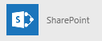
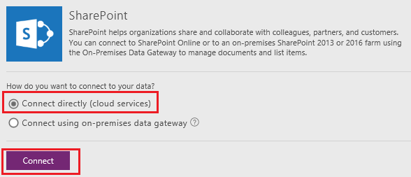
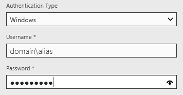
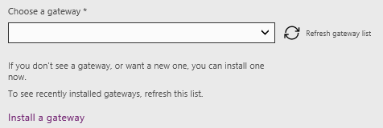

<properties
   pageTitle="Create an app to manage data from SharePoint | Microsoft PowerApps"
   description="Create an app to manage data, such as account information, from SharePoint"
   services=""
   suite="powerapps"
   documentationCenter="na"
   authors="jamesol-msft"
   manager="erikre"
   editor=""
   tags=""/>

<tags
   ms.service="powerapps"
   ms.devlang="na"
   ms.topic="article"
   ms.tgt_pltfrm="na"
   ms.workload="na"
   ms.date="07/30/2016"
   ms.author="jamesol"/>

# Create an app to manage data from SharePoint #
Create an app for adding, updating, and deleting data in a SharePoint list. Specify the list, create the app automatically, customize the app, and then test it by updating an item in the list.

**Prerequisites**

- [Sign up](signup-for-powerapps.md) for PowerApps, [install](http://aka.ms/powerappsinstall) it, open it, and then sign in by providing the same credentials that you used to sign up.

	This topic was written for PowerApps Studio, but the steps are similar if you [open PowerApps in a browser](create-app-browser.md).

As of this writing, PowerApps supports lists but not libraries. In addition, you can show data in some types of columns, such as **Choice** and **Picture**, but you can't update that data. For more information, see [Known issues](connection-sharepoint-online.md#known-issues).

The list in this tutorial contains these columns:  

## Create an app ##
1. In PowerApps, click or tap **New** (near the left edge of the screen).

	

1. Under **Create an app from your data**, click or tap the arrow to the right of the row of tiles.

	

1. Above the list of connectors, click or tap **New connection**, and then click or tap the **SharePoint** tile.

	

1. Specify the type of site to which you want to connect:

	

	- Click or tap **Connect directly (cloud services)** to connect to SharePoint Online, and then skip to step 5.

	- Click or tap **Connect using on-premises data gateway** to connect to an on-premises SharePoint site.

		Specify **Windows** as the authentication type, and then specify your credentials. (If your credentials include a domain name, specify it as *domain\alias*.)

		

		**Note**: If you don't have an on-premises data gateway installed, [install one](gateway-reference.md), and then click or tap the icon to refresh the list of gateways.

		Under **Choose a gateway**, click or tap the gateway that you want to use.

		

1. Click or tap **Connect**.

1. Under **Connect to a SharePoint site**, type or paste the URL to the site that contains the list that you want to use, and then click or tap **Go**.

	**Note**: Don't include a specific list in the URL.

	

1. Under **Choose a list**, click or tap the name of the list that you want to use.

	

	In the search box, you can type or paste at least one letter to show only those lists of which their names contain the letter or letters that you specify. You can also click or tap the sort-order icon to toggle between sorting the list in ascending or descending order.

	

1. Click or tap **Connect**.

PowerApps builds an app that has three screens:  

- In **BrowseScreen1**, users can easily browse through all items in a **[Gallery](control-gallery.md)** control.  
- In **DetailScreen1**, users can view all information about a specific item in a **[Display form](edit-form.md)** control.  
- In **EditScreen1**, users can add or update an item in an **[Edit form](edit-form.md)** control.  

## Customize the app ##
When PowerApps builds an app automatically, heuristics suggest the best layout and content based on the data. You might need to change the app for your needs.

1. If you haven't used PowerApps before, take the intro tour (or click or tap **Skip**).

	

	You can always take the intro tour later by clicking or tapping the question-mark icon near the upper-right corner and then clicking or tapping **Take the intro tour**.

1. In the right-hand pane, click or tap a layout that suits your data. (To follow this topic exactly, use the layout that's highlighted in this graphic.)

	**Note**: If the **DetailScreen1** or **EditScreen1** is selected, the **Layout** tab offers different options, which reflect the types of data that you can show on that screen.

	

	The layout of **BrowseScreen1** changes to reflect your selection.  

	

1. Click or tap any control, such as the **Image** control, in the first item of the gallery.

	

1. In the right-hand pane, specify the data that you want to show in each control. In this example, the upper text box now shows the title instead of the multiple-line description.

	

	The screen changes to reflect your selections.

	

1. In the left navigation bar, click or tap the middle thumbnail to select **DetailsScreen1**.

	

1. Click or tap any field in that screen to show the form-customization options in the right-hand pane.

	

1. In the right-hand pane, click or tap the eye icon for each card to show or hide it in the app.

	

1. Change the order in which the cards appear by clicking or tapping a card to select it and then dragging its title bar up or down.

	

## Run the app ##
As you customize the app, you can test your changes by running the app in **Preview** mode, as the steps in this section demonstrate.

1. In the left navigation bar, click or tap the top thumbnail to select **BrowseScreen1**.

1. Open Preview mode by pressing F5 (or by selecting the **Preview** icon near the upper-right corner).  

	

2. On **BrowseScreen1**, click or tap the arrow for an item to show details about that item.  

	

3. On **DetailsScreen1**, click or tap the edit icon (in the upper-right corner) to edit the record.  

	

4. On **EditScreen1**, change the information in one or more fields, and then click or tap the check mark in the upper-right corner to save your changes back to the SharePoint list.  

	

## Next steps ##
- Press Ctrl-S to save your app so that you can run it from other devices.
- [Customize one or more cards](customize-card.md) (for example, to change the control in which a type of data appears).
- [Share the app](share-app.md) so that other people can run it.
