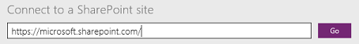
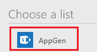
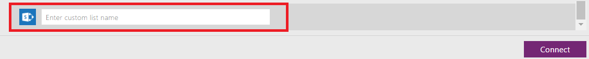

<properties
	pageTitle="Generate an app to manage data in a SharePoint list | Microsoft PowerApps"
	description="Generate a three-screen app to manage data in a SharePoint list, whether the site is on-premises or in the cloud."
	services=""
	suite="powerapps"
	documentationCenter="na"
	authors="skjerland"
	manager="anneta"
	editor=""
	tags=""/>

<tags
	ms.service="powerapps"
	ms.devlang="na"
	ms.topic="article"
	ms.tgt_pltfrm="na"
	ms.workload="na"
	ms.date="06/05/2017"
	ms.author="sharik"/>

# Generate an app to manage data in a SharePoint list #

[AZURE.VIDEO nb:cid:UUID:34ccfd46-7826-49ce-90d8-cf6a144b6968]

In PowerApps, generate a three-screen app automatically to manage data in a SharePoint list, whether the site is on-premises or in the cloud.

By default, every generated app has a screen for browsing records, a screen for showing details of a record, and a screen for creating or updating records. The initial layout and content for each screen is automatically determined, but you'll probably need to customize the app to suit your needs.

If you're unfamiliar with PowerApps, see [Introduction to PowerApps](getting-started.md).

As of this writing, PowerApps supports custom lists but not libraries. In addition, you can show data in some types of columns, such as **Choice** and **Picture**, but you can't update that data. For more information, see [Known issues](connection-sharepoint-online.md#known-issues).

**Note:** If any column name contains a space, PowerApps will show it as **"\_x0020\_"**. For example **"Column Name"** will display as **"Column_x0020_Name"**.

## Specify a SharePoint app ##
1. If you haven't already created a [connection to SharePoint](connect-to-sharepoint.md), create one.

1. Open PowerApps in *either* of these ways:

	- [Install PowerApps Studio for Windows](http://aka.ms/powerappsinstall), open it, and then sign in using the same credentials that you used to sign up. Near the left edge, click or tap **New**.

		

	- [Open PowerApps Studio for the web](https://create.powerapps.com/api/start) in a browser.

		For a list of supported browsers and limitations in the preview release of PowerApps Studio for the web, see [Create or edit apps in a browser](create-app-browser.md).

1. Under **Start with your data**, click or tap **Phone layout** on the SharePoint tile.

	

## Specify a site and a list ##
1. Under **Connect to a SharePoint site**, type or paste the URL to the site that contains the list that you want to use, and then click or tap **Go**.

	**Note**: Don't include a specific list in the URL.

	

2. Under **Choose a list**, click or tap the name of the list that you want to use.

	You can sort the list names alphabetically by clicking or tapping the sort button.

	

	You can also type or paste at least one letter in the search box to show only those list names that contain the text that you specify.

	

	Not all types of lists appear by default. If the name of the list that you want to use doesn't appear, scroll to the bottom, and then type the list name in the box that contains **Enter custom list name**.

	

3. Click or tap **Connect** to generate the app.

	

4. If you're prompted to take the intro tour, click or tap **Next** to get familiar with key areas of the PowerApps interface (or click or tap **Skip**).

	

	You can always take the tour later by clicking or tapping the question-mark icon near the upper-right corner and then clicking or tapping **Take the intro tour**.

## Next steps ##
- To save the app that you've just generated, press Ctrl-S.
- To customize the browse screen (which appears by default), see [Customize a layout](customize-layout-sharepoint.md).
- To customize the details or edit screens, see [Customize a form](customize-forms-sharepoint.md).
