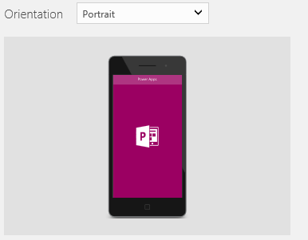
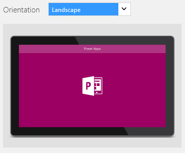

<properties
	pageTitle="Change app settings | Microsoft PowerApps"
	description="Step-by-step instructions for changing settings such as the screen size and orientation, the app name, and the app icon"
	services=""
	suite="powerapps"
	documentationCenter="na"
	authors="AFTOwen"
	manager="dwrede"
	editor=""
	tags=""/>

<tags
   ms.service="powerapps"
   ms.devlang="na"
   ms.topic="article"
   ms.tgt_pltfrm="na"
   ms.workload="na"
   ms.date="01/21/2015"
   ms.author="anneta"/>

# Change app settings in PowerApps #
Customize an app by changing its name, its tile, its screen size, its screen orientation, or any combination of these settings.

**Prerequisites**

1. [Create an app](quick-tour-other.md) in PowerApps, and then open it on a tablet, a laptop or a desktop computer that's running PowerApps.
1. On the **File** menu, select **App settings**.

## Rename an app ##
- Under **App name**, select **Rename this app**, and then type a different name.

	

## Change an app tile ##
Follow one or more of these steps:

- Select a different background color from the list of options.

	

- Select an icon from the list of default icons.

	

- Select **Browse file**, select the image that you want to use, and then select **Open**.

## Change screen size and orientation ##
1. Under **App settings**, select **Screen size + orientation**.

	

1. For a phone app, follow any of these steps:
	- In the **Orientation** list, select either **Portrait** or **Landscape**.

	

	- Under **Lock aspect ratio**, specify either **On** or **Off**.

		If you lock the aspect ratio, the app will retain the appropriate aspect ratio for an iPhone. If the app is running on another kind of device, the app will display incorrectly and may show undesirable results. If you unlock the aspect ratio, the app will adjust to the aspect ratio of the device on which it's running.
1. For a tablet app, follow any of these steps:
	- In the **Orientation** list, select either **Portrait** or **Landscape**.

	

	- Under **Aspect ratio**, select the ratio that matches the target device for this app.

	

	- Under **Lock aspect ratio**, specify either **On** or **Off**.

		If you lock the app's aspect ratio, the app will retain the aspect ratio that you specify. If the app is running on a device that has a different aspect ratio, the app will display incorrectly and may show undesirable results. If you unlock the aspect ratio, the app will adjust to the aspect ratio of the device on which it's running.

	- Under **Lock orientation**, specify either **On** or **Off**.

		If you lock the app's orientation, the app will retain the orientation that you specify. If the app is running on a device for which the screen is in a different orientation, the app will display incorrectly and may show undesirable results. If you unlock the app's orientation, it will adjust to the screen orientation of the device on which it's running.

1. Select **Apply** to save your changes.

## Next step #
On the **File** menu, select **Save** to republish your app with the new settings.
