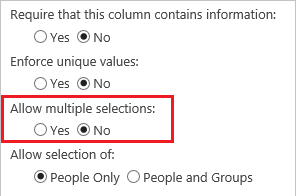

<properties
	pageTitle="Common issues and resolutions | Microsoft PowerApps"
	description="Read about PowerApps issues and resolutions"
	services=""
	suite="powerapps"
	documentationCenter="na"
	authors="AFTOwen"
	manager="erikre"
	editor=""
	tags=""/>

<tags
   ms.service="powerapps"
   ms.devlang="na"
   ms.topic="article"
   ms.tgt_pltfrm="na"
   ms.workload="na"
   ms.date="06/10/2016"
   ms.author="anneta"/>

# Common issues and resolutions

## Create any app

1.  **When PowerApps generates an app from data, the field used for sorting and searching isn't automatically configured** (as of release 2.0.410).

	To configure this field, edit the **[Items](controls/properties-core.md)** formula for the gallery, as the sections for filtering and sorting in [Add a gallery](add-gallery.md) describe.

1. **For apps that are created from data, only the first 500 records of a data source can be accessed**  (as of release 2.0.410).

	In general, PowerApps works with any size data source by delegating operations to the data source. For operations that can't be delegated, PowerApps will give a warning at authoring time and operate on only the first 500 records of the data source.  See the [Filter function](functions/function-filter-lookup.md) article for more details about delegation.  

	As of this writing, delegation doesn't support **[Filter](functions/function-filter-lookup.md)** and **[Sort](functions/function-sort.md)** functions used together, nor does it support the **[In](functions/operators.md#in-and-exactin-operators)** operator. These features are used by apps that are created from data, so these apps are limited to the first 500 records. To partially work around this issue, you can remove one or both of the Filter and Sort functions from the gallery's **[Items](controls/properties-core.md)** property.

## Create an app automatically from Excel

1. **Excel data must be formatted as a table** (as of release 2.0.410).

	If **Data type unsupported** or **Not formatted as a table** appears when you try to use an Excel connection in your app, [format the data as a table](https://support.office.com/article/Format-an-Excel-table-6789619F-C889-495C-99C2-2F971C0E2370) by following these steps:

	1. Open the Excel file, and then select any cell in the data that you want to use.
	1. On the **Insert** tab, select **Table**.
	1. In the **Save as Table** dialog box, select the **My table has headers** checkbox, and then select **OK**.
	1. Save your changes.

## Create an app automatically from SharePoint

1. **You can create an app from a SharePoint Online custom list but not a document library** (as of release 2.0.410).

	Support for document libraries is expected soon.

1. **Not all column types are supported** (as of release 2.0.410 unless otherwise stated).

	| Column type | Support |
|---|---|
| Single line of text | Yes |
| Multiple lines of text | Yes |
| Choice | Yes (read-only) |
| Number | Yes |
| Currency | Yes |
| Date and Time | Yes |
| Lookup | Yes (as of release 2.0.440) |
| Boolean (Yes/No) | Yes |
| Person or Group | Yes (as of release 2.0.440) |
| Hyperlink | Yes |
| Picture | Yes (read-only) |
| Calculated | Yes (read-only) |
| Task Outcome | No |
| External data | No |
| Managed Metadata | Yes (as of release 2.0.440) |

	**Note**: For the column types marked as *Yes (read-only)*, full support is expected soon.

1. **PowerApps doesn't support columns that support multiple values or selections** (as of release 2.0.410).

	- For Lookup columns, the **Allow multiple values** checkbox must be cleared.

		

	- For Managed Metadata columns, the **Allow multiple values** checkbox must be cleared.

		

	- For Person or Group columns, the **No** option under **Allow multiple selections** must be selected.

		

	- For Choice columns, the **Drop-Down Menu** or **Radio Buttons** option under **Display choices using** must be selected.

		

1. **Not all types of columns support all types of cards** (as of release 2.0.410 unless otherwise stated).  

	| Column type | Supported card/s |
|---|---|
| Yes/No | View text  View toggle |
| Number | View percentage  View rating  View text |
| Hyperlink | View URL  View text |
| Single line of text | View text |
| Multiple lines of text | View text |
| Date and Time | View text |
| Currency | View percentage  View rating  View text |
| Picture | View image  View text |
| Lookup | View lookup Edit lookup (as of release 2.0.440) |
| Person or Group | View lookup Edit lookup (as of release 2.0.440) |
| Managed Metadata | View lookup Edit lookup (as of release 2.0.440)  |
| Choice | View lookup |

## Other areas

1. **Windows 10 Insider builds**

	PowerApps will no longer open if you upgrade to Windows 10 Insider build 14631 or later. The Windows team has fixed the issue, but that fix has not yet been released in a build. You can run PowerApps on the current release of Windows 10 or earlier Windows 10 Insider builds.

1. **Co-authoring isn't supported. One author at a time, please** (as of release 2.0.410).

	You can corrupt an app or over-write others’ changes if more than one person modifies the same app at the same time. Close the app before someone else edits it.

1. **It can sometimes take a moment before a newly shared app can be used** (as of release 2.0.410).

	In some cases, a newly shared app won't be immediately available. Wait a few moments, and it should become available.

1. **In the [Form control](controls/control-form-detail.md), you can't change data by using a custom card** (as of release 2.0.410).

	The stock custom card is missing the **[Update](controls/control-card.md)** property, which is required to write back changes. To work around this:
	- Select the form control, and insert a card by using the right-hand pane based on the field that you want the card to show.  
	- Unlock the card, as described in [Understanding data cards](working-with-cards.md#unlock-a-card).
	- Remove or rearrange controls within the card as you see fit, just as you would with the custom card.   

1. **Card gallery is deprecated** (as of release 2.0.410).

	Existing apps that use this feature will continue to run for the time being, but you can't add a card gallery. Please replace card galleries with the new **[Edit form](controls/control-form-detail.md)** and **[Display form](controls/control-form-detail.md)** controls.

1. **An app that's running on Android 5.0, Nexus 6 with Webview versions v48 or v49 may crash** (as of release 2.0.410).

	Users can fix this problem by updating to a lower version of Webview (3x) or update to Android 6.0.

1. **Camera usage may be temporarily disabled if memory is low** (as of release 2.0.410).

	If your mobile device is low on memory, the camera is temporarily disabled to avoid crashing the device.
