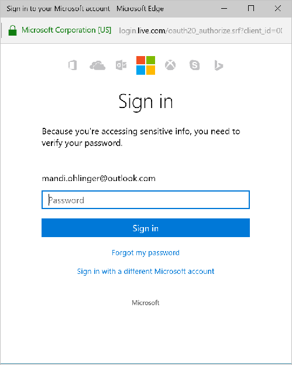
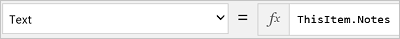

<properties
	pageTitle="Overview of the cloud storage connection | Microsoft PowerApps"
	description="See how to connect to a cloud storage account, and display Excel data in your app"
	services=""
	suite="powerapps"
	documentationCenter="" 	
	authors="MandiOhlinger"
	manager="erikre"
	editor=""
	tags="" />

<tags
ms.service="powerapps"
ms.devlang="na"
ms.topic="article"
ms.tgt_pltfrm="na"
ms.workload="na"
ms.date="06/06/2016"
ms.author="mandia"/>

# Cloud storage connections
PowerApps offers several cloud storage connections. Using these connections, you can store Excel files, and then use the information in the Excel file throughout your app. These connections include:  

|&nbsp;|&nbsp;|&nbsp;|&nbsp;|&nbsp;|
|---|---|---|---|---|
| **Box** ![API Icon][boxicon] | **Dropbox** ![API Icon][dropboxicon]  |  **Google Drive** ![API Icon][googledriveicon]| **OneDrive** ![API Icon][onedriveicon]| **OneDrive for Business** ![API Icon][onedriveforbusinessicon]|

[AZURE.INCLUDE [connection-requirements](../../includes/connection-requirements.md)]
- An Excel file with the data formatted as a table. [Create an app from scratch](../get-started-create-from-blank.md) lists the steps.

## Connect to the cloud storage connection

1. At [powerapps.com](https://web.powerapps.com), expand **Manage**, and select **Connections**:  

	

2. Select **New connection**, and select your cloud storage connection. For example, select **OneDrive**.
3. You are prompted for the user name and password of your cloud storage account. Enter them, and then select **Sign in**:  
	

	Once you are signed in, this connection is ready to be used within your apps. 

4. In your app, select **Options** (bottom right), select your cloud storage connection, and then choose the Excel table. 

5. Select **Connect**. When you do this, the table is listed as a Data source:  
	    **NOTE** Remember, the Excel data must be formatted as a table. 

## Using the Excel data in your app

1. On the **Insert** tab, select **Gallery**, and then select a **Text gallery** control.
2. Set the **[Items](../controls/properties-core.md)** property of the gallery to your Excel table. For example, if your Excel table is named **Table1**, then set it to Table1:  

	  

	The gallery is automatically updated with information from your Excel table. 

3. In the gallery, select the second or third **Text box** control. By default, you see the **Text** property of the second and third text boxes is automatically set to `ThisItem.something`. You can set these text boxes to any column in your table. 

	In the following example, the second text box is set to `ThisItem.Name` and the third text box is set to `ThisItem.Notes`:  

	  

	  

	Sample output:  
	 

	 **NOTE** The first box is actually an image control. If you don't have an image in your Excel table, then you can delete the image control, and add a text box in its place. [Add and configure controls](../add-configure-controls.md) is a good resource.

[Understand tables and records](../working-with-tables.md) provides more details and some examples.  

## Helpful links

See all the [available connections](../connections-list.md).  
Learn how to [add connections](../add-manage-connections.md) and [add a data source](../add-data-connection.md) to your apps.  
[Understand tables and records](../working-with-tables.md) with tabular data sources.  
Some additional gallery resources include [Show a list of items](../add-gallery.md) and [Show images and text in a gallery](../show-images-text-gallery-sort-filter.md). 

<!--Icon references-->
[boxicon]: ./media/cloud-storage-blob-connections/boxicon.png
[dropboxicon]: ./media/cloud-storage-blob-connections/dropboxicon.png
[googledriveicon]: ./media/cloud-storage-blob-connections/googledriveicon.png
[onedriveicon]: ./media/cloud-storage-blob-connections/onedriveicon.png
[onedriveforbusinessicon]: ./media/cloud-storage-blob-connections/onedriveforbusinessicon.png 
