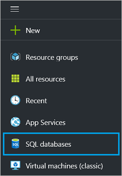
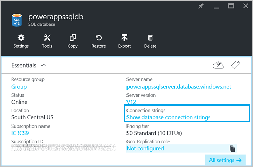
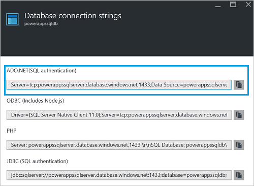
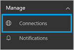
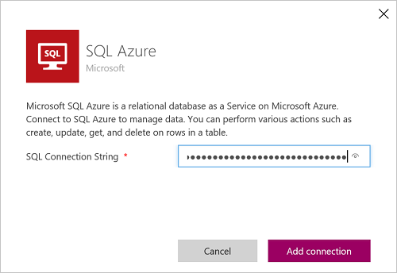
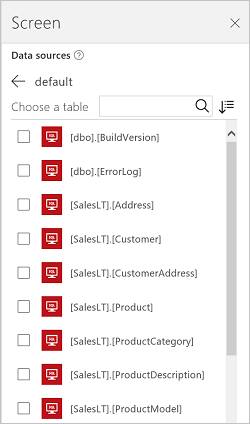
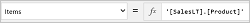
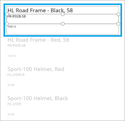
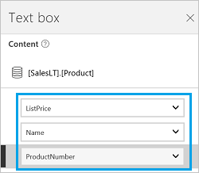

<properties
	pageTitle="Overview of the Azure SQL Database connection | Microsoft PowerApps"
	description="See the available Azure SQL Database functions, responses, and examples"
	services=""
	suite="powerapps"
	documentationCenter="" 	
	authors="MandiOhlinger"
	manager="erikre"
	editor=""
	tags="" />

<tags
ms.service="powerapps"
ms.devlang="na"
ms.topic="article"
ms.tgt_pltfrm="na"
ms.workload="na"
ms.date="06/02/2016"
ms.author="mandia"/>

#  Azure SQL Database

Azure SQL Database provides an API to work with SQL tables.

You can connect to an Azure SQL database and display this information in your app. For example, you can use the gallery controls to display all the rows in a SQL table, or display a single row from a single table.

This topic shows you how to add Azure SQL Database as a connection, add a SQL database as a data source to your app, and use table data in a gallery control.

&nbsp;

[AZURE.INCLUDE [connection-requirements](../../includes/connection-requirements.md)]
- An Azure SQL database with its user name and password. You can use these steps at [Create a SQL database tutorial](https://azure.microsoft.com/documentation/articles/sql-database-get-started/) to create a database. When you create the SQL database, we suggest you add the **Sample data**.

## Get the connection string

1. In the [Azure portal](https://portal.azure.com/), select **SQL databases**:  

	
2. Select your SQL database from the list. If you don't have one, go to [Create a SQL database tutorial](https://azure.microsoft.com/documentation/articles/sql-database-get-started/) to create a database.

3. When you select it, the properties open. Select **Show database connection strings**:  

	
4. Copy the **ADO.NET (SQL authentication)** connection string:  

	

5. Paste the connection string in a text editor, and then look for the following properties:  

	- User ID={your_username}
	- Password={your_password}

	When the SQL database is created, a user name and password is entered. In your connection string, update the **User ID** and **Password** properties with these user name and password values.

	For example, if your username is `powerapps` and your password is `powerapps1609`, your connection string looks similar to the following:  

	`Server=tcp:powerappssqlserver.database.windows.net,1433;Data Source=powerappssqlserver.database.windows.net;Initial Catalog=powerappssqldb;Persist Security Info=False;User ID=powerapps;Password=powerapps1609;Pooling=False;MultipleActiveResultSets=False;Encrypt=True;TrustServerCertificate=False;Connection Timeout=30;`

Keep this connection string nearby. You need it to create the connection in PowerApps.

## Connect to a SQL database and enter your connection string

1. At [powerapps.com](https://web.powerapps.com), expand **Manage**, and select **Connections**:  

	
2. Select **New connection**, and select **SQL Azure**.
3. When prompted, paste in the connection string you updated in the previous section, and then select **Add connection**:  

	

	The connect is added to the list.  
4. Open your app, and add SQL Azure as a [data source](../add-data-connection.md). Select **default**, and then you should see your tables. The following example uses the Sample data:  

	
5. Select some tables (e.g., Product, Customer), and then select **Connect**. The tables are now listed as a data source.

## Using the tables in your app

A SQL database connection is a "tabular" data source. As a result, use galleries to display the data from your tables. These steps use the Sample data in the SQL database, and uses the Product table.

1. On the **Insert** tab, select **Gallery**, and then select a **Text gallery** control.
2. Set the **[Items](../controls/properties-core.md)** property of the gallery to one of your tables. If you're using the Sample data, then set it to the Product table:  

	

3. In the gallery, select any **Text box** control, and set its **Text** property to `ThisItem.something`. For example, set the top text box to `ThisItem.Name`, the middle text box to `ThisItem.ProductNumber`, and the bottom text box to `ThisItem.ListPrice`:  

	

	If you open the **Options** pane, the **Text** property of each text box appears:  

	

The gallery is updated with the information in the Product table.

[Understand tables and records](../working-with-tables.md) provides more details and some examples.  

<!--NotAvailableYet

## View the available functions

This connection includes the following functions:

| Function Name |  Description |
| --- | --- |
|[GetItems](connection-azure-sqldatabase.md#getitems) | Retrieves rows from a SQL table |
|[PostItem](connection-azure-sqldatabase.md#postitem) | Inserts a new row into a SQL table |
|[GetItem](connection-azure-sqldatabase.md#getitem) | Retrieves a single row from a SQL table |
|[DeleteItem](connection-azure-sqldatabase.md#deleteitem) | Deletes a row from a SQL table |
|[PatchItem](connection-azure-sqldatabase.md#patchitem) | Updates an existing row in a SQL table |
|[GetTables](connection-azure-sqldatabase.md#gettables) | Retrieves tables from a SQL database |

### ExecuteProcedure
Execute stored procedure: Executes a stored procedure in SQL

#### Input properties

| Name| Data Type|Required|Description|
| ---|---|---|---|
|procedure|string|yes|Procedure name|
|parameters| |yes|Input parameters|

#### Output properties
Result of the stored procedure execution.

| Property Name | Data Type | Required | Description |
|---|---|---|---|
|OutputParameters|object|No | Output parameter values |
|ReturnCode|integer|No | Return code of a procedure |
|ResultSets|object|No | Result sets|

### GetItems
Get rows: Retrieves rows from a SQL table

#### Input properties

| Name| Data Type|Required|Description|
| ---|---|---|---|
|table|string|yes|Name of SQL table|
|$skip|integer|no|Number of entries to skip (default = 0)|
|$top|integer|no|Maximum number of entries to retrieve (default = 256)|
|$filter|string|no|An ODATA filter query to restrict the number of entries|
|$orderby|string|no|An ODATA orderBy query for specifying the order of entries|

### PostItem
Insert row: Inserts a new row into a SQL table

#### Input properties

| Name| Data Type|Required|Description|
| ---|---|---|---|
|table|string|yes|Name of SQL table|
|item| |yes|Row to insert into the specified table in SQL|

#### Output properties

| Property Name | Data Type | Required | Description |
|---|---|---|---|
|value|array|No | |

### GetItem
Get row: Retrieves a single row from a SQL table

#### Input properties

| Name| Data Type|Required|Description|
| ---|---|---|---|
|table|string|yes|Name of SQL table|
|id|string|yes|Unique identifier of the row to retrieve|

#### Output properties

| Property Name | Data Type | Required | Description |
|---|---|---|---|
|ItemInternalId|string|No | |

### DeleteItem
Delete row: Deletes a row from a SQL table

#### Input properties

| Name| Data Type|Required|Description|
| ---|---|---|---|
|table|string|yes|Name of SQL table|
|id|string|yes|Unique identifier of the row to delete|

#### Output properties
None.

### PatchItem
Update row: Updates an existing row in a SQL table

#### Input properties

| Name| Data Type|Required|Description|
| ---|---|---|---|
|table|string|yes|Name of SQL table|
|id|string|yes|Unique identifier of the row to update|
|item| |yes|Row with updated values|

#### Output properties

| Property Name | Data Type | Required | Description |
|---|---|---|---|
|ItemInternalId|string|No | |

### GetTables
Get tables: Retrieves tables from a SQL database

#### Input properties
None.

#### Output properties

| Property Name | Data Type | Required | Description |
|---|---|---|---|
|value|array|No | Can output the Name and DisplayName properties |

-->

## Helpful links

See all the [available connections](../connections-list.md).  
Learn how to [add connections](../add-manage-connections.md) to your apps.  
[Understand tables and records](../working-with-tables.md) with tabular data sources.  
Some additional gallery resources include [Show a list of items](../add-gallery.md) and [Show images and text in a gallery](../show-images-text-gallery-sort-filter.md).  
