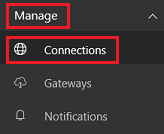

<properties
	pageTitle="Overview of the SQL Server connection | Microsoft PowerApps"
	description="Step-by-step instructions for how to connect to Azure SQL or an on-premises SQL Server database"
	services=""
	suite="powerapps"
	documentationCenter="" 	
	authors="AFTOwen"
	manager="erikre"
	editor=""
	tags="" />

<tags
ms.service="powerapps"
ms.devlang="na"
ms.topic="article"
ms.tgt_pltfrm="na"
ms.workload="na"
ms.date="06/07/2016"
ms.author="anneta"/>

# SQL Server #

Connect from PowerApps to either Azure SQL or an on-premises SQL Server database so that you can display information from it in your app.

**Prerequisites**

- [Sign up](signup-for-powerapps.md) for PowerApps, [install](http://aka.ms/powerappsinstall) it, open it, and then sign in by providing the same credentials that you used to sign up.
- The server name, the database name, the user name, and the password for a database that contains at least one table with a primary key. If you don't have this information, ask the administrator of the database that you want to use.

## Connect to a database ##
### When PowerApps creates an app for you ###
1. Open PowerApps, and then click or tap **New** on the **File** menu (along the left edge).

1. Under **Create an app from your data**, click or tap the right arrow at the end of the row of connectors.

1. If you already have a connection to the database that you want to use, click or tap it, and then skip to the last step in this procedure.

1. Click or tap **Add**, and then click or tap **Sql Server [Hybrid]**.

1. Under **Data location**, click or tap **Cloud** or **On-premises**, and then type or paste the server name, the database name, the user name, and the password for the database that you want to use.

1. [On-premises only] Specify the authentication type and the gateway.

	**Note**: If you don't have a gateway, [install one](filename.md), and then click or tap **Refresh gateway list**.

1. Click or tap **Connect**.

1. Click or tap an option under **Choose a dataset**, click or tap an option under **Choose a table**, and then click or tap **Connect**.

	PowerApps creates an app that shows data on three screens. Heuristics suggest what kind of data to show, but you might need to customize the UI to suit your needs.

### When you update an app or build one from scratch ###
1. Follow the steps to [add a data connection](add-data-connection.md), clicking or tapping **Sql Server [Hybrid]** in the last step.

1. Under **Data location**, click or tap **Cloud** or **On-premises**, and then type or paste the server name, the database name, the user name, and the password for the database that you want to use.

1. [On-premises only] Specify the authentication type and the gateway.

	**Note**: If you don't have a gateway, [install one](filename.md), and then click or tap **Refresh gateway list**.

1. Click or tap **Connect**.

1. Click or tap an option under **Choose a dataset**, and then click or tap an option under **Choose a table**, and then click or tap **Connect**.

### From powerapps.com ###

1. Sign in to [powerapps.com](https://web.powerapps.com) with the same account that you used to sign up for PowerApps.

1. In the left navigation bar, click or tap **Manage**, and click or tap **Connections**:  

	

1. In the upper-right corner, click or tap **New connection**, and then click or tap **Sql Server [Hybrid]**.

1. Next to **Data location**, click or tap **Cloud** or **On-premises**, and then type or paste the server name, the database name, the user name, and the password for the database that you want to use.

1. [On-premises only] Specify the authentication type and the gateway.

	**Note**: If you don't have a gateway, [install one](filename.md), and then click or tap **Refresh gateway list**.

1. Click or tap **Add connection** to create the connection.

## View the available functions ##

This connection includes the following functions:

| Function Name |  Description |
| --- | --- |
|[GetItems](connection-azure-sqldatabase.md#getitems) | Retrieves rows from a SQL table |
|[PostItem](connection-azure-sqldatabase.md#postitem) | Inserts a new row into a SQL table |
|[GetItem](connection-azure-sqldatabase.md#getitem) | Retrieves a single row from a SQL table |
|[DeleteItem](connection-azure-sqldatabase.md#deleteitem) | Deletes a row from a SQL table |
|[PatchItem](connection-azure-sqldatabase.md#patchitem) | Updates an existing row in a SQL table |
|[GetTables](connection-azure-sqldatabase.md#gettables) | Retrieves tables from a SQL database |

### GetItems
Get rows: Retrieves rows from a SQL table

#### Input properties

| Name| Data Type|Required|Description|
| ---|---|---|---|
|table|string|yes|Name of SQL table|
|$skip|integer|no|Number of entries to skip (default = 0)|
|$top|integer|no|Maximum number of entries to retrieve (default = 256)|
|$filter|string|no|An ODATA filter query to restrict the number of entries|
|$orderby|string|no|An ODATA orderBy query for specifying the order of entries|

### PostItem
Insert row: Inserts a new row into a SQL table

#### Input properties

| Name| Data Type|Required|Description|
| ---|---|---|---|
|table|string|yes|Name of SQL table|
|item| |yes|Row to insert into the specified table in SQL|

#### Output properties

| Property Name | Data Type | Required | Description |
|---|---|---|---|
|value|array|No | |

### GetItem
Get row: Retrieves a single row from a SQL table

#### Input properties

| Name| Data Type|Required|Description|
| ---|---|---|---|
|table|string|yes|Name of SQL table|
|id|string|yes|Unique identifier of the row to retrieve|

#### Output properties

| Property Name | Data Type | Required | Description |
|---|---|---|---|
|ItemInternalId|string|No | |

### DeleteItem
Delete row: Deletes a row from a SQL table

#### Input properties

| Name| Data Type|Required|Description|
| ---|---|---|---|
|table|string|yes|Name of SQL table|
|id|string|yes|Unique identifier of the row to delete|

#### Output properties
None.

### PatchItem
Update row: Updates an existing row in a SQL table

#### Input properties

| Name| Data Type|Required|Description|
| ---|---|---|---|
|table|string|yes|Name of SQL table|
|id|string|yes|Unique identifier of the row to update|
|item| |yes|Row with updated values|

#### Output properties

| Property Name | Data Type | Required | Description |
|---|---|---|---|
|ItemInternalId|string|No | &nbsp; |

### GetTables
Get tables: Retrieves tables from a SQL database

#### Input properties
None.

#### Output properties

| Property Name | Data Type | Required | Description |
|---|---|---|---|
|value|array|No | Can output the Name and DisplayName properties |

<!--NotAvailableYet

### ExecuteProcedure
Execute stored procedure: Executes a stored procedure in SQL

#### Input properties

| Name| Data Type|Required|Description|
| ---|---|---|---|
|procedure|string|yes|Procedure name|
|parameters| |yes|Input parameters|

#### Output properties
Result of the stored procedure execution.

| Property Name | Data Type | Required | Description |
|---|---|---|---|
|OutputParameters|object|No | Output parameter values |
|ReturnCode|integer|No | Return code of a procedure |
|ResultSets|object|No | Result sets|

-->

## Next steps ##
- Learn how to [show data from a data source](../add-gallery.md).
- Learn how to [view details and create or update records](../add-form.md).
- See other types of [data sources](../connections-list.md) to which you can connect.  
- [Understand tables and records](../working-with-tables.md) with tabular data sources.
