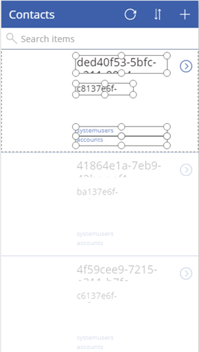
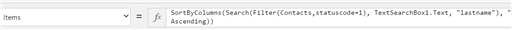
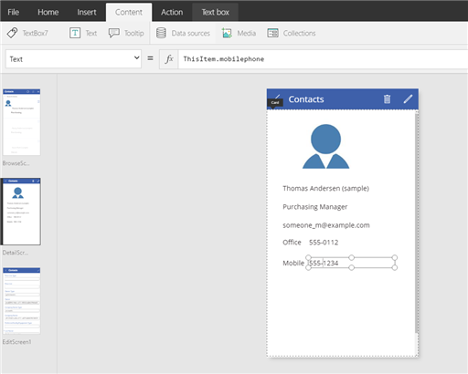

<properties
	pageTitle="Overview of the Dynamics 365 connection | Microsoft PowerApps"
	description="Create an app for managing data in Dynamics 365"
	services=""
	suite="powerapps"
	documentationCenter="" 	
	authors="Mattp123"
	manager="anneta"
	editor=""
	tags="" />

<tags
ms.service="powerapps"
ms.devlang="na"
ms.topic="article"
ms.tgt_pltfrm="na"
ms.workload="na"
ms.date="01/31/2017"
ms.author="matp"/>

# Connect from Microsoft PowerApps to Dynamics 365 #
PowerApps lets you quickly generate, customize, share, and run mobile apps with little or no code. With the Dynamics 365 connector, in just a few minutes you can create useful mobile apps to share with your organization.   

## Prerequisites and details
* Office 365 account that includes a Microsoft Dynamics 365 subscription.
* PowerApps app for mobile clients. This is required for mobile users to use your app and is available from the Microsoft Store.
* A connection for Dynamics 365 (see next section).

## Create a connection for Dynamics 365
1. Click **Connections** on the left navigation pane.
2. Click **New connection** in the upper right.
3. In the list of connections, click Dynamics 365, and then in the dialog box, click **Create**.
4. In the Sign in to your account dialog box, enter your credentials for the Dynamics 365 (online) tenant.
5. A connection is created.

## Walkthrough: Create a mobile app to view, edit, create, and delete contacts in Dynamics 365
This walkthrough creates an app that can be used to browse, add, delete, and make updates to contacts in Dynamics 365.
### Build the initial app
1.	[Sign in to PowerApps](https://powerapps.microsoft.com/).
2.	On the PowerApps main screen, near the bottom, click **New app**.
3.	Click **PowerApps Studio for web**.
4.	In the list of services available, click **Phone layout** under **Dynamics 365**.

	

5.	Under **Connections**, select the connection that you want, and then choose a dataset, which corresponds to the instance of Dynamics 365 that you will use to connect with the app.
6.	Under Choose a table, select the table, which represents the Dynamics 365 entity you want to base the app on. For this walkthrough, click **Contacts** and then click **Connect**.   
PowerApps Studio for web connects to the Dynamics 365 instance and builds a three screen app based on contact records.
	* **BrowseScreen1**. This is the top screen that is displayed in PowerApps Studio and is the main screen of the app.
	* **DetailScreen1**. This is the second screen that is displayed in PowerApps Studio and will appear in the app when the user clicks an item from BrowseScreen1.
	* **EditScreen1**. This is the third screen that is displayed in PowerApps Studio and will appear in the app when the user clicks the edit icon for an item from DetailScreen1.
7.	Although the app can run in its initial state, we can make it more useful by refining the query and changing the fields on each screen.

### BrowseScreen1 changes
1. Change the default query to refine the dataset to only active contacts. In BrowseScreen1 click the edge of the first contacts record and then CTRL + click the lower record so that all records are selected.  
2. In the formula bar (**fx**), paste in this query:
```
SortByColumns(Search(Filter(Contacts,statuscode=1), TextSearchBox1.Text, "lastname"), "lastname", If(SortDescending1, Descending, Ascending))
```
	

The app is refreshed with the new query, which filters on active contacts sorting by last name in descending order.
3. Remove all fields except the entityimage field. CTRL + click each field to select it and then press DEL.

	
4. Add a text box to display the contacts first and last name by concatenating them. Click **Insert**, and then click **Text**. Click the text box and in the formula bar enter *ThisItem.firstname & “ “ & ThisItem.lastname*.
5. Add a text box to display the contacts job title. Click **Insert**, and then click **Text**. Click the text box and in the formula bar enter *ThisItem.jobtitle*.

	
6. Drag and resize the three controls on the form as needed.
7. It’s a good idea to save the app now. Click **File**, and then click **Save as**. By default, the app will be saved to the cloud. Click **This computer** to save your app local.
8. Type a name, such as *Dynamics 365 Contacts*, and then click **Save**.

### DetailsScreen1 changes
1. Click **DetailsScreen1** in the left pane to select it.
2. On the DetailScreen1 screen click **Add custom card**.
3. Remove all other cards and fields saving only the custom card you created in the previous step.
4. Resize the custom card so that it covers the screen, make sure you have the custom card selected, click **Insert** > **Media** > **Image**. Then in the formula bar enter *ThisItem.entityimage*. Repeat the same steps for the following text box controls and fn statements.
	* **Textbox**. formula bar = *ThisItem.firstname & “ “ & ThisItem.lastname*
	* **Textbox**. formula bar = *ThisItem.jobtitle*
	* **Textbox**. formula bar = *ThisItem.emailaddress1*
	* **Textbox**. formula bar = *“Office”*
	* **Textbox**. formula bar = *ThisItem.telephone1*
	* **Textbox**. formula bar = *“Mobile”*
	* **Textbox**. formula bar = *ThisItem.mobilephone*
5. Resize and arrange the controls to fit the screen. When you’re finished, the DetailsScreen1 should look like this.

	

### EditScreen1 changes  
1. Click **EditScreen1** in the left pane to select it.  
2. Remove all fields that are on the screen. To do this click the card, and then press DEL.
3. On the EditScreen1 screen, click **Add custom card** .
4. Make sure that the card is selected, and then click **Insert** > **Media** > **Image**. Then in the formula bar enter *ThisItem.entityimage*.  
5. Resize the custom card so that the image is at the top, and then click the screen outside the custom card.
6. In the right pane, several contact fields are displayed. Click  next to each of the following fields in the order presented to enable each field on the screen. Notice that when you enable a field, it moves up to the top of the list in the **EditForm1** pane in the same order as it appears on the screen.
	* firstname
	* lastname
	* job title
	* emailaddress1
	* telephone1
	* mobilephone

	
7. Save the app.
8. To see how your app will behave when it runs, click the **BrowseScreen1** screen, and then click .
9. Click **File** > **Share** to share your app with your organization. Users with PowerApps on their mobile devices sign in using their Office 365 accounts through PowerApps to download your app and start using it.  
