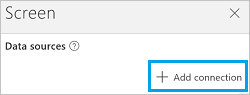

<properties
	pageTitle="Overview of the Office 365 Outlook connection | Microsoft PowerApps"
	description="See how to connect to Office 365 users, step through some examples, and see all the functions"
	services=""
	suite="powerapps"
	documentationCenter="na"
	authors="AFTOwen"
	manager="erikre"
	editor=""
	tags=""/>

<tags
   ms.service="powerapps"
   ms.devlang="na"
   ms.topic="article"
   ms.tgt_pltfrm="na"
   ms.workload="na"
   ms.date="06/08/2016"
   ms.author="anneta"/>

#  Office 365 Outlook

If you connect to Office 365 Outlook, you can create, edit, and update contacts and calendar items, in addition to other tasks.

You can add controls, including buttons and text boxes, to do these functions in your app. For example, you can add input text boxes on your app that asks for email information, including the recipient, the subject, and the body of the email. Then, add a Send button that sends the email. You can also use these controls for similar calendar items, like adding a new calendar item on a specific date, or getting today's events, and then displaying them in your app.

This topic shows you how to add Office 365 Outlook as a connection, add Office 365 Outlook as a data source to your app, and use this data in different controls.

&nbsp;

[AZURE.INCLUDE [connection-requirements](../../includes/connection-requirements.md)]

## Connect to Office 365
1.  Open PowerApps, select **New**, and then create a **Blank app**. Choose phone or tablet layout. Tablet layout gives you more workspace:  

	

2. In the right-hand pane, open the **Data sources** tab, and then select **Add data source**.

3. Select **Add connection**, and then select **Office 365 Outlook**:  

	

	

4. Select **Connect**, and if prompted to sign in, enter your work account. Your connection is listed under **Data sources**. If it's not listed, select **Add Data Source**, and select **Office 365 Users**.

The Office 365 Outlook connection has been created, and added to your app. Now, it's ready to be used.

## Use the Office 365 Users connection in your app

### Get Emails

1. On the **Insert** menu, select **Text**, and then select a **Text gallery** control.

2. Set its **[Items](../controls/properties-core.md)** property to the following formula:  

	`Office365.GetEmails({fetchOnlyUnread:false})`

	The gallery control is automatically populated with some of your emails.

3. In the gallery, set the **Text** property of the first text box to `ThisItem.From`. Set the second text box to `ThisItem.Subject`. Set the third text box to `ThisItem.Body`. You can also resize the text boxes.

	The gallery control is automatically populated with the new properties.

4. This function has several optional parameters available. Set the gallery's **Items** property to the following formulas:

	`Office365.GetEmails({fetchOnlyUnread:false})`  
	`Office365.GetEmails({fetchOnlyUnread:false, top:2})`  
	`Office365.GetEmails({folderPath:"Sent Items", fetchOnlyUnread:false, top:2})`  
	`Office365.GetEmails({folderPath:"Sent Items", fetchOnlyUnread:false, top:2, searchQuery:"powerapps"})`  
	`Office365.GetEmails({folderPath:"Deleted Items", fetchOnlyUnread:false, top:2, skip:3})`

### Send email

1. On the **Insert** menu, select **Text**, and then select **Text input**. Do this three times to create three different text input controls. Arrange them in a column:  

	

2. Rename them to:  

	- **inputTo**
	- **inputSubject**
	- **inputBody**

3. On the **Insert** menu, select **Controls**, and then select **Button**. Set its **[OnSelect](../controls/properties-core.md)** property to the following formula:  

	`Office365.SendEmail(inputSubject.Text, inputBody.Text, inputTo.Text)`

4. Move the button so that it appears under all the other controls, and set its **[Text](../controls/properties-core.md)** property to **"Send email"**.

5. Press F5, or select the Preview button (). Type in a valid email address in **inputTo**, and type whatever you want in the other two Text input controls.

6. Select **Send email** to send the message. Press Esc to return to the default workspace.

### Delete email

1. On the **Insert** menu, select **Text**, and then select a **Text gallery** control.

2. Set its **[Items](../controls/properties-core.md)** property to the following formula:  

	`Office365.GetEmails({fetchOnlyUnread:false})`

	The gallery control is automatically populated with some of your emails.

3. In the gallery, set the **Text** property of the first text box to `ThisItem.Id`. Set the second text box to `ThisItem.Subject`. Set the third text box to `ThisItem.Body`.
4. Select the first text box in the gallery, and rename it to **EmailID**:

	

5. Select the third text box in the gallery, and add a **Button** (**Insert** menu). Set the button's **OnSelect** property to the following formula:  

	`Office365.DeleteEmail(EmailID.Text)`

5. Press F5, or select the Preview button (). Select one of the emails in your gallery, and click the button.    **NOTE** This deletes the selected email from your inbox. So, choose wisely.

6. Press Esc to return to the default workspace.

### Mark email as read

This section uses the same controls as [Delete email](connection-office365-outlook.md#delete-email).

1. Set the button's **OnSelect** property to the following formula:  

	`Office365.MarkAsRead(EmailID.Text)`

2. Press F5, or select the Preview button (). Select one of the  unread emails, and click the button.

3. Press Esc to return to the default workspace.

## View the available functions

This connection includes the following functions:

| Function Name |  Description |
| --- | --- |
|[OnUpcomingEvents](connection-office365-outlook.md#onupcomingevents) | Triggers a flow when an upcoming calendar event is starting |
|[GetEmails](connection-office365-outlook.md#getemails) | Retrieves emails from a folder  |
|[SendEmail](connection-office365-outlook.md#sendemail) | Sends an email message  |
|[DeleteEmail](connection-office365-outlook.md#deleteemail) | Deletes an email message using the message id  |
|[MarkAsRead](connection-office365-outlook.md#markasread) | Marks an email message as having been read  |
|[ReplyTo](connection-office365-outlook.md#replyto) | Replies to an email message   |
|[GetAttachment](connection-office365-outlook.md#getattachment) |  Retrieves message attachment by id  |
|[OnNewEmail](connection-office365-outlook.md#onnewemail) | Triggers a flow when a new email arrives   |
|[SendMailWithOptions](connection-office365-outlook.md#sendmailwithoptions) | Send an email with multiple options and wait for the recipient to respond back with one of the options.   |
|[SendApprovalMail](connection-office365-outlook.md#sendapprovalmail) | Send an approval email and wait for a response from the To recipient.   |
|[CalendarGetTables](connection-office365-outlook.md#calendargettables) | Retrieves calendars  |
|[CalendarGetItems](connection-office365-outlook.md#calendargetitems) |  Retrieves items from a calendar  |
|[CalendarPostItem](connection-office365-outlook.md#calendarpostitem) | Creates a new event   |
|[CalendarGetItem](connection-office365-outlook.md#calendargetitem) |  Retrieves a specific item from a calendar  |
|[CalendarDeleteItem](connection-office365-outlook.md#calendardeleteitem) | Deletes a calendar item   |
|[CalendarPatchItem](connection-office365-outlook.md#calendarpatchitem) | Partially updates a calendar item   |
|[CalendarGetOnNewItems](connection-office365-outlook.md#calendargetonnewitems) |  Triggered when a new calendar item is created  |
|[CalendarGetOnUpdatedItems](connection-office365-outlook.md#calendargetonupdateditems) |  Triggered when a calendar item is modified  |
|[ContactGetTables](connection-office365-outlook.md#contactgettables) | Retrieves contacts folders   |
|[ContactGetItems](connection-office365-outlook.md#contactgetitems) | Retrieves contacts from a contacts folder   |
|[ContactPostItem](connection-office365-outlook.md#contactpostitem) | Creates a new contact   |
|[ContactGetItem](connection-office365-outlook.md#contactgetitem) | Retrieves a specific contact from a contacts folder   |
|[ContactDeleteItem](connection-office365-outlook.md#contactdeleteitem) |  Deletes a contact  |
|[ContactPatchItem](connection-office365-outlook.md#contactpatchitem) | Partially updates a contact   |

### OnUpcomingEvents
On event starting soon: Triggers a flow when an upcoming calendar event is starting

#### Input properties

| Name| Data Type|Required|Description|
| ---|---|---|---|
|table|string|yes|Unique identifier of the calendar|
|lookAheadTimeInMinutes|integer|no|Time (in minutes) to look ahead for upcoming events.|

#### Output properties

| Property Name | Data Type | Required | Description |
|---|---|---|---|
|array | string |no | List of calendar items |

### GetEmails
Get emails: Retrieves emails from a folder

#### Input properties

| Name| Data Type|Required|Description|
| ---|---|---|---|
|folderPath|string|no|Path of the folder to retrieve messages (default: 'Inbox')|
|top|integer|no|Number of emails to retrieve (default: 10)|
|fetchOnlyUnread|boolean|no|Retrieve only unread messages? (default: true)|
|includeAttachments|boolean|no|If set to true, attachments will also be retrieved along with the email message. (default: false)|
|searchQuery|string|no|Search query to filter emails|
|skip|integer|no|Number of emails to skip (default: 0)|
|skipToken|string|no|Skip token to fetch new page|

#### Output properties

| Property Name | Data Type | Required | Description |
|---|---|---|---|
|value|array|yes |Receive email messages that can include the following properties: <ul><li>From (optional)</li><li>To (required)</li><li>Subject (required)</li><li>Body (required)</li><li>Importance (optional): "Low", "Normal", or "High"</li><li>HasAttachment (optional)</li><li>Id (optional)</li><li>IsRead (optional)</li><li>DateTimeReceived (optional)</li><li>Attachments (optional): Receive an attachment. Attachment properties include Id (required), ContentType (required), Name (required), ContentBytes (required).</li><li>Cc (optional)</li><li>Bcc (optional)</li><li>IsHtml (optional)</li></ul> |

### SendEmail
Send Email: Sends an email message

#### Input properties

| Name| Data Type|Required|Description|
| ---|---|---|---|
|emailMessage| |yes|Email message instance that can include the following properties: <ul><li>Attachment (optional): Send an attachment. Attachment properties include Name (required), and ContentBytes (required).</li><li>From (optional)</li><li>Cc (optional)</li><li>Bcc (optional)</li><li>Subject (required)</li><li>Body (required)</li><li>Importance (optional): "Low", "Normal", or "High"</li><li>IsHtml (optional): Enter true or false</li><li>To (required): Separate email addresses with a comma.</li></ul> |

#### Output properties
None.

### DeleteEmail
Delete email: Deletes an email message by id

#### Input properties

| Name| Data Type|Required|Description|
| ---|---|---|---|
|messageId|string|yes|Id of the message to delete.|

#### Output properties
None.

### MarkAsRead
Mark as read: Marks an email message as having been read

#### Input properties

| Name| Data Type|Required|Description|
| ---|---|---|---|
|messageId|string|yes|Id of the message to be marked as read|

#### Output properties
None.

### ReplyTo
Reply to message: Replies to an email message

#### Input properties

| Name| Data Type|Required|Description|
| ---|---|---|---|
|messageId|string|yes|Id of the message to reply to|
|comment|string|yes|Reply comment|
|replyAll|boolean|no|Reply to all recipients|

#### Output properties
None.

### GetAttachment
Get attachment: Retrieves message attachment by id

#### Input properties

| Name| Data Type|Required|Description|
| ---|---|---|---|
|messageId|string|yes|Id of the message|
|attachmentId|string|yes|Id of the attachment to download|

#### Output properties
None.

### OnNewEmail
On new email: Triggers a flow when a new email arrives

#### Input properties

| Name| Data Type|Required|Description|
| ---|---|---|---|
|folderPath|string|no|Email folder to retrieve (default: Inbox, Inbox\ToMe etc.)|
|to|string|no|Recipient email addresses|
|from|string|no|From address|
|importance|string|no|Importance of the email (High, Normal, Low) (default: Normal)|
|fetchOnlyWithAttachment|boolean|no|Retrieve only emails with an attachment|
|includeAttachments|boolean|no|Include attachments|
|subjectFilter|string|no|String to look for in the subject.|

#### Output properties

| Property Name | Data Type | Required | Description |
|---|---|---|---|
|value|array|No | |

### SendMailWithOptions
Send email with options: Send an email with multiple options and wait for the recipient to respond back with one of the options.

#### Input properties

| Name| Data Type|Required|Description|
| ---|---|---|---|
|optionsEmailSubscription| |yes|Subscription Request for Email options, including:  <ul><li>NotificationUrl (optional)</li><li>Message (optional)</li></ul> |

#### Output properties

| Property Name | Data Type | Required | Description |
|---|---|---|---|
|id|string|No | |
|resource|string|No | |
|notificationType|string|No | |
|notificationUrl|string|No | |

### SendApprovalMail
Send approval email: Send an approval email and wait for a response from the To recipient.

#### Input properties

| Name| Data Type|Required|Description|
| ---|---|---|---|
|approvalEmailSubscription| |yes|Subscription Request for Approval Email, including: <ul><li>NotificationUrl (optional)</li><li>Message (optional)</li></ul>|

#### Output properties

| Property Name | Data Type | Required | Description |
|---|---|---|---|
|id|string|No | |
|resource|string|No | |
|notificationType|string|No | |
|notificationUrl|string|No | |

### CalendarGetTables
Get calendars: Retrieves calendars

#### Input properties
None.

#### Output properties

| Property Name | Data Type | Required | Description |
|---|---|---|---|
|value|array|No | |

### CalendarGetItems
Get events: Retrieves items from a calendar

#### Input properties

| Name| Data Type|Required|Description|
| ---|---|---|---|
|table|string|yes|Unique identifier of the calendar to retrieve|
|$skip|integer|no|Number of entries to skip (default = 0)|
|$top|integer|no|Maximum number of entries to retrieve (default = 256)|
|$filter|string|no|An ODATA filter query to restrict the number of entries|
|$orderby|string|no|An ODATA orderBy query for specifying the order of entries|

#### Output properties

| Property Name | Data Type | Required | Description |
|---|---|---|---|
|value|array|No | |

### CalendarPostItem
Create event: Creates a new event

#### Input properties

| Name| Data Type|Required|Description|
| ---|---|---|---|
|table|string|yes|Unique identifier of a calendar|
|item| |yes|Calendar item to create. You can optionally pass in the ItemInternalId. |

#### Output properties
| Property Name | Data Type | Required | Description |
|---|---|---|---|
|ItemInternalId|string|No |Represents a calendar table item |

### CalendarGetItem
Get event: Retrieves a specific item from a calendar

#### Input properties

| Name| Data Type|Required|Description|
| ---|---|---|---|
|table|string|yes|Unique identifier of a calendar|
|id|string|yes|Unique identifier of a calendar item to retrieve|

#### Output properties
| Property Name | Data Type | Required | Description |
|---|---|---|---|
|ItemInternalId|string|No |Represents a calendar table item |

### CalendarDeleteItem
Delete event: Deletes a calendar item

#### Input properties

| Name| Data Type|Required|Description|
| ---|---|---|---|
|table|string|yes|Unique identifier of a calendar.|
|id|string|yes|Unique identifier of calendar item to delete|

#### Output properties
None.

### CalendarPatchItem
Update event: Partially updates a calendar item

#### Input properties

| Name| Data Type|Required|Description|
| ---|---|---|---|
|table|string|yes|Unique identifier of a calendar|
|id|string|yes|Unique identifier of calendar item to update|
|item| |yes|Calendar item to update|

#### Output properties
| Property Name | Data Type | Required | Description |
|---|---|---|---|
|ItemInternalId|string|No | |

### CalendarGetOnNewItems
On new items: Triggered when a new calendar item is created

#### Input properties

| Name| Data Type|Required|Description|
| ---|---|---|---|
|table|string|yes|Unique identifier of a calendar|
|$skip|integer|no|Number of entries to skip (default = 0)|
|$top|integer|no|Maximum number of entries to retrieve (default = 256)|
|$filter|string|no|An ODATA filter query to restrict the number of entries|
|$orderby|string|no|An ODATA orderBy query for specifying the order of entries|

#### Output properties

| Property Name | Data Type | Required | Description|
| ---|---|---|---|
|value|array|No | |

### CalendarGetOnUpdatedItems
On updated items: Triggered when a calendar item is modified

#### Input properties

| Name| Data Type|Required|Description|
| ---|---|---|---|
|table|string|yes|Unique identifier of a calendar|
|$skip|integer|no|Number of entries to skip (default = 0)|
|$top|integer|no|Maximum number of entries to retrieve (default = 256)|
|$filter|string|no|An ODATA filter query to restrict the number of entries|
|$orderby|string|no|An ODATA orderBy query for specifying the order of entries|

#### Output properties

| Property Name | Data Type | Required | Description|
| ---|---|---|---|
|value|array|No | |

### ContactGetTables
Get contact folders: Retrieves contacts folders

#### Input properties
None.

#### Output properties

| Property Name | Data Type | Required | Description|
| ---|---|---|---|
|value|array|No | |

### ContactGetItems
Get contacts: Retrieves contacts from a contacts folder

#### Input properties

| Name| Data Type|Required|Description|
| ---|---|---|---|
|table|string|yes|Unique identifier of the contacts folder to retrieve|
|$skip|integer|no|Number of entries to skip (default = 0)|
|$top|integer|no|Maximum number of entries to retrieve (default = 256)|
|$filter|string|no|An ODATA filter query to restrict the number of entries|
|$orderby|string|no|An ODATA orderBy query for specifying the order of entries|

#### Output properties

| Property Name | Data Type | Required | Description|
| ---|---|---|---|
|value|array|No | |

### ContactPostItem
Create contact: Creates a new contact

#### Input properties

| Name| Data Type|Required|Description|
| ---|---|---|---|
|table|string|yes|Unique identifier of a contacts folder|
|item| |yes|Contact to create|

#### Output properties

| Property Name | Data Type | Required | Description|
| ---|---|---|---|
|ItemInternalId|string|No | |

### ContactGetItem
Get contact: Retrieves a specific contact from a contacts folder

#### Input properties

| Name| Data Type|Required|Description|
| ---|---|---|---|
|table|string|yes|Unique identifier of a contacts folder|
|id|string|yes|Unique identifier of a contact to retrieve|

#### Output properties

| Property Name | Data Type | Required | Description|
| ---|---|---|---|
|ItemInternalId|string|No | |

### ContactDeleteItem
Delete contact: Deletes a contact

#### Input properties

| Name| Data Type|Required|Description|
| ---|---|---|---|
|table|string|yes|Unique identifier of a contacts folder.|
|id|string|yes|Unique identifier of contact to delete|

#### Output properties
None.

### ContactPatchItem
Update contact: Partially updates a contact

#### Input properties

| Name| Data Type|Required|Description|
| ---|---|---|---|
|table|string|yes|Unique identifier of a contacts folder|
|id|string|yes|Unique identifier of contact to update|
|item| |yes|Contact item to update|

#### Output properties

| Property Name | Data Type | Required | Description|
| ---|---|---|---|
|ItemInternalId|string|No | |

## Helpful links

See all the [available connections](../connections-list.md).  
Learn how to [add connections](../add-manage-connections.md) to your apps.
