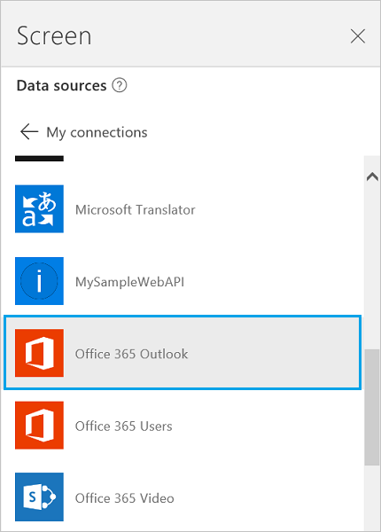

<properties
	pageTitle="Overview of the Office 365 Outlook connection | Microsoft PowerApps"
	description="Reference information, including examples, for the Office 365 Outlook connection to PowerApps"
	services=""
	suite="powerapps"
	documentationCenter="na"
	authors="archnair"
	manager="anneta"
	editor=""
	tags=""/>

<tags
   ms.service="powerapps"
   ms.devlang="na"
   ms.topic="article"
   ms.tgt_pltfrm="na"
   ms.workload="na"
   ms.date="05/25/2017"
   ms.author="archanan"/>

# Connect to Office 365 Outlook from PowerApps #

If you connect to Office 365 Outlook, you can show, send, delete, and reply to email messages, in addition to other tasks.

You can add controls to perform these functions in your app. For example, you can add **Text input** controls to ask for the recipient, the subject, and the body of the email, and add a **Button** control to send the email.

This topic shows you how to add Office 365 Outlook as a connection, add Office 365 Outlook as a data source to your app, and use this data in different controls.

**Important**: As of this writing, the calendar operation doesn't support recurring events.

&nbsp;

[AZURE.INCLUDE [connection-requirements](../../includes/connection-requirements.md)]

## Connect to Office 365 Outlook
1. [Add a data connection](add-data-connection.md) and select **Office 365 Outlook**:  

	

1. Select **Connect**, and if prompted to sign in, enter your work account.

The Office 365 Outlook connection has been created and added to your app. Now, it's ready to be used.

## Show messages ##
1. On the **Insert** menu, select **Gallery**, and then select a **Text gallery** control.

2. Set its **[Items](../controls/properties-core.md)** property to the following formula:  

	`Office365.GetEmails({fetchOnlyUnread:false})`

	The gallery control is automatically populated with some of your emails.

3. In the gallery, set the **Text** property of the first label to `ThisItem.From`. Set the second label to `ThisItem.Subject`. Set the third label to `ThisItem.Body`. You can also resize the labels.

	The gallery control is automatically populated with the new properties.

4. This function has several optional parameters available. Set the gallery's **Items** property to one of the following formulas:

	`Office365.GetEmails({fetchOnlyUnread:false})`  
	`Office365.GetEmails({fetchOnlyUnread:false, top:2})`  
	`Office365.GetEmails({folderPath:"Sent Items", fetchOnlyUnread:false, top:2})`  
	`Office365.GetEmails({folderPath:"Sent Items", fetchOnlyUnread:false, top:2, searchQuery:"powerapps"})`  
	`Office365.GetEmails({folderPath:"Deleted Items", fetchOnlyUnread:false, top:2, skip:3})`

## Send a message ##
1. On the **Insert** menu, select **Text**, and then select **Text input**.

1. Repeat the previous step two more times so that you have three boxes, and then arrange them in a column:  

	

2. Rename the controls to:  

	- **inputTo**
	- **inputSubject**
	- **inputBody**

3. On the **Insert** menu, select **Controls**, and then select **Button**. Set its **[OnSelect](../controls/properties-core.md)** property to the following formula:  

	`Office365.SendEmail(inputTo.Text, inputSubject.Text, inputBody.Text)`

4. Move the button so that it appears under all the other controls, and set its **[Text](../controls/properties-core.md)** property to **"Send email"**.

5. Press F5, or select the Preview button (). Type in a valid email address in **inputTo**, and type whatever you want in the other two **Text input** controls.

6. Select **Send email** to send the message. Press Esc to return to the default workspace.

## Send a message with an attachment ##
You can, for example, create an app in which the user takes pictures by using the device's camera and then sends them as attachments. Users can also attach many other kinds of files to an email app.

To add an attachment to a message, follow the steps in the previous section, but add a parameter to specify an attachment (when you set the **OnSelect** property of the button). This parameter is structured as a table in which you specify up to three properties for each attachment:

- Name
- ContentBytes
- @odata.type

**Note**: You can specify the @odata.type property for only one attachment, and you can set it to an empty string.

In this example, a photo will be sent as **file1.jpg**:

`Office365.SendEmail(inputTo.Text, inputSubject.Text, inputBody.Text, {Attachments:Table({Name:"file1.jpg", ContentBytes:Camera1.Photo, '@odata.type':""})})`

In this example, an audio file will be sent in addition to the photo:

`Office365.SendEmail(inputTo.Text, inputSubject.Text, inputBody.Text, {Attachments:Table({Name:"file1.jpg", ContentBytes:Camera1.Photo, '@odata.type':""}, {Name:"AudioFile", ContentBytes:microphone1.audio })})`

## Delete a message ##

1. On the **Insert** menu, select **Gallery**, and then select a **Text gallery** control.

2. Set its **[Items](../controls/properties-core.md)** property to the following formula:  

	`Office365.GetEmails({fetchOnlyUnread:false})`

	The gallery control is automatically populated with some of your emails.

3. In the gallery, set the **Text** property of the first label to `ThisItem.Id`. Set the second label to `ThisItem.Subject`. Set the third label to `ThisItem.Body`.
4. Select the first label in the gallery, and rename it to **EmailID**:

	

5. Select the third label in the gallery, and add a **Button** (**Insert** menu). Set the button's **OnSelect** property to the following formula:  

	`Office365.DeleteEmail(EmailID.Text)`

5. Press F5, or select the Preview button (). Select one of the emails in your gallery, and click the button.    **NOTE** This deletes the selected email from your inbox. So, choose wisely.

6. Press Esc to return to the default workspace.

## Mark a message as read ##

This section uses the same controls as [Delete email](connection-office365-outlook.md#delete-email).

1. Set the button's **OnSelect** property to the following formula:  

	`Office365.MarkAsRead(EmailID.Text)`

2. Press F5, or select the Preview button (). Select one of the unread emails, and then click the button.

3. Press Esc to return to the default workspace.

## Helpful links ##

- For a list of all functions and their parameters, see the [Office 365 Outlook reference](https://docs.microsoft.com/en-us/connectors/office365connector/).
- See all the [available connections](../connections-list.md).  
- Learn how to [manage your connections](../add-manage-connections.md).
