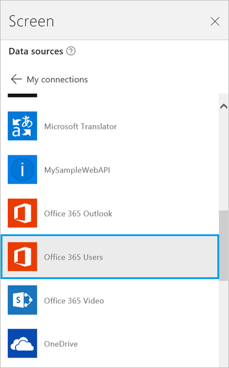

<properties
	pageTitle="Overview of the Office 365 users connection | Microsoft PowerApps"
	description="See how to connect to Office 365 users, step through some examples, and see all the functions"
	services=""
	suite="powerapps"
	documentationCenter="na"
	authors="MandiOhlinger"
	manager="erikre"
	editor=""
	tags=""/>

<tags
   ms.service="powerapps"
   ms.devlang="na"
   ms.topic="article"
   ms.tgt_pltfrm="na"
   ms.workload="na"
   ms.date="06/07/2016"
   ms.author="mandia"/>

# Office 365 Users

Office 365 Users lets you access user profiles in your organization using your Office 365 account. You can perform various actions such as get your profile, a user's profile, a user's manager or direct reports.

You can display this information in a text box on your app. You can display one function, multiple functions, or even combine different functions. For example, you can create an expression that combines the User Name and Phone Number, and then display this information in your app.

This topic shows you how to add Office 365 Users as a connection, add Office 365 Users as a data source to your app, and use table data in a gallery control.

&nbsp;

[AZURE.INCLUDE [connection-requirements](../../includes/connection-requirements.md)]

## Connect to Office 365
1.  Open PowerApps, select **New**, and then create a **Blank app**. Choose phone or tablet layout. Tablet layout gives you more workspace:  

	

2. In the lower-right corner, select **Options**, and then select **Add data source**.

3. Select **Add connection**, and then select **Office 365 Users**:  

	

	

4. Select **Connect**, and if prompted to sign in, enter your work account. Your connection is listed under **Data sources**. If it's not listed, select **Add Data Source**, and select **Office 365 Users**.

5. Close the **Options** pane by selecting the **X** in its upper-right corner:  

	

The Office 365 Users connection has been created, and added to your app. Now, it's ready to be used.

## Use the Office 365 Users connection in your app

### Show information about the current user
1. On the **Insert** menu, select **Text box**
2. In the function bar, set its **[Text](../controls/properties-core.md)** property to any of the following formulas:

	`Office365Users.MyProfile().Department`  
	`Office365Users.MyProfile().DisplayName`  
	`Office365Users.MyProfile().GivenName`  
	`Office365Users.MyProfile().Id`  
	`Office365Users.MyProfile().JobTitle`  
	`Office365Users.MyProfile().Mail`  
	`Office365Users.MyProfile().MailNickname`  
	`Office365Users.MyProfile().Surname`  
	`Office365Users.MyProfile().TelephoneNumber`  
	`Office365Users.MyProfile().UserPrincipalName`  
	`Office365Users.MyProfile().AccountEnabled`  

The text box shows the information that you entered about the current user.

### Show information about another user
1. On the **Insert** menu, select **Text**, and then select **Text input**. Rename it **InfoAbout**:  

	

2. In **InfoAbout**, type or paste an email address of a user in your organization. For example, type in *yourName*@*yourCompany.com*. 

3. Add a **text box** (**Insert** menu), and set its **[Text](../controls/properties-core.md)** property to any of the following formulas:

	- To show information about another user:  

		`Office365Users.UserProfile(InfoAbout.Text).Department`  
		`Office365Users.UserProfile(InfoAbout.Text).DisplayName`  
		`Office365Users.UserProfile(InfoAbout.Text).GivenName`  
		`Office365Users.UserProfile(InfoAbout.Text).Id`  
		`Office365Users.UserProfile(InfoAbout.Text).JobTitle`  
		`Office365Users.UserProfile(InfoAbout.Text).Mail`  
		`Office365Users.UserProfile(InfoAbout.Text).MailNickname`  
		`Office365Users.UserProfile(InfoAbout.Text).Surname`  
		`Office365Users.UserProfile(InfoAbout.Text).TelephoneNumber`  
		`Office365Users.UserProfile(InfoAbout.Text).UserPrincipalName`  
		`Office365Users.UserProfile(InfoAbout.Text).AccountEnabled`  

	- To show information about another user's manager:  
	
		`Office365Users.Manager(InfoAbout.Text).Department`  
		`Office365Users.Manager(InfoAbout.Text).DisplayName`  
		`Office365Users.Manager(InfoAbout.Text).GivenName`  
		`Office365Users.Manager(InfoAbout.Text).Id`  
		`Office365Users.Manager(InfoAbout.Text).JobTitle`  
		`Office365Users.Manager(InfoAbout.Text).Mail`  
		`Office365Users.Manager(InfoAbout.Text).MailNickname`  
		`Office365Users.Manager(InfoAbout.Text).Surname`  
		`Office365Users.Manager(InfoAbout.Text).TelephoneNumber`  
		`Office365Users.Manager(InfoAbout.Text).UserPrincipalName`  
		`Office365Users.Manager(InfoAbout.Text).AccountEnabled`  

The text box shows the information that you entered about the user you entered and that user's manager.

### Show the direct reports of another user
1. Add a **Text input** control (**Insert** menu > **Text**), and rename it **InfoAbout**.

2. In **InfoAbout**, enter the email address of a user in your organization. For example, enter *yourManagersName*@*yourCompany.com*

3. Add a **With text** gallery (**Insert** menu > **Gallery**), and set its **[Items](../controls/properties-core.md)** property to the following formula:

	`Office365Users.DirectReports(InfoAbout.Text)`

	The gallery shows information about the direct reports of the user you entered.

4. With the gallery still selected, select **Options** in the lower-right corner. In the second list, select **JobTitle**. In the third list, select **DisplayName**. The gallery is updated to show these values.  

	 **NOTE** The first box is actually an image control. If you don't have an image, then you can delete the image control, and add a text box in its place. [Add and configure controls](../add-configure-controls.md) is a good resource.

### Search for users
1. Add a **Text input** control (**Insert** menu > **Text**), and rename it **SearchTerm**. Enter a name to search. For example, enter your first name. 

2. Add a **With text** gallery (**Insert** menu > **Gallery**), and set its **[Items](../controls/properties-core.md)** property to the following formula:

	`Office365Users.SearchUser({searchTerm: SearchTerm.Text})`

	The gallery shows users whose name contains the search text you entered.

3. With the gallery still selected, select **Options** in the lower-right corner. In the second list, select **Mail**. In the third list, select **DisplayName**. 

	The second and third text boxes in the gallery are updated. 

## View the available functions
 
This connection includes the following functions:

| Function Name |  Description |
| --- | --- |
|[MyProfile](connection-office365-users.md#myprofile) | Retrieves the profile for the current user |
|[UserProfile](connection-office365-users.md#userprofile) | Retrieves a specific user profile |
|[Manager](connection-office365-users.md#manager) | Retrieves user profile for the manager of the specified user |
|[DirectReports](connection-office365-users.md#directreports) | Returns the direct reports for the specified user |
|[SearchUser](connection-office365-users.md#searchuser) | Retrieves search results of user profiles |

### MyProfile
Get my profile: Retrieves the profile for the current user.

#### Input properties
None.

#### Output properties

| Property Name | Type | Description |
| --- | --- | --- |
| Department | string | Department of the user. |
| DisplayName  | string | Display name of user. |
| GivenName  | string | Given name of user. |
| Id  | string | User id |
| JobTitle  | string | Job Title of the user. |
| Mail  | string | Email id of user. |
| MailNickname  | string | Nickname of user. |
| Surname  | string | Surname of user. |
| TelephoneNumber  | string | Telephone number of user. |
| UserPrincipalName  | string | User Principal Name. |
| AccountEnabled  | boolean | Account enabled flag. |

### UserProfile
Get user profile: Retrieves a specific user profile. 

#### Input properties

| Name| Data Type| Required | Description|
| ---|---|---|---|
|Id|string| yes|User principal name or email id |

#### Output properties

| Property Name | Type | Description |
| --- | --- | --- |
| Department | string | Department of the user. |
| DisplayName  | string | Display name of user. |
| GivenName  | string | Given name of user. |
| Id  | string | User id |
| JobTitle  | string | Job Title of the user. |
| Mail  | string | Email id of user. |
| MailNickname  | string | Nickname of user. |
| Surname  | string | Surname of user. |
| TelephoneNumber  | string | Telephone number of user. |
| UserPrincipalName  | string | User Principal Name. |
| AccountEnabled  | boolean | Account enabled flag. |

### Manager
Get manager: Retrieves user profile for the manager of the specified user

#### Input properties

| Name| Data Type| Required | Description|
| ---|---|---|---|
|Id|string| yes|User principal name or email id |

#### Output properties

| Property Name | Type | Description |
| --- | --- | --- |
| Department | string | Department of the user. |
| DisplayName  | string | Display name of user. |
| GivenName  | string | Given name of user. |
| Id  | string | User id |
| JobTitle  | string | Job Title of the user. |
| Mail  | string | Email id of user. |
| MailNickname  | string | Nickname of user. |
| Surname  | string | Surname of user. |
| TelephoneNumber  | string | Telephone number of user. |
| UserPrincipalName  | string | User Principal Name. |
| AccountEnabled  | boolean | Account enabled flag. |

### DirectReports 
Get direct reports: Get direct reports

#### Input properties

| Name| Data Type| Required | Description|
| ---|---|---|---|
|Id|string| yes|User principal name or email id |

#### Output properties

| Property Name | Type | Description |
| --- | --- | --- |
| Department | string | Department of the user. |
| DisplayName  | string | Display name of user. |
| GivenName  | string | Given name of user. |
| Id  | string | User id |
| JobTitle  | string | Job Title of the user. |
| Mail  | string | Email id of user. |
| MailNickname  | string | Nickname of user. |
| Surname  | string | Surname of user. |
| TelephoneNumber  | string | Telephone number of user. |
| UserPrincipalName  | string | User Principal Name. |
| AccountEnabled  | boolean | Account enabled flag. |

### SearchUser
Search for users: Retrieves search results of user profiles

#### Input properties

| Name| Data Type| Required | Description|
| ---|---|---|---|
|searchTerm|string| no | Search string. Applies to: display name, given name, surname, mail, mail nickname, and user principal name|

#### Output properties

| Property Name | Type | Description |
| --- | --- | --- |
| Department | string | Department of the user. |
| DisplayName  | string | Display name of user. |
| GivenName  | string | Given name of user. |
| Id  | string | User id |
| JobTitle  | string | Job Title of the user. |
| Mail  | string | Email id of user. |
| MailNickname  | string | Nickname of user. |
| Surname  | string | Surname of user. |
| TelephoneNumber  | string | Telephone number of user. |
| UserPrincipalName  | string | User Principal Name. |
| AccountEnabled  | boolean | Account enabled flag. |

## Helpful links

See all the [available connections](../connections-list.md).  
Learn how to [add connections](../add-manage-connections.md) to your apps.
