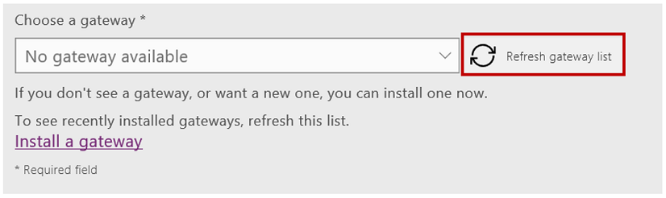

<properties
    pageTitle="Connect to Oracle DB | Microsoft PowerApps"
    description="Learn how to connect to Oracle DB and use it for building apps in PowerApps."
    services=""
    suite="powerapps"
    documentationCenter="na"
    authors="archnair"
    manager="anneta"
    editor=""
    tags=""/>
<tags
    ms.service="powerapps"
    ms.devlang="na"
    ms.topic="article"
    ms.tgt_pltfrm="na"
    ms.workload="na"
    ms.date="04/14/2017"
    ms.author="archanan"/>

# Connect to Oracle Database #

You can now connect to your Oracle Database from PowerApps. The Oracle Database connection allows you to list tables, and perform standard create, read, update and delete of rows in an Oracle Databases. In addition, it supports full delegation of PowerApps filtering, sorting and other functions. It does not support triggers or store procedures yet.

Supported versions: Oracle 9 and later, Oracle client software 8.1.7 and later.

## Prerequisites ##
The Oracle Database connection requires the installation of the on-premises data gateway and Oracle client SDK.

### Install on-premises data gateway ###
The Oracle Database connection requires the on-premises data gateway to be installed. You can follow the steps defined in [this tutorial](gateway-management.md) to install the gateway.

**A note about the on-premises data gateway**: The on-premises data gateway acts as a bridge, providing quick and secure data transfer between on-premises data (data that is not in the cloud) and the Power BI, Microsoft Flow, Logic Apps, and PowerApps services.  The same gateway can be used with multiple services and multiple data sources. More about gateways can be found [here](gateway-reference.md).

### Install Oracle Client ###
To connect to Oracle, you will also need to install the Oracle client software on the machine where you have installed the on-premises data gateway. Specifically, the Oracle Database connection requires the installation of the 64-bit Oracle Data Provider for .NET. You can use the following link to download and install the Oracle client:

- [64-bit ODAC 12c Release 4 (12.1.0.2.4) for Windows x64](http://www.oracle.com/technetwork/database/windows/downloads/index-090165.html)

If you do not have the Oracle client installed, you will see an error when you try to create or use the connection (see the known issues below).

## Create an app using the Oracle Database connection ##
Follow the steps below to create an app from an Oracle database in PowerApps:

1. Open PowerApps Studio, sign in if it prompts you to, and click **New** to create an app.

  

1. Under **Start with your data**, click on the arrow which will show you a list of connections you already have. Click on “+New connection” to specify that you want to create a new connection.

  

1. Under the list of connections, select **Oracle Database**.

  

1. On the right side, specify the Oracle server name, username and password. For the server, if an SID is required, you can specify this in the format: ServerName/SID.

  

1. As mentioned above, you will need to use a Gateway to use an Oracle Database connection. Select the appropriate gateway. If required, you can also install a gateway. Click on “Refresh gateway list” if you do not see your gateway.

  

1. Click **Create** to create the connection. If everything is fine, you will see the screen to select a dataset with a single dataset called “default”.

  

1. Select default.

  

1. You will see a list of tables based on the Oracle Database you are connecting to.  Select the table that you want to use.

  

1. Click **Connect** to create the app

  

Based on the table that you selected, PowerApps will create an app for you with three screens:
- A Browse screen that list all the entries in the table
- A Detail screen that provides additional info about an entry
- An Edit screen that can be used for updating an existing entry or creating a new entry

## Next steps ##
This is just the starting point. You may want to customize these screens, add more tables into your app to finish up your app. You can refer to PowerApps documentation for more information.
- To save the app that you've just generated, press Ctrl-S.
- To customize the browse screen (which appears by default), see [Customize a layout](customize-layout-sharepoint.md).
- To customize the details or edit screens, see [Customize a form](customize-forms-sharepoint.md).

## Known issues, tips, and troubleshooting ##

Here are some common issues, limitations and workarounds:
1. Cannot reach the Gateway.

  If you get this error “Cannot reach the Gateway”, it means that on-premises data gateway is not able to connect to the cloud. To check the status of your Gateway, you can login to powerapps.microsoft.com. Click Gateways, and select/click the Gateway you are trying to connect to.

  Mitigation: Make sure your gateway is running on the on-premise machine where it is installed, and that it can connect to the internet.  We recommend against installing the gateway on a computer that may be turned off or sleep.  Try restarting the on-premises data gateway service (PBIEgwService) as well.

2. The provider being used is deprecated: 'System.Data.OracleClient requires Oracle client software version 8.1.7 or greater.'. Please visit https://go.microsoft.com/fwlink/p/?LinkID=272376 to install the official provider.

  You get the above error if the Oracle client SDK is not installed on the machine where the on-premises data gateway is running.  To fix this issue, download and install the Oracle client SDK as given above.

3. Table '[Tablename]' does not define any key columns.  This error message signifies that the table it is connecting to, does not have any primary key.  Currently, the Oracle Database connection requires that a table with a primary key column be used.

4. Stored Procedures are currently not supported.

5. Any table with composite keys are not supported.

6. Nested object types in tables are not supported.
