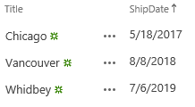
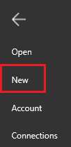
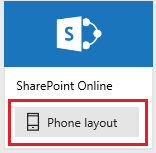
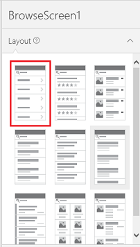
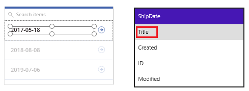
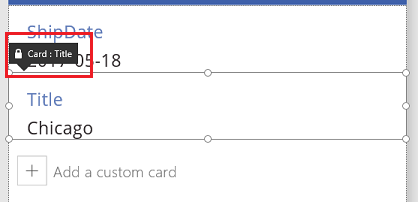
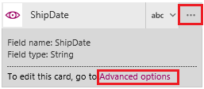
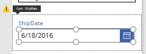
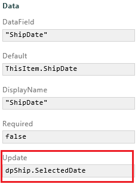
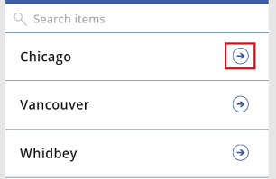

<properties
	pageTitle="Overview of the SharePoint Online connection | Microsoft PowerApps"
	description="See the available SharePoint Online functions, responses, and examples"
	services=""
	suite="powerapps"
	documentationCenter="" 	
	authors="AFTOwen"
	manager="erikre"
	editor=""
	tags="" />

<tags
ms.service="powerapps"
ms.devlang="na"
ms.topic="article"
ms.tgt_pltfrm="na"
ms.workload="na"
ms.date="06/18/2016"
ms.author="anneta"/>

# Connect to SharePoint Online in PowerApps

Connect to SharePoint Online, and then create an app in which users can show, create, and update items in a custom list. If you specify the name of the site and then select the list, PowerApps can automatically create an app with three screens: one each for browsing items, showing details, and creating or updating items.

**Prerequisites**

- Learn how to [add and configure controls](add-configure-controls.md).
- Identify or create a custom list in SharePoint Online that contains only [supported columns](connection-sharepoint-online.md#known-issues).

For simplicity, the list in this topic contains only a couple of columns and a few entries, but your list can be much more complicated.

The Title column is set to show single lines of text, and the ShipDate column is set to show dates.

## Create an app automatically ##
1. Open PowerApps, and then click or tap **New** in the **File** menu (along the left edge).

	

1. In the **SharePoint Online** tile, click or tap **Phone layout**.

	

1. Under **Connect to a SharePoint site**, type or paste the URL to the site that contains the list that you want to use.

	**Note**: Don't include a specific list in the URL.

1. Under **Choose a list**, click or tap the name of the list that you want to use.

	In the search box, you can type or paste at least one letter to show only those lists whose names contain the letter or letters that you specify. You can also click or tap the sort-order icon to toggle between sorting the list in ascending or descending order.

	

1. Click or tap **Connect** to automatically create your app.

## Customize the app ##
1. If the default layout of **BrowseScreen1** doesn't show types of the information that you want, click or tap a different option in the **Layout** tab of the right-hand pane.

	

1. If a particular control doesn't show the specific column that you want, click or tap it, and then select a different option in the drop-down list in the right-hand pane.

	

1. On **EditScreen1**, swap the positions of cards by clicking or tapping a lower card and then dragging its title bar up (or drag a higher card down).

	

## Customize a card ##
1. Click or tap the **ShipDate** card, and then set its **Height** property to **185**.

1. Click or tap just below the **Text input** control to select **ErrorMessage1**, which has no border.

	**Note**: To select **ErrorMessage1** more easily, increase the zoom to **100%**.

	

1. Set the **Height** property of **ErrorMessage1** to this formula: 
**dpShip.Y + dpShip.Height**

	An error icon appears, but you'll resolve it in the next few steps.

1. Click or tap the **ShipDate** card, click or tap its ellipsis icon in the right-hand pane, and then click or tap **Advanced options**.

	

1. At the top of the right-hand pane, click or tap the lock icon to unlock the card.

	

1. In the **ShipDate** card, delete the **Input text** control, add a **DatePicker** control to the card, and name the new control **dpShip**.

	

1. Click or tap the **ShipDate** card, and set its **Update** property (under **Data** in the right-hand pane) to this formula: 
**dpShip.SelectedDate**

	**Note**: If the **Update** property doesn't appear, click or tap the down arrow at the bottom of the **Data** section.

	

## Update an entry ##
1. Click or tap **BrowseScreen1** in the left navigation bar, and then open Preview mode by pressing F5.

	 You can also open Preview mode by clicking or tapping the play button near the upper-right corner.

1. Click or tap the arrow for any item in the list.

	

1. Click or tap the pencil icon in the upper-right corner to edit the item.

	

1. In the **DatePicker** control, click or tap a different date, click or tap **OK**, and then click or tap the checkmark icon in the upper-right corner to save your changes.

	

1. (optional) Verify that your list reflects your change.

## Create an entry ##
1. On **DetailScreen1**, return to **BrowseScreen1** by clicking or tapping the back arrow in the upper-left corner.

	

1. On **BrowseScreen1**, click or tap the plus icon in the upper-right corner.

	

1. Provide data for the new entry, and then click or tap the checkmark icon in the upper-right corner to save your changes.

	

1. (optional) Verify that your list reflects your change.

## View the available functions

This connection includes the following functions:

| Function Name |  Description |
| --- | --- |
|[GetOnNewItems](connection-sharepoint-online.md#getonnewitems) | When an item is created in a SharePoint list |
|[GetOnUpdatedItems](connection-sharepoint-online.md#getonupdateditems) | When an existing item is modified in a SharePoint list |
|[GetItems](connection-sharepoint-online.md#getitems) | Retrieves items from a SharePoint list |
|[PostItem](connection-sharepoint-online.md#postitem) | Creates an item in a SharePoint list |
|[GetItem](connection-sharepoint-online.md#getitem) | Retrieves a single item from a SharePoint list |
|[DeleteItem](connection-sharepoint-online.md#deleteitem) | Deletes an item from a SharePoint list |
|[PatchItem](connection-sharepoint-online.md#patchitem) | Updates an item in a SharePoint list |
|[GetColumnValues](connection-sharepoint-online.md#getcolumnvalues) | Retrieves possible values for a SharePoint column |
|[GetTables](connection-sharepoint-online.md#gettables) | Retrieves SharePoint lists from a site |

<!--NotAvailableYet
## GetFileMetadata
Get file metadata using id: Used for getting a file metadata on Document Library

#### Input properties

| Name| Data Type|Required|Description|
| ---|---|---|---|
|dataset|string|yes|SharePoint Site URL. E.g. http://contoso.sharepoint.com/sites/mysite|
|id|string|yes|Unique identifier of the file|

#### Output properties

| Property Name | Data Type | Required | Description |
|---|---|---|---|
|Id|string|No | |
|Name|string|No | |
|DisplayName|string|No | |
|Path|string|No | |
|LastModified|string|No | |
|Size|integer|No | |
|MediaType|string|No | |
|IsFolder|boolean|No | |
|ETag|string|No | |
|FileLocator|string|No | |

## UpdateFile
Update file: Used for updating a file on Document Library

#### Input properties

| Name| Data Type|Required|Description|
| ---|---|---|---|
|dataset|string|yes|SharePoint Site URL. E.g. http://contoso.sharepoint.com/sites/mysite|
|id|string|yes|Unique identifier of the file|
|body|string |yes|The Content of the file|

#### Output properties

| Property Name | Data Type | Required | Description |
|---|---|---|---|
|Id|string|No | |
|Name|string|No | |
|DisplayName|string|No | |
|Path|string|No | |
|LastModified|string|No | |
|Size|integer|No | |
|MediaType|string|No | |
|IsFolder|boolean|No | |
|ETag|string|No | |
|FileLocator|string|No | |

## DeleteFile
Delete file: Used for deleting a file on Document Library

#### Input properties

| Name| Data Type|Required|Description|
| ---|---|---|---|
|dataset|string|yes|SharePoint Site URL. E.g. http://contoso.sharepoint.com/sites/mysite|
|id|string|yes|Unique identifier of the file|

#### Output properties
None.

## GetFileMetadataByPath
Get file metadata using path: Used for getting a file metadata on Document Library

#### Input properties

| Name| Data Type|Required|Description|
| ---|---|---|---|
|dataset|string|yes|SharePoint Site URL. E.g. http://contoso.sharepoint.com/sites/mysite|
|path|string|yes|Path of the file|

#### Output properties

| Property Name | Data Type | Required | Description |
|---|---|---|---|
|Id|string|No | |
|Name|string|No | |
|DisplayName|string|No | |
|Path|string|No | |
|LastModified|string|No | |
|Size|integer|No | |
|MediaType|string|No | |
|IsFolder|boolean|No | |
|ETag|string|No | |
|FileLocator|string|No | |

## GetFileContentByPath
Get file using path: Used for getting a file on Document Library

#### Input properties

| Name| Data Type|Required|Description|
| ---|---|---|---|
|dataset|string|yes|SharePoint Site URL. E.g. http://contoso.sharepoint.com/sites/mysite|
|path|string|yes|Path of the file|

#### Output properties
None.

## GetFileContent
Get file using id: Used for getting a file on Document Library

#### Input properties

| Name| Data Type|Required|Description|
| ---|---|---|---|
|dataset|string|yes|SharePoint Site URL. E.g. http://contoso.sharepoint.com/sites/mysite|
|id|string|yes|Unique identifier of the file|

#### Output properties
None.

## CreateFile
Create file: Used for uploading a file on Document Library

#### Input properties

| Name| Data Type|Required|Description|
| ---|---|---|---|
|dataset|string|yes|SharePoint Site URL. E.g. http://contoso.sharepoint.com/sites/mysite|
|folderPath|string|yes|The path to the folder|
|name|string|yes|Name of the file|
|body| string |yes|The Content of the file|

#### Output properties

| Property Name | Data Type | Required | Description |
|---|---|---|---|
|Id|string|No | |
|Name|string|No | |
|DisplayName|string|No | |
|Path|string|No | |
|LastModified|string|No | |
|Size|integer|No | |
|MediaType|string|No | |
|IsFolder|boolean|No | |
|ETag|string|No | |
|FileLocator|string|No | |

## CopyFile
Copy file: Used for copying a file on Document Library

#### Input properties

| Name| Data Type|Required|Description|
| ---|---|---|---|
|dataset|string|yes|SharePoint Site URL. E.g. http://contoso.sharepoint.com/sites/mysite|
|source|string|yes|Path to the source file|
|destination|string|yes|Path to the destination file|
|overwrite|boolean|no|Whether or not to overwrite an existing file|

#### Output properties

| Property Name | Data Type | Required | Description |
|---|---|---|---|
|Id|string|No | |
|Name|string|No | |
|DisplayName|string|No | |
|Path|string|No | |
|LastModified|string|No | |
|Size|integer|No | |
|MediaType|string|No | |
|IsFolder|boolean|No | |
|ETag|string|No | |
|FileLocator|string|No | |

## OnNewFile
When a file is created: Triggers a flow when a new file is created in a SharePoint folder

#### Input properties

| Name| Data Type|Required|Description|
| ---|---|---|---|
|dataset|string|yes|SharePoint site url|
|folderId|string|yes|Unique identifier of the folder in SharePoint|

#### Output properties
None.

## OnUpdatedFile
When a file is modified: Triggers a flow when a file is modified in a SharePoint folder

#### Input properties

| Name| Data Type|Required|Description|
| ---|---|---|---|
|dataset|string|yes|SharePoint site url|
|folderId|string|yes|Unique identifier of the folder in SharePoint|

#### Output properties
None.

## ListFolder
List folder: List the files on a folder

#### Input properties

| Name| Data Type|Required|Description|
| ---|---|---|---|
|dataset|string|yes|SharePoint Site URL. E.g. http://contoso.sharepoint.com/sites/mysite|
|id|string|yes|Unique identifier of the file|

#### Output properties

| Property Name | Data Type | Required | Description |
|---|---|---|---|
|Id|string|No | |
|Name|string|No | |
|DisplayName|string|No | |
|Path|string|No | |
|LastModified|string|No | |
|Size|integer|No | |
|MediaType|string|No | |
|IsFolder|boolean|No | |
|ETag|string|No | |
|FileLocator|string|No | |

## ListRootFolder
List root folder: List the files on Root folder

#### Input properties

| Name| Data Type|Required|Description|
| ---|---|---|---|
|dataset|string|yes|SharePoint Site URL. E.g. http://contoso.sharepoint.com/sites/mysite|

#### Output properties

| Property Name | Data Type | Required | Description |
|---|---|---|---|
|Id|string|No | |
|Name|string|No | |
|DisplayName|string|No | |
|Path|string|No | |
|LastModified|string|No | |
|Size|integer|No | |
|MediaType|string|No | |
|IsFolder|boolean|No | |
|ETag|string|No | |
|FileLocator|string|No | |

## ExtractFolderV2
Extract folder: Used for extracting a folder on Document Library

#### Input properties

| Name| Data Type|Required|Description|
| ---|---|---|---|
|dataset|string|yes|SharePoint Site URL. E.g. http://contoso.sharepoint.com/sites/mysite|
|source|string|yes|Path to the source file|
|destination|string|yes|Path to the destination folder|
|overwrite|boolean|no|Whether or not to overwrite an existing file|

#### Output properties

| Property Name | Data Type | Required | Description |
|---|---|---|---|
|Id|string|No | |
|Name|string|No | |
|DisplayName|string|No | |
|Path|string|No | |
|LastModified|string|No | |
|Size|integer|No | |
|MediaType|string|No | |
|IsFolder|boolean|No | |
|ETag|string|No | |
|FileLocator|string|No | |
-->

### GetOnNewItems
When a new item is created: When a new item is created in a SharePoint list

#### Input properties

| Name| Data Type|Required|Description|
| ---|---|---|---|
|dataset|string|yes|SharePoint Site url (example: http://contoso.sharepoint.com/sites/mysite)|
|table|string|yes|SharePoint list name|
|$skip|integer|no|Number of entries to skip (default = 0)|
|$top|integer|no|Maximum number of entries to retrieve (default = 256)|
|$filter|string|no|An ODATA filter query to restrict the number of entries|
|$orderby|string|no|An ODATA orderBy query for specifying the order of entries|

#### Output properties

| Property Name | Data Type | Required | Description |
|---|---|---|---|
|value|array|No | |

### GetOnUpdatedItems
When an existing item is modified: When an existing item is modified in a SharePoint list

#### Input properties

| Name| Data Type|Required|Description|
| ---|---|---|---|
|dataset|string|yes|SharePoint Site url (example: http://contoso.sharepoint.com/sites/mysite)|
|table|string|yes|SharePoint list name|
|$skip|integer|no|Number of entries to skip (default = 0)|
|$top|integer|no|Maximum number of entries to retrieve (default = 256)|
|$filter|string|no|An ODATA filter query to restrict the number of entries|
|$orderby|string|no|An ODATA orderBy query for specifying the order of entries|

#### Output properties

| Property Name | Data Type | Required | Description |
|---|---|---|---|
|value|array|No | |

### GetItems
Get items: Retrieves items from a SharePoint list

#### Input properties

| Name| Data Type|Required|Description|
| ---|---|---|---|
|dataset|string|yes|SharePoint site url (example: http://contoso.sharepoint.com/sites/mysite)|
|table|string|yes|SharePoint list name|
|$skip|integer|no|Number of entries to skip (default = 0)|
|$top|integer|no|Maximum number of entries to retrieve (default = 256)|
|$filter|string|no|An ODATA filter query to restrict the number of entries|
|$orderby|string|no|An ODATA orderBy query for specifying the order of entries|

#### Output properties

| Property Name | Data Type | Required | Description |
|---|---|---|---|
|value|array|No | |

### PostItem
Create item: Creates a new item in a SharePoint list

#### Input properties

| Name| Data Type|Required|Description|
| ---|---|---|---|
|dataset|string|yes|SharePoint Site url (example: http://contoso.sharepoint.com/sites/mysite)|
|table|string|yes|SharePoint list name|
|item| |yes|Item to create|

#### Output properties

| Property Name | Data Type | Required | Description |
|---|---|---|---|
|ItemInternalId|string|No |

### GetItem
Get item: Retrieves a single item from a SharePoint list

#### Input properties

| Name| Data Type|Required|Description|
| ---|---|---|---|
|dataset|string|yes|SharePoint Site url (example: http://contoso.sharepoint.com/sites/mysite)|
|table|string|yes|SharePoint list name|
|id|integer|yes|Unique identifier of item to be retrieved|

#### Output properties

| Property Name | Data Type | Required | Description |
|---|---|---|---|
|ItemInternalId|string|No |

### DeleteItem
Delete item: Deletes an item from a SharePoint list

#### Input properties

| Name| Data Type|Required|Description|
| ---|---|---|---|
|dataset|string|yes|SharePoint Site url (example: http://contoso.sharepoint.com/sites/mysite)|
|table|string|yes|SharePoint list name|
|id|integer|yes|Unique identifier of item to be deleted|

#### Output properties
None.

### PatchItem
Update item: Updates an item in a SharePoint list

#### Input properties

| Name| Data Type|Required|Description|
| ---|---|---|---|
|dataset|string|yes|SharePoint Site url (example: http://contoso.sharepoint.com/sites/mysite)|
|table|string|yes|SharePoint list name|
|id|integer|yes|Unique identifier of item to be updated|
|item| |yes|Item with changed properties|

#### Output properties

| Property Name | Data Type | Required | Description |
|---|---|---|---|
|ItemInternalId|string|No |

### GetColumnValues
Get column values: Retrieves possible values for a SharePoint column

#### Input properties

| Name| Data Type|Required|Description|
| ---|---|---|---|
|dataset|string|yes|SharePoint Site url (example: http://contoso.sharepoint.com/sites/mysite)|
|table|string|yes|SharePoint list name|
|column|string|yes|Column name|
|$search|string|no|An search string to look for values|

#### Output properties
None.

### GetTables
Get lists: Retrieves SharePoint lists from a site

#### Input properties

| Name| Data Type|Required|Description|
| ---|---|---|---|
|dataset|string|yes|SharePoint site url (example: http://contoso.sharepoint.com/sites/mysite)|

#### Output properties

| Property Name | Data Type | Required | Description |
|---|---|---|---|
|value|array|No | |

## Known issues ##

You can add data from a list but not a library.

Not all types of columns are supported, and not all types of columns support all types of cards.

| Column type | Support | Default cards |
|---|---|----|
| Single line of text | Yes | View text |
| Multiple lines of text | Yes | View text |
| Choice | Yes (read-only) | View lookup |
| Number | Yes | View percentage View rating View text |
| Currency | Yes | View percentage View rating View text
| Date and Time | Yes | View text |
| Lookup | Yes (as of release 2.0.440) | View lookup Edit lookup (as of release 2.0.440) |
| Boolean (Yes/No) | Yes | View text View toggle |
| Person or Group | Yes (as of release 2.0.440) | View lookup Edit lookup (as of release 2.0.440) |
| Hyperlink | Yes | View URL View text |
| Picture | Yes (read-only) | View image View text |
| Calculated | Yes (read-only) |   |
| Task Outcome | No |  |
| External data | No |  |
| Managed Metadata | Yes (as of release 2.0.440) | View lookup Edit lookup (as of release 2.0.440) |

PowerApps doesn't support columns that support multiple values or selections.

- For Lookup columns, the **Allow multiple values** checkbox must be cleared.

	

- For Managed Metadata columns, the **Allow multiple values** checkbox must be cleared.

	

- For Person or Group columns, the **No** option under **Allow multiple selections** must be selected.

	

- For Choice columns, the **Drop-Down Menu** or **Radio Buttons** option under **Display choices using** must be selected.

	

### Helpful links

See all the [available connections](../connections-list.md).  
Learn how to [add connections](../add-manage-connections.md) to your apps.
