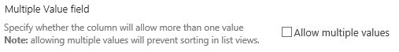
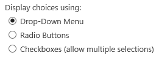
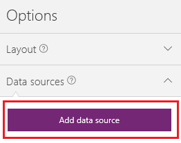
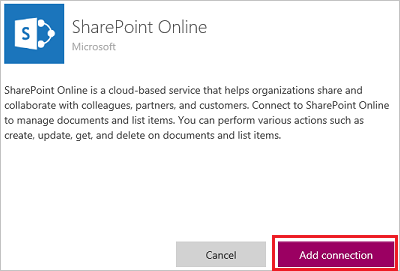
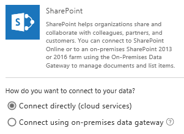
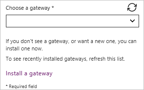
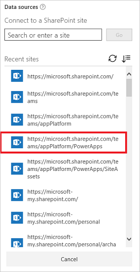
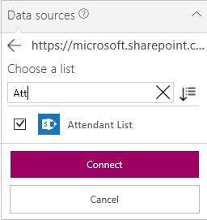

<properties
	pageTitle="Overview of the SharePoint connection | Microsoft PowerApps"
	description="See the available functions, responses, and examples for SharePoint"
	services=""
	suite="powerapps"
	documentationCenter="" 	
	authors="sarafankit"
	manager="anneta"
	editor=""
	tags="" />

<tags
ms.service="powerapps"
ms.devlang="na"
ms.topic="article"
ms.tgt_pltfrm="na"
ms.workload="na"
ms.date="04/18/2017"
ms.author="ankitsar"/>

# Connect from Microsoft PowerApps to SharePoint #

Connect to a SharePoint site to generate an app automatically from a list, build an app from scratch, or update an existing app.

## Known issues ##
You can add data from a custom list but not a library. In addition, not all types of columns are supported, and not all types of columns support all types of cards.

| Column type | Support | Default cards |
|---|---|----|
| Single line of text | Yes | View text |
| Multiple lines of text | Yes | View text |
| Choice | Yes (single values only) | View lookup |
| Number | Yes | View percentage View rating View text |
| Currency | Yes | View percentage View rating View text
| Date and Time | Yes | View text |
| Lookup | Yes (single values only) | View lookup Edit lookup |
| Boolean (Yes/No) | Yes | View text View toggle |
| Person or Group | Yes (single values only) | View lookup Edit lookup |
| Hyperlink | Yes | View URL View text |
| Picture | Yes (read-only) | View image View text |
| Calculated | Yes (read-only) |   |
| Task Outcome | No |  |
| External data | No |  |
| Managed Metadata | Yes (read-only) |  |
| Rating | No |  |

Moreover, PowerApps doesn't support columns that support multiple values or selections.

- For Lookup columns, the **Allow multiple values** checkbox must be cleared.

	

- For Managed Metadata columns, the **Allow multiple values** checkbox must be cleared.

	

- For Person or Group columns, the **No** option under **Allow multiple selections** must be selected.

	

- For Choice columns, the **Drop-Down Menu** or **Radio Buttons** option under **Display choices using** must be selected.

	

## Prerequisites ##
Open PowerApps by taking *either* of these steps:

- [Sign up](signup-for-powerapps.md) for PowerApps, [install PowerApps Studio for Windows](http://aka.ms/powerappsinstall), open it, and then sign in by providing the same credentials that you used to sign up.

- [Open PowerApps Studio for the web](https://create.powerapps.com/api/start) in a browser.

	For a list of supported browsers and limitations in the preview release of PowerApps Studio for the web, see [Create or edit apps in a browser](create-app-browser.md).

## Create an app ##
- [Generate an app automatically](app-from-sharepoint.md) based on data in a SharePoint list.

	The app will have three screens by default: one each for browsing records, displaying details of a record, and creating or updating a record. After the app is generated, you'll probably want to customize [the browse screen](customize-layout-sharepoint.md) and [the details and edit screens](customize-forms-sharepoint.md) to suit your needs.

	**Note**: If your SharePoint list contains a **Choice**, **Lookup**, or **Person or group** column, see [Show data in a gallery](connection-sharepoint-online.md#show-data-in-a-gallery) later in this topic.

- Build your own app from scratch by [connecting to SharePoint](connect-to-sharepoint.md), reviewing the concepts in [Create an app from scratch](get-started-create-from-blank.md), and applying them to SharePoint instead of Excel.

## Add a SharePoint list to an existing app ##
1. In PowerApps Studio, open the app that you want to update.

1. In the right-hand pane, click or tap the **Data sources** tab, and then click or tap **Add data source**.

	If the right-hand pane doesn't show a **Data sources** tab, click or tap any screen in the left navigation bar.

	

1. Click or tap **New connection**, click or tap **SharePoint**, and then click or tap **Connect**.

	

1. Specify the type of SharePoint site to which you want to connect:

	

	- Click or tap **Connect directly (cloud services)** to connect to SharePoint Online.

	- Click or tap **Connect using on-premises data gateway** to connect to an on-premises SharePoint site.

		Specify **Windows** as the authentication type, and then specify your credentials. (If your credentials include a domain name, specify it as *domain\alias*.)

		

		**Note**: If you don't have an on-premises data gateway installed, [install one](gateway-reference.md), and then click or tap the icon to refresh the list of gateways.

		Under **Choose a gateway**, click or tap the gateway that you want to use.

		

1. Click or tap **Connect**.

1. Under **Connect to a SharePoint site**, click or tap an entry in the **Recent sites** list (or type or paste the URL for the site that you want to use), and then click or tap **Go**.

	

1. Under **Choose a list**, select the check box for one or more tables that you want to use, and then click or tap **Connect**:  

	

	The data sources are added to your app.

	

## Show data in a gallery ##
To show data from any of these types of columns in a gallery, use the formula bar to set the **Text** property of one or more **Text box** controls in that gallery:

- For a **Choice** or **Lookup** column, specify **ThisItem.[ColumnName].Value** to show data in that column.

	For example, specify **ThisItem.Location.Value** if you have a **Choice** column named **Location**, and specify **ThisItem.PostalCode.Value** if you have a **Lookup** column named **PostalCode**.

- For a **Person or Group** column, specify **ThisItem.[ColumnName].DisplayName** to show the display name of the user or the group.

	For example, specify **ThisItem.Manager.DisplayName** to show display names from a **Person or Group** column named **Manager**.

	You can also show different information about users, such as email addresses or job titles. To display a complete list of options, specify **ThisItem.[ColumnName].** (with the trailing period).

	**Note**: For a **CreatedBy** column, specify **ThisItem.Author.DisplayName** to show the display names of users who created items in the list. For a **ModifiedBy** column, specify **ThisItem.Editor.DisplayName** to show the display names of users who changed items in the list.

- For a **Managed Metadata** column, specify **ThisItem.[ColumnName].Label** to show data in that column.

	For example, specify **ThisItem.Languages.Label** if you have a **Managed Metadata** column named **Languages**.

## Next steps ##
- Learn how to [show data from a data source](../add-gallery.md).
- Learn how to [view details and create or update records](../add-form.md).
- See other types of [data sources](../connections-list.md) to which you can connect.  

<!--NotAvailableYet
>>>>>>> 3ee7bcf69103ee075f397c40f242932b91b4e945
## View the available functions ##
This connection includes the following functions:

| Function Name |  Description |
| --- | --- |
|[GetOnNewItems](connection-sharepoint-online.md#getonnewitems) | When an item is created in a SharePoint list |
|[GetOnUpdatedItems](connection-sharepoint-online.md#getonupdateditems) | When an existing item is modified in a SharePoint list |
|[GetItems](connection-sharepoint-online.md#getitems) | Retrieves items from a SharePoint list |
|[PostItem](connection-sharepoint-online.md#postitem) | Creates an item in a SharePoint list |
|[GetItem](connection-sharepoint-online.md#getitem) | Retrieves a single item from a SharePoint list |
|[DeleteItem](connection-sharepoint-online.md#deleteitem) | Deletes an item from a SharePoint list |
|[PatchItem](connection-sharepoint-online.md#patchitem) | Updates an item in a SharePoint list |
|[GetColumnValues](connection-sharepoint-online.md#getcolumnvalues) | Retrieves possible values for a SharePoint column |
|[GetTables](connection-sharepoint-online.md#gettables) | Retrieves SharePoint lists from a site |

<!--NotAvailableYet
## GetFileMetadata
Get file metadata using id: Used for getting a file metadata on Document Library

#### Input properties

| Name| Data Type|Required|Description|
| ---|---|---|---|
|dataset|string|yes|SharePoint Site URL. E.g. http://contoso.sharepoint.com/sites/mysite|
|id|string|yes|Unique identifier of the file|

#### Output properties

| Property Name | Data Type | Required | Description |
|---|---|---|---|
|Id|string|No | |
|Name|string|No | |
|DisplayName|string|No | |
|Path|string|No | |
|LastModified|string|No | |
|Size|integer|No | |
|MediaType|string|No | |
|IsFolder|boolean|No | |
|ETag|string|No | |
|FileLocator|string|No | |

## UpdateFile
Update file: Used for updating a file on Document Library

#### Input properties

| Name| Data Type|Required|Description|
| ---|---|---|---|
|dataset|string|yes|SharePoint Site URL. E.g. http://contoso.sharepoint.com/sites/mysite|
|id|string|yes|Unique identifier of the file|
|body|string |yes|The Content of the file|

#### Output properties

| Property Name | Data Type | Required | Description |
|---|---|---|---|
|Id|string|No | |
|Name|string|No | |
|DisplayName|string|No | |
|Path|string|No | |
|LastModified|string|No | |
|Size|integer|No | |
|MediaType|string|No | |
|IsFolder|boolean|No | |
|ETag|string|No | |
|FileLocator|string|No | |

## DeleteFile
Delete file: Used for deleting a file on Document Library

#### Input properties

| Name| Data Type|Required|Description|
| ---|---|---|---|
|dataset|string|yes|SharePoint Site URL. E.g. http://contoso.sharepoint.com/sites/mysite|
|id|string|yes|Unique identifier of the file|

#### Output properties
None.

## GetFileMetadataByPath
Get file metadata using path: Used for getting a file metadata on Document Library

#### Input properties

| Name| Data Type|Required|Description|
| ---|---|---|---|
|dataset|string|yes|SharePoint Site URL. E.g. http://contoso.sharepoint.com/sites/mysite|
|path|string|yes|Path of the file|

#### Output properties

| Property Name | Data Type | Required | Description |
|---|---|---|---|
|Id|string|No | |
|Name|string|No | |
|DisplayName|string|No | |
|Path|string|No | |
|LastModified|string|No | |
|Size|integer|No | |
|MediaType|string|No | |
|IsFolder|boolean|No | |
|ETag|string|No | |
|FileLocator|string|No | |

## GetFileContentByPath
Get file using path: Used for getting a file on Document Library

#### Input properties

| Name| Data Type|Required|Description|
| ---|---|---|---|
|dataset|string|yes|SharePoint Site URL. E.g. http://contoso.sharepoint.com/sites/mysite|
|path|string|yes|Path of the file|

#### Output properties
None.

## GetFileContent
Get file using id: Used for getting a file on Document Library

#### Input properties

| Name| Data Type|Required|Description|
| ---|---|---|---|
|dataset|string|yes|SharePoint Site URL. E.g. http://contoso.sharepoint.com/sites/mysite|
|id|string|yes|Unique identifier of the file|

#### Output properties
None.

## CreateFile
Create file: Used for uploading a file on Document Library

#### Input properties

| Name| Data Type|Required|Description|
| ---|---|---|---|
|dataset|string|yes|SharePoint Site URL. E.g. http://contoso.sharepoint.com/sites/mysite|
|folderPath|string|yes|The path to the folder|
|name|string|yes|Name of the file|
|body| string |yes|The Content of the file|

#### Output properties

| Property Name | Data Type | Required | Description |
|---|---|---|---|
|Id|string|No | |
|Name|string|No | |
|DisplayName|string|No | |
|Path|string|No | |
|LastModified|string|No | |
|Size|integer|No | |
|MediaType|string|No | |
|IsFolder|boolean|No | |
|ETag|string|No | |
|FileLocator|string|No | |

## CopyFile
Copy file: Used for copying a file on Document Library

#### Input properties

| Name| Data Type|Required|Description|
| ---|---|---|---|
|dataset|string|yes|SharePoint Site URL. E.g. http://contoso.sharepoint.com/sites/mysite|
|source|string|yes|Path to the source file|
|destination|string|yes|Path to the destination file|
|overwrite|boolean|no|Whether or not to overwrite an existing file|

#### Output properties

| Property Name | Data Type | Required | Description |
|---|---|---|---|
|Id|string|No | |
|Name|string|No | |
|DisplayName|string|No | |
|Path|string|No | |
|LastModified|string|No | |
|Size|integer|No | |
|MediaType|string|No | |
|IsFolder|boolean|No | |
|ETag|string|No | |
|FileLocator|string|No | |

## OnNewFile
When a file is created: Triggers a flow when a new file is created in a SharePoint folder

#### Input properties

| Name| Data Type|Required|Description|
| ---|---|---|---|
|dataset|string|yes|SharePoint site url|
|folderId|string|yes|Unique identifier of the folder in SharePoint|

#### Output properties
None.

## OnUpdatedFile
When a file is modified: Triggers a flow when a file is modified in a SharePoint folder

#### Input properties

| Name| Data Type|Required|Description|
| ---|---|---|---|
|dataset|string|yes|SharePoint site url|
|folderId|string|yes|Unique identifier of the folder in SharePoint|

#### Output properties
None.

## ListFolder
List folder: List the files on a folder

#### Input properties

| Name| Data Type|Required|Description|
| ---|---|---|---|
|dataset|string|yes|SharePoint Site URL. E.g. http://contoso.sharepoint.com/sites/mysite|
|id|string|yes|Unique identifier of the file|

#### Output properties

| Property Name | Data Type | Required | Description |
|---|---|---|---|
|Id|string|No | |
|Name|string|No | |
|DisplayName|string|No | |
|Path|string|No | |
|LastModified|string|No | |
|Size|integer|No | |
|MediaType|string|No | |
|IsFolder|boolean|No | |
|ETag|string|No | |
|FileLocator|string|No | |

## ListRootFolder
List root folder: List the files on Root folder

#### Input properties

| Name| Data Type|Required|Description|
| ---|---|---|---|
|dataset|string|yes|SharePoint Site URL. E.g. http://contoso.sharepoint.com/sites/mysite|

#### Output properties

| Property Name | Data Type | Required | Description |
|---|---|---|---|
|Id|string|No | |
|Name|string|No | |
|DisplayName|string|No | |
|Path|string|No | |
|LastModified|string|No | |
|Size|integer|No | |
|MediaType|string|No | |
|IsFolder|boolean|No | |
|ETag|string|No | |
|FileLocator|string|No | |

## ExtractFolderV2
Extract folder: Used for extracting a folder on Document Library

#### Input properties

| Name| Data Type|Required|Description|
| ---|---|---|---|
|dataset|string|yes|SharePoint Site URL. E.g. http://contoso.sharepoint.com/sites/mysite|
|source|string|yes|Path to the source file|
|destination|string|yes|Path to the destination folder|
|overwrite|boolean|no|Whether or not to overwrite an existing file|

#### Output properties

| Property Name | Data Type | Required | Description |
|---|---|---|---|
|Id|string|No | |
|Name|string|No | |
|DisplayName|string|No | |
|Path|string|No | |
|LastModified|string|No | |
|Size|integer|No | |
|MediaType|string|No | |
|IsFolder|boolean|No | |
|ETag|string|No | |
|FileLocator|string|No | |

### GetOnNewItems ###
When a new item is created: When a new item is created in a SharePoint list

#### Input properties

| Name| Data Type|Required|Description|
| ---|---|---|---|
|dataset|string|yes|SharePoint Site url (example: http://contoso.sharepoint.com/sites/mysite)|
|table|string|yes|SharePoint list name|
|$skip|integer|no|Number of entries to skip (default = 0)|
|$top|integer|no|Maximum number of entries to retrieve (default = 256)|
|$filter|string|no|An ODATA filter query to restrict the number of entries|
|$orderby|string|no|An ODATA orderBy query for specifying the order of entries|

#### Output properties

| Property Name | Data Type | Required | Description |
|---|---|---|---|
|value|array|No | |

### GetOnUpdatedItems ###
When an existing item is modified: When an existing item is modified in a SharePoint list

#### Input properties

| Name| Data Type|Required|Description|
| ---|---|---|---|
|dataset|string|yes|SharePoint Site url (example: http://contoso.sharepoint.com/sites/mysite)|
|table|string|yes|SharePoint list name|
|$skip|integer|no|Number of entries to skip (default = 0)|
|$top|integer|no|Maximum number of entries to retrieve (default = 256)|
|$filter|string|no|An ODATA filter query to restrict the number of entries|
|$orderby|string|no|An ODATA orderBy query for specifying the order of entries|

#### Output properties

| Property Name | Data Type | Required | Description |
|---|---|---|---|
|value|array|No | |

### GetItems ###
Get items: Retrieves items from a SharePoint list

#### Input properties

| Name| Data Type|Required|Description|
| ---|---|---|---|
|dataset|string|yes|SharePoint site url (example: http://contoso.sharepoint.com/sites/mysite)|
|table|string|yes|SharePoint list name|
|$skip|integer|no|Number of entries to skip (default = 0)|
|$top|integer|no|Maximum number of entries to retrieve (default = 256)|
|$filter|string|no|An ODATA filter query to restrict the number of entries|
|$orderby|string|no|An ODATA orderBy query for specifying the order of entries|

#### Output properties

| Property Name | Data Type | Required | Description |
|---|---|---|---|
|value|array|No | |

### PostItem ###
Create item: Creates a new item in a SharePoint list

#### Input properties

| Name| Data Type|Required|Description|
| ---|---|---|---|
|dataset|string|yes|SharePoint Site url (example: http://contoso.sharepoint.com/sites/mysite)|
|table|string|yes|SharePoint list name|
|item| |yes|Item to create|

#### Output properties

| Property Name | Data Type | Required | Description |
|---|---|---|---|
|ItemInternalId|string|No |

### GetItem ###
Get item: Retrieves a single item from a SharePoint list

#### Input properties

| Name| Data Type|Required|Description|
| ---|---|---|---|
|dataset|string|yes|SharePoint Site url (example: http://contoso.sharepoint.com/sites/mysite)|
|table|string|yes|SharePoint list name|
|id|integer|yes|Unique identifier of item to be retrieved|

#### Output properties

| Property Name | Data Type | Required | Description |
|---|---|---|---|
|ItemInternalId|string|No |

### DeleteItem ###
Delete item: Deletes an item from a SharePoint list

#### Input properties

| Name| Data Type|Required|Description|
| ---|---|---|---|
|dataset|string|yes|SharePoint Site url (example: http://contoso.sharepoint.com/sites/mysite)|
|table|string|yes|SharePoint list name|
|id|integer|yes|Unique identifier of item to be deleted|

#### Output properties
None.

### PatchItem ###
Update item: Updates an item in a SharePoint list

#### Input properties

| Name| Data Type|Required|Description|
| ---|---|---|---|
|dataset|string|yes|SharePoint Site url (example: http://contoso.sharepoint.com/sites/mysite)|
|table|string|yes|SharePoint list name|
|id|integer|yes|Unique identifier of item to be updated|
|item| |yes|Item with changed properties|

#### Output properties

| Property Name | Data Type | Required | Description |
|---|---|---|---|
|ItemInternalId|string|No |

### GetColumnValues ###
Get column values: Retrieves possible values for a SharePoint column

#### Input properties

| Name| Data Type|Required|Description|
| ---|---|---|---|
|dataset|string|yes|SharePoint Site url (example: http://contoso.sharepoint.com/sites/mysite)|
|table|string|yes|SharePoint list name|
|column|string|yes|Column name|
|$search|string|no|An search string to look for values|

#### Output properties
None.

### GetTables ###
Get lists: Retrieves SharePoint lists from a site

#### Input properties

| Name| Data Type|Required|Description|
| ---|---|---|---|
|dataset|string|yes|SharePoint site url (example: http://contoso.sharepoint.com/sites/mysite)|

#### Output properties

| Property Name | Data Type | Required | Description |
|---|---|---|---|
|value|array|No | |
-->
