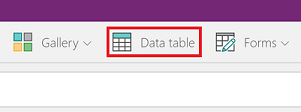
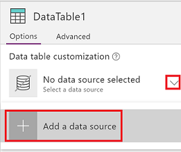
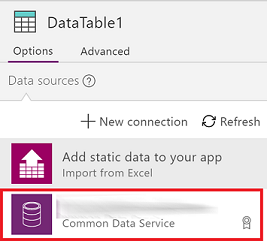
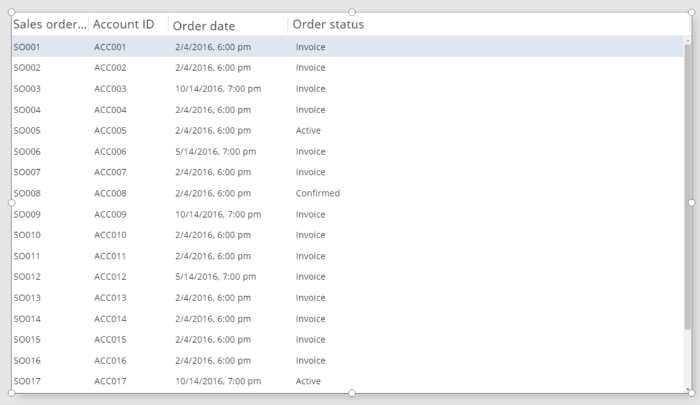
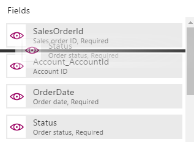
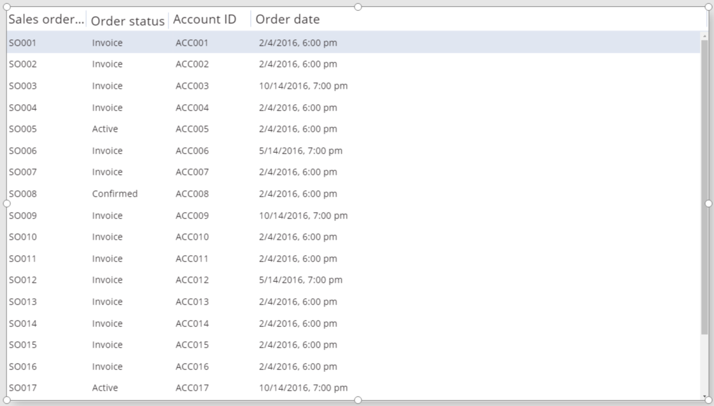
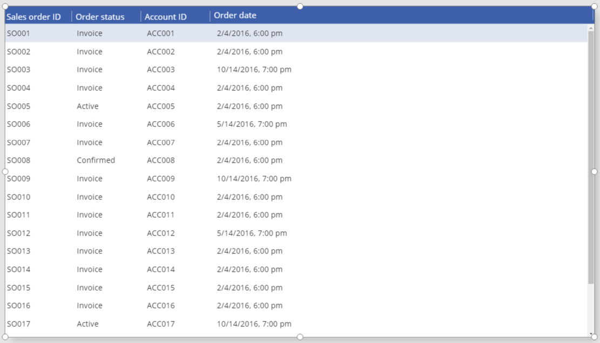
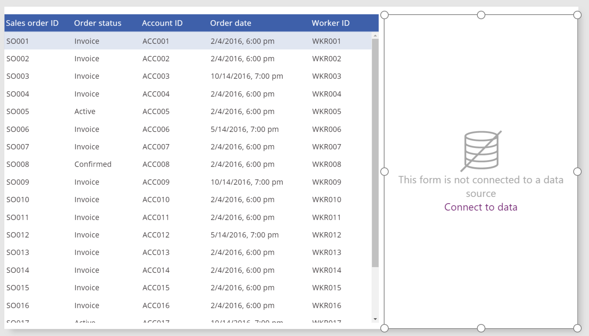
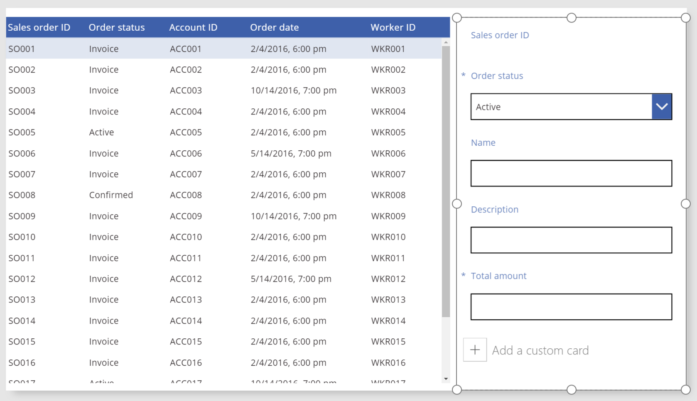
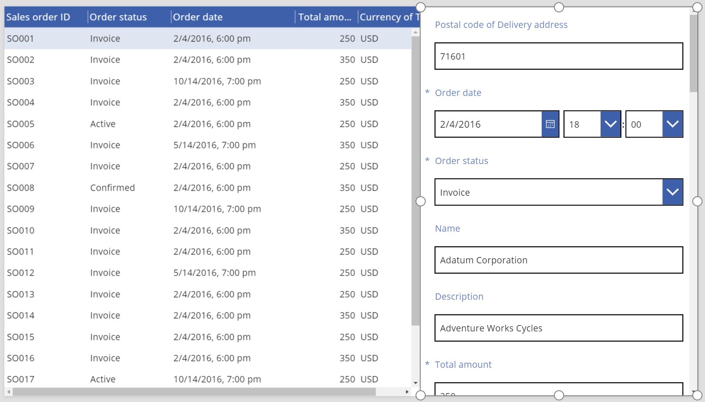

<properties
	pageTitle="Data table control: reference | Microsoft PowerApps"
	description="Information, including properties and examples, about the Data table control"
	services="powerapps"
	documentationCenter="na"
	authors="jasongre"
	manager="kfend"
	editor=""
	tags=""/>

<tags
   ms.service="powerapps"
   ms.devlang="na"
   ms.topic="article"
   ms.tgt_pltfrm="na"
   ms.workload="na"
   ms.date="05/05/2017"
   ms.author="kfend"/>

# Data table control in PowerApps #
A control that shows data in a tabular format.

## Description ##
The **Data table** control shows data in a format that includes column headers for each field that the control shows. You can specify which fields to show and in which order. This control maintains a **Selected** property that, like the **Gallery** control, points to the single row that the user selected. Therefore, you can link the **Data table** control to other controls.

## Key properties ##
+ [**Items**](properties-core.md) – The source of data that the control shows.

+ **Selected** – The selected row.

## Other properties
+ [**BorderColor**](properties-color-border.md) – The color of the control’s border.

+ [**BorderStyle**](properties-color-border.md) – The style of the control's border. The options are **Solid**, **Dashed**, **Dotted**, and **None**.

+ [**BorderThickness**](properties-color-border.md) – The thickness of the control's border.

+ [**Color**](properties-color-border.md) – The default text color for all data rows.

+ [**Fill**](properties-color-border.md) – The default background color for all data rows.

+ [**Font**](properties-text.md) – The default font for all data rows.

+ [**FontWeight**](properties-text.md) – The default font weight for all data rows.

+ **HeadingColor** – The text color of the column headings.

+ **HeadingFill** – The background color of the column headings.

+ **HeadingFont** – The font of the column headings.

+ **HeadingFontWeight** – The font weight of the column headings.

+ **HeadingSize** – The font size of the column headings.

+ [**Height**](properties-size-location.md) – The distance between the control’s top and bottom edges.

+ [**HoverColor**](properties-color-border.md) – The text color of the row on which the user keeps the mouse pointer.

+ [**HoverFill**](properties-color-border.md) – The background color of the row on which the user keeps the mouse pointer.

+ **NoDataText** – The message that appears if the control can show no records.

+ **SelectedColor** – The color of the text in the selected row.

+ **SelectedFill** – The background color of the selected row.

+ [**Size**](properties-text.md) – The default font size for all data rows.

+ [**Visible**](properties-core.md) – A value that determines whether the control appears or is hidden.

+ [**Width**](properties-size-location.md) – The distance between the control’s left and right edges.

+ [**X**](properties-size-location.md) – The distance between the left edge of the control and the left edge of its parent container (or the left edge of the screen if there is no parent container).

+ [**Y**](properties-size-location.md) – The distance between the top edge of the control and the top edge of its parent container (or the top edge of the screen if there is no parent container).

## Related functions

+ [**Filter**](function-filter-lookup.md)(*DataSource*, *Formula*)

+ [**Search**](function-filter-lookup.md)(*DataSource*, *SearchString*, *Column*)

+ [**Lookup**](function-filter-lookup.md)(*DataSource*, *Formula*)

## Examples
### Basic usage
1. Create a blank app for a tablet.

2. On the **Insert** tab, click or tap **Data table**.

   

   A **Data table** control is added to the screen.

3. Rename the new control **SalesOrderTable**, and resize it so that it covers the whole screen.

4. In the right-hand pane, click or tap the down arrow next to **No data source selected**, and then click or tap **Add a data source**.

   

5. In the list of connections, click or tap the connection for your Common Data Service database.

   

6. In the list of entities, click or tap **Sales order**, and then click or tap **Connect**.

   

   **SalesOrderTable** is now attached to the **Sales order** data source. However, no data will appear until you select fields.

7. In the right-hand pane, click or tap the eye icon for each field that you want to show.

	For this example, show **SalesOrderId**, **Account**, **OrderDate**, and **Status**.

   **SalesOrderTable** shows data from the fields that you specified.

   

8. Reorder the fields by dragging them up or down in the right-hand pane.

   

   **SalesOrderTable** shows the fields in the order that you specified.

   

### Restyle the header ###
1. With the **Data table** control selected, click or tap the **Advanced** tab in the right-hand pane.

2. Click or tap the field for the **HeadingFill** property, and then change the value to **RGBA(62,96,170,1)**.

3. Click or tap the field for the **HeadingColor** property, and change the value to **White**.

4. Click or tap the field for the **HeadingSize** property, and then change the value to **14**.

   

### Connect a **Data table** control to another control
1. Add an **Edit form** control to the screen.

2. Resize the **Data table** and the **Edit form** controls so that the **Data table** control appears in the left part of the screen and the **Edit form** control appears in the right part of the screen.

   

3. Connect the **Edit form** control to the **Sales order** data source.

4. In the right-hand pane, show the **SalesOrderId**, **Status**, **Name**, **Description**, and **Total amount** in the **Edit form** control.

   

3. In the right-hand pane, click or tap the **Advanced** tab.

4. Set the **Item** property for the **Edit form** control to **SalesOrderTable.Selected**.

	The **Edit form** control shows information from the row that's selected in the **Data table** control.

   
