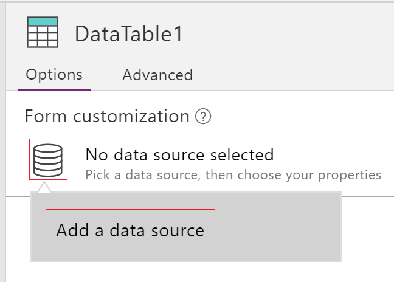

<properties
	pageTitle="Data table control: reference | Microsoft PowerApps"
	description="Information, including properties and examples, about the Data table control"
	services="powerapps"
	documentationCenter="na"
	authors="jasongre"
	manager="kfend"
	editor=""
	tags=""/>

<tags
   ms.service="powerapps"
   ms.devlang="na"
   ms.topic="article"
   ms.tgt_pltfrm="na"
   ms.workload="na"
   ms.date="05/23/2017"
   ms.author="kfend"/>

# Data table control in PowerApps #
Shows a set of data in a tabular format.

## Description ##
The **Data table** control shows a dataset in a format that includes column headers for each field that the control shows. As an app maker, you have full control over which fields appear and in what order. As in the **Gallery** control, the **Data table** control maintains a **Selected** property that points to the selected row. Therefore, you can link the **Data table** control to other controls.

## Capabilities ##
PowerApps introduced the **Data table** control on May 5, 2017. This section provides information about items that are supported and those that aren't supported.

**Now available**

- Data in a **Data table** control is read-only.
- A single row is always selected in a **Data table** control.
- Link a **Data table** control to a connected data source.
- **(New)** Link a **Data table** control to a local data source (collection).
- **(New)** Adjust column widths in a **Data table** control while you run the app, though your changes aren't saved.
- **(New)** A set of default fields appear in a **Data table** control when you link it to a connector that has implemented this capability, such as the Common Data Service. You can then show or hide these fields and others as necessary.

**Not yet available**

- Customize columns, including widths, text, and styling
- Show hyperlinks in a **Data table** control
- Add a **Data table** control in a form control
- Change the height of all rows
- Copy and paste a **Data table** control
- Show images in a **Data table** control
- Show fields from related entities
- Use built-in functionality to filter and sort data by column heading
- Add a **Data table** control in a **Gallery** control
- Edit data in the **Data table** control
- Select multiple rows

**Known issues**

- No data appears if you use the **FirstN** function in the **Items** property.
- If you modify the **Items** property, the field list is reset.
- For some connectors, the connection to the data source is lost if you modify the **Items** property.

## Key properties ##
+ [**Items**](properties-core.md) – The source of data that the control shows.

+ **Selected** – The selected row.

## Other properties
+ [**BorderColor**](properties-color-border.md) – The color of the control’s border.

+ [**BorderStyle**](properties-color-border.md) – The style of the control's border. The options are **Solid**, **Dashed**, **Dotted**, and **None**.

+ [**BorderThickness**](properties-color-border.md) – The thickness of the control's border.

+ [**Color**](properties-color-border.md) – The default text color for all data rows.

+ [**Fill**](properties-color-border.md) – The default background color for all data rows.

+ [**Font**](properties-text.md) – The default font for all data rows.

+ [**FontWeight**](properties-text.md) – The default font weight for all data rows.

+ **HeadingColor** – The text color of the column headings.

+ **HeadingFill** – The background color of the column headings.

+ **HeadingFont** – The font of the column headings.

+ **HeadingFontWeight** – The font weight of the column headings.

+ **HeadingSize** – The font size of the column headings.

+ [**Height**](properties-size-location.md) – The distance between the control’s top and bottom edges.

+ [**HoverColor**](properties-color-border.md) – The text color of the row on which the user keeps the mouse pointer.

+ [**HoverFill**](properties-color-border.md) – The background color of the row on which the user keeps the mouse pointer.

+ **NoDataText** – The message that appears if the control can show no records.

+ **SelectedColor** – The color of the text in the selected row.

+ **SelectedFill** – The background color of the selected row.

+ [**Size**](properties-text.md) – The default font size for all data rows.

+ [**Visible**](properties-core.md) – A value that determines whether the control appears or is hidden.

+ [**Width**](properties-size-location.md) – The distance between the control’s left and right edges.

+ [**X**](properties-size-location.md) – The distance between the left edge of the control and the left edge of its parent container (or the left edge of the screen if there is no parent container).

+ [**Y**](properties-size-location.md) – The distance between the top edge of the control and the top edge of its parent container (or the top edge of the screen if there is no parent container).

## Related functions

+ [**Filter**](function-filter-lookup.md)(*DataSource*, *Formula*)

+ [**Search**](function-filter-lookup.md)(*DataSource*, *SearchString*, *Column*)

## Examples
### Basic usage
1. Create a blank tablet app.

2. On the **Insert** tab, click or tap **Data table**.

	

	A **Data table** control is added to the screen.

3. Rename the new control **SalesOrderTable**, and resize it to cover the whole screen.

4. In the right pane, click or tap the data source icon to the left of the **No data source selected**, and then click or tap **Add a data source**.

	

5. In the list of connections, click or tap the connection for your Common Data Service database.

	

6. In the list of entities, click or tap **Sales order**, and then click or tap **Connect**.

	

	The **SalesOrderTable** control is now attached to the **Sales order** data source. However, no data will appear until you select fields.

7. In the right pane, click or tap the eye icon for each field that you want to show. For this example, show **SalesOrderId**, **Account**, **OrderDate**, and **Status**.

	**SalesOrderTable** shows data from the fields that you specified.
	

8. Reorder the fields by dragging them up or down in the right pane.

	

	The **SalesOrderTable** control shows the fields in the order that you specified.

	

### Restyle the header for the **Data table** control ###
1. With the **Data table** control selected, in the right pane, click or tap the **Advanced** tab.

2. Click or tap the field for the **HeadingFill** property, and then change the value to **RGBA(62,96,170,1)**.

3. Click or tap the field for the **HeadingColor** property, and then change the value to **White**.

4. Click or tap the field for the **HeadingSize** property, and then change the value to **14**.

	

### Connect a **Data table** control to another control
1. Add an **Edit form** control to the screen.

2. Resize the **Data table** and the **Edit form** controls so that the **Data table** control appears in the left part of the screen and the **Edit form** control appears in the right part of the screen.

	

3. Connect the **Edit form** control to the **Sales order** data source.

4. With the **Edit form** control selected, in the right pane, select the fields to show. For this example, select **SalesOrderId**, **Status**, **Name**, **Description**, and **Total amount**.

	

5. In the right pane, click or tap the **Advanced** tab.

6. Set the **Item** property for the **Edit form** control to **SalesOrderTable.Selected**.

	The **Edit form** control shows information from the row that's selected in the **Data table** control.

	
