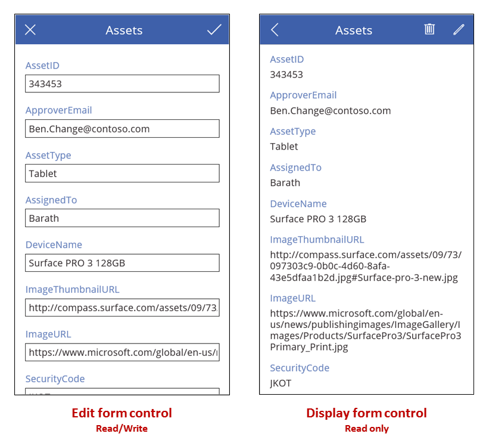

<properties
    pageTitle="Display form and Edit form controls: reference | Microsoft PowerApps"
    description="Information, including properties and examples, about the Display form and Edit form controls"
    services=""
    suite="powerapps"
    documentationCenter="na"
    authors="gregli-msft"
    manager="erikre"
    editor=""
    tags=""/>

<tags
   ms.service="powerapps"
   ms.devlang="na"
   ms.topic="article"
   ms.tgt_pltfrm="na"
   ms.workload="na"
   ms.date="02/29/2016"
   ms.author="gregli"/>

# Edit form and Display form controls in PowerApps #
Display, edit, and create a record in a data source.

## Description ##
If you add a **Display form** control, the user can display all fields of a record or only the fields that you specify. If you add an **Edit form** control, the user can edit those fields, create a record, and save those changes to a data source.

If you add a **Gallery** control, you can configure it to show a table in a data source and then configure a form to show whichever record the user selects in the gallery. You can also add one or more **Button** controls that the user can select to save edits, cancel edits, and create a record. By using controls together, you can [create a complete solution](working-with-forms.md).

### Record selection ###
For either type of form, you set its **DataSource** property to a table of records, and you set the form's **Item** property to show a specific record in that table. For example, you can set the **Item** property of a form to the **SelectedItem** property of a **Gallery** control. When the user selects a record in the gallery, the same record appears in the form, except that the form can show more fields. If the user returns to the gallery and selects a different record, the **SelectedItem** property of the gallery changes. This change updates the **Item** property of the form, which then shows the newly selected record.

Each form control contains one or more **[Card](control-card.md)** controls. By setting the **DataField** property of a card, you [specify which field that card shows and other details](add-form.md).

### Create a record ###
When an **Edit Form** control is in **Edit** mode, the user can update the record that's specified in the form's **Item** property. If inspected, the **Mode** property returns **Edit**.

When an **Edit form** control is in **New** mode, however, the **Item** property is ignored. The form doesn't show an existing record; instead, the values in each field match the default values of the data source with which you configured the form. The **NewForm** function causes a form to switch to this mode.

For example, you can set the **Text** property of a button to show **New** and its **OnSelect** property to a formula that includes the **NewForm** function. If the user selects that button, the form switches to **New** mode so that the user can create a record starting with known values.

A form switches back to **Edit** mode if either the **ResetForm** function runs or the **SubmitForm** function runs successfully.

- You can set the **Text** property of a button to show **Cancel** and its **OnSelect** property to a formula that includes the **ResetForm** function. If the user selects that button, any changes in progress are discarded, and the values in the form, once again, match the default values of the data source.
- You can set the **Text** property of a button to show **Save changes** and its **OnSelect** property to a formula that includes the **SubmitForm** function. If the user selects that button and the data source is updated, the values in the form are reset to the default values of the data source.

### Save changes ###
If you create a **Save changes** button as the previous section describes, the user can create or update a record and then select that button to save those changes to the data source. You could, instead, configure an **Image** control or some other control to perform the same task, as long as you configure that control with the **SubmitForm** function. In any case, the **Error**, **ErrorKind**, **OnSuccess**, and **OnFailure** properties provide feedback on the outcome.

When the **SubmitForm** function runs, it first validates the data that user wants to submit. If a required field doesn't contain a value or another value doesn't conform to some other constraint, the **ErrorKind** properties are set, and the **OnFailure** formula runs. You can configure the **Save changes** button or other control so that the user can select it only if the data is valid (that is, if the **Valid** property of the form is **true**). Note that the user must not only correct the problem but also select the **Save changes** button again (or discard the changes by selecting a **Cancel** button, as described earlier) to reset the **Error** and **ErrorKind** properties.

If the data passes validation, **SubmitForm** sends it to the data source, which can take some time depending on network latency.

- If the submission succeeds, the **Error** property is cleared, the **ErrroKind** property is set to **ErrorKind.None**, and the **OnSuccess** formula runs. If the user created a record (that is, if the form was previously in **New** mode), the form is switched to **Edit** mode so that the user can edit the newly created record or a different one.
- If the submission fails, the **Error** property contains a user-friendly error message from the data source, explaining the problem. The **ErrorKind** property is set appropriately, depending on the issue, and the **OnFailure** formula runs.

Some data sources can detect when two people try to update the same record at the same time  In this case, **ErrorKind** is set to **ErrorKind.Conflict**, and the remedy is to refresh the data source with the other user's changes and reapply the change made by this user.

**Tip:** If you offer a **Cancel** button on your form so that the user can abandon changes in progress, add the **ResetForm** function to the button's **OnSelect** property even that property also contains a **Navigate** function to change screens. Otherwise, the form will retain the user's changes.

## Key properties ##

**DataSource** – The data source that contains the record that the user will show, edit, or create.

- If you don't set this property, the user can't show, edit, or create a record, and no additional metadata or validation is provided.

**Error** – A user friendly error message to display for this form when the **SubmitForm** function fails.

- This property applies only to the **Edit form** control.
- This property changes only when the **SubmitForm**, **EditForm**, or **ResetForm** function runs.
- If no error occurs, this property is *blank*, and **ErrorKind** is set to **ErrorKind.None**.
- When possible, the error message returned will be in the user's language. Some error messages come from the data source directly and may not be in the user's language.

**ErrorKind** – If an error occurs when **SubmitForm** runs, the kind of error that occurred.

- Applies only to an **Edit form** control.
- This property has the same enumeration as the **Errors** function. An **Edit form** control can return these values:

| ErrorKind | Description |
|------------|-------------|
| ErrorKind.Conflict | Another user changed the same record, resulting in a change conflict. Run **[Refresh](function-refresh.md)** to reload the record, and try the change again. |
| ErrorKind.None | The error is of an unknown kind. |
| ErrorKind.Sync | The data source reported an error. Check the **Error** property for more information. |
| ErrorKind.Validation | A general validation issue was detected. |

**Item** – The record in the **DataSource** that the user will show or edit.

- If an **Edit form** control's **Item** property is blank, the form will automatically be in **New** mode. If this property is set to the **SelectedItem** property of a **Gallery** control, blank is returned if the user hasn't selected a record in that gallery or it contains no records.

**LastSubmit** – The last successfully submitted record, including any server generated fields.

- This property applies only to the **Edit form** control.
- If the data source automatically generates or calculates any fields, such as an **ID** field with a unique number, the **LastSubmit** property will have this new value after **SubmitForm** successfully runs.
- The value of this property is available in the **OnSuccess** formula.

**Mode** – The control is in **Edit** or **New** mode.

| Mode | Description |
|----------|-------------|
| **FormMode.Edit** | The user can edit a record by using the form. The values in the form's cards are pre-populated with the existing record, for the user to change. If the **SubmitForm** function runs successfully, an existing record is modified. |
| **FormMode.New** | The user can create a record by using the form. The values in the form's controls are pre-popoulated with the defaults for a record of the data source. If the **SubmitForm** function runs successfully, an record is created. |

- By default, the form control is in **Edit** mode but switches to **New** mode when the **NewForm** function runs. if the **Item** property of the form is blank, the form is automatically in **New** mode because there's no item to edit).

The form switches from **New** mode to **Edit** mode when any of these changes occurs:
- The form is successfully submitted, and a record is created. If the gallery is set to automatically move selection to this new record, the form will be in **Edit** mode for the created record so that the user can make additional changes.
- The value of the **Item** property changes. This change indicates that user has decided to edit a record instead of creating one.
- The **ResetForm** function runs. For example, the user might select a **Cancel** button that's been configured with this function.

**OnFailure** – How an app responds when a data operation has been unsuccessful.

- This property applies only to the **Edit form** control.

**OnReset** – How an app responds when an **Edit form** control is reset.

- This property applies only to the **Edit form** control.

**OnSuccess** – How an app responds when a data operation has been successful.

- This property applies only to the **Edit form** control.

**Unsaved** – True if the **Edit form** control contains user changes that have not been saved.

- This property applies only to the **Edit form** control.
- Use this property to warn the user before they lose any unsaved changes.  To prevent the user from selecting a different record in a **Gallery** control before saving changes to the current record, set the gallery's **Disabled** property to **Form.Unsaved** and, likewise, disable refresh operations.

**Valid** – Whether a **Card** or **Edit form** control contains valid entries, ready to be submitted to the data source.

- This property applies only to the **Edit form** control.
- A **Form** control's **Valid** property aggregates the **Valid** properties of all the **Card** controls in the form. A form's **Valid** property is **true** only if the data in all cards in that form is valid; otherwise, the form's **Valid** property is **false**.
- To enable a button to save changes only when the data in a form is valid but hasn't yet been submitted, set the button's **Enabled** to this formula:

	**SubmitButton.Enabled = IsBlank( Form.Error ) || Form.Valid**

## Additional properties ##

**[BorderColor](../properties/properties-color-border.md)** – The color of a control's border.

**[BorderStyle](../properties/properties-color-border.md)** – Whether a control's border is **Solid**, **Dashed**, **Dotted**, or **None**.

**[BorderThickness](../properties/properties-color-border.md)** – The thickness of a control's border.

**[Fill](../properties/properties-color-border.md)** – The background color of a control.

**[Height](../properties/properties-size-location.md)** – The distance between a control's top and bottom edges.

**[Visible](../properties/properties-core.md)** – Whether a control appears or is hidden.

**[Width](../properties/properties-size-location.md)** – The distance between a control's left and right edges.

**[X](../properties/properties-size-location.md)** – The distance between the left edge of a control and the left edge of the screen.

**[Y](../properties/properties-size-location.md)** – The distance between the top edge of a control and the top edge of the screen.

