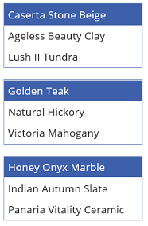

<properties
    pageTitle="List Box control: reference | Microsoft PowerApps"
    description="Information, including properties and examples, about the List Box control"
    services=""
    suite="powerapps"
    documentationCenter="na"
    authors="aftowen"
    manager="erikre"
    editor=""
    tags=""/>

<tags
   ms.service="powerapps"
   ms.devlang="na"
   ms.topic="article"
   ms.tgt_pltfrm="na"
   ms.workload="na"
   ms.date="02/29/2016"
   ms.author="anneta"/>

# List Box control in PowerApps #
[AZURE.INCLUDE [control-summary-list-box](../../includes/control-summary-list-box.md)]

## Description ##
A **List Box** control always shows all available choices (unlike a **Drop down** control) and in which the user can choose more than one item at a time (unlike a **Radio** control).

## Key properties ##

**[Default](../properties/properties-core.md)** – The initial value of a control before it is changed by the user.

**[Items](../properties/properties-core.md)** – The source of data that appears in a control such as a gallery, a list, or a chart.

[AZURE.INCLUDE [long-items](../../includes/long-items.md)]

## Additional properties ##

**[BorderColor](../properties/properties-color-border.md)** – The color of a control's border.

**[BorderStyle](../properties/properties-color-border.md)** – Whether a control's border is **Solid**, **Dashed**, **Dotted**, or **None**.

**[BorderThickness](../properties/properties-color-border.md)** – The thickness of a control's border.

**[Color](../properties/properties-color-border.md)** – The color of text in a control.

**[Disabled](../properties/properties-core.md)** – Whether the user can interact with the control.

**[DisabledBorderColor](../properties/properties-color-border.md)** – The color of a control's border if the control's **Disabled** property is set to **true**.

**[DisabledColor](../properties/properties-color-border.md)** – The color of text in a control if its **Disabled** property is set to **true**.

**[DisabledFill](../properties/properties-color-border.md)** – The background color of a control if its **Disabled** property is set to **true**.

**[Fill](../properties/properties-color-border.md)** – The background color of a control.

**[Font](../properties/properties-text.md)** – The name of the family of fonts in which text appears.

**[FontWeight](../properties/properties-text.md)** – The weight of the text in a control: **Bold**, **Semibold**, **Normal**, or **Lighter**.

**[Height](../properties/properties-size-location.md)** – The distance between a control's top and bottom edges.

**[HoverBorderColor](../properties/properties-color-border.md)** – The color of a control's border when the user keeps the mouse pointer on that control.

**[HoverColor](../properties/properties-color-border.md)** – The color of the text in a control when the user keeps the mouse pointer on it.

**[HoverFill](../properties/properties-color-border.md)** – The background color of a control when the user keeps the mouse pointer on it.

**[Italic](../properties/properties-text.md)** – Whether the text in a control is italic.

**ItemPaddingLeft** – The distance between text in a listbox and its left edge.

**[LineHeight](../properties/properties-text.md)** – The distance between, for example, lines of text or items in a list.

**[OnChange](../properties/properties-core.md)** – How the app responds when the user changes the value of a control (for example, by adjusting a slider).

**[OnSelect](../properties/properties-core.md)** – How the app responds when the user taps or clicks a control.

**[PaddingBottom](../properties/properties-size-location.md)** – The distance between text in a control and the bottom edge of that control.

**[PaddingLeft](../properties/properties-size-location.md)** – The distance between text in a control and the left edge of that control.

**[PaddingRight](../properties/properties-size-location.md)** – The distance between text in a control and the right edge of that control.

**[PaddingTop](../properties/properties-size-location.md)** – The distance between text in a control and the top edge of that control.

**[PressedBorderColor](../properties/properties-color-border.md)** – The color of a control's border when the user taps or clicks that control.

**[PressedColor](../properties/properties-color-border.md)** – The color of text in a control when the user taps or clicks that control.

**[PressedFill](../properties/properties-color-border.md)** – The background color of a control when the user taps or clicks that control.

**[Reset](../properties/properties-core.md)** – Whether a control reverts to its default value.

**[SelectionColor](../properties/properties-color-border.md)** – The text color of a selected item or items in a list or the color of the selection tool in a pen control.

**[SelectionFill](../properties/properties-color-border.md)** – The background color of a selected item or items in a list or a selected area of a pen control.

**SelectMultiple** – Whether a user can select more than one item in a listbox.

**[Size](../properties/properties-text.md)** – The font size of the text that appears on a control.

**[Strikethrough](../properties/properties-text.md)** – Whether a line appears through the text that appears on a control.

**[Tooltip](../properties/properties-core.md)** – Explanatory text that appears when the user hovers over a control.

**[Underline](../properties/properties-text.md)** – Whether a line appears under the text that appears on a control.

**[Visible](../properties/properties-core.md)** – Whether a control appears or is hidden.

**[Width](../properties/properties-size-location.md)** – The distance between a control's left and right edges.

**[X](../properties/properties-size-location.md)** – The distance between the left edge of a control and the left edge of the screen.

**[Y](../properties/properties-size-location.md)** – The distance between the top edge of a control and the top edge of the screen.

## Related functions ##

[**Distinct**( *DataSource*, *ColumnName* )](function-distinct.md)

## Example ##
1. Add a **List box** control, name it **CategoryList**, and set its **Items** property to this formula: 
**["Carpet","Hardwood","Tile"]**

	Don't know how to [add, name, and configure a control](add-configure-controls.md)?

	

1. Add three **Drop down** controls, move them under **CategoryList**, and name them **CarpetList**, **HardwoodList**, and **TileList**.

1. Set the **Items** property of each **Drop down** control to one of these values:
	- CarpetList: **["Caserta Stone Beige","Ageless Beauty Clay", "Lush II Tundra"]**
	- HardwoodList: **["Golden Teak","Natural Hickory", "Victoria Mahogany"]**
	- TileList: **["Honey Onyx Marble","Indian Autumn Slate", "Panaria Vitality Ceramic"]**

	

1. Set the **Visible** property of each **Drop down** control to one of these values:
	- CarpetList: **If("Carpet" in CategoryList.SelectedItems.Value, true)**
	- HardwoodList: **If("Hardwood" in CategoryList.SelectedItems.Value, true)**
	- TileList: **If("Tile" in CategoryList.SelectedItems.Value, true)**

	Want more information about the [**If** function](function-if.md) or [other functions](formula-reference.md)?

1. Press F5, and then choose one or more items in **CategoryList**.

	The appropriate **Drop down** control or controls appear based on your choice or choices.

	

1. (optional) Press Esc to return to the default workspace.
