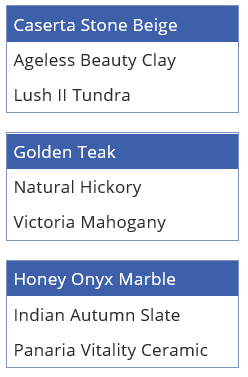
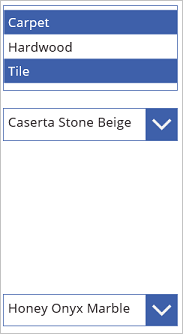

<properties
    pageTitle="Listbox control: reference | Microsoft PowerApps"
    description="Information, including properties and examples, about the listbox control"
    services=""
    suite="powerapps"
    documentationCenter="na"
    authors="aftowen"
    manager="erikre"
    editor=""
    tags=""/>

<tags
   ms.service="powerapps"
   ms.devlang="na"
   ms.topic="article"
   ms.tgt_pltfrm="na"
   ms.workload="na"
   ms.date="02/29/2016"
   ms.author="anneta"/>

# Listbox in PowerApps #
[AZURE.INCLUDE [control-listbox](../../includes/control-listbox.md)]

## Description ##
A listbox shows always shows all available choices (unlike a dropdown list), and you can configure it so that users can choose more than one item at a time (unlike a set of radio buttons).

## Key properties ##

[AZURE.INCLUDE [long-items](../../includes/long-items.md)]

[AZURE.INCLUDE [long-default](../../includes/long-default.md)]

[AZURE.INCLUDE [long-reset](../../includes/long-reset.md)]

## All properties ##

[AZURE.INCLUDE [short-bordercolor](../../includes/short-bordercolor.md)]

[AZURE.INCLUDE [short-borderstyle](../../includes/short-borderstyle.md)]

[AZURE.INCLUDE [short-borderthickness](../../includes/short-borderthickness.md)]

[AZURE.INCLUDE [short-color](../../includes/short-color.md)]

[AZURE.INCLUDE [short-default](../../includes/short-default.md)]

[AZURE.INCLUDE [short-disabled](../../includes/short-disabled.md)]

[AZURE.INCLUDE [short-disabledbordercolor](../../includes/short-disabledbordercolor.md)]

[AZURE.INCLUDE [short-disabledcolor](../../includes/short-disabledcolor.md)]

[AZURE.INCLUDE [short-disabledfill](../../includes/short-disabledfill.md)]

[AZURE.INCLUDE [short-fill](../../includes/short-fill.md)]

[AZURE.INCLUDE [short-font](../../includes/short-font.md)]

[AZURE.INCLUDE [short-fontweight](../../includes/short-fontweight.md)]

[AZURE.INCLUDE [short-height](../../includes/short-height.md)]

[AZURE.INCLUDE [short-hoverbordercolor](../../includes/short-hoverbordercolor.md)]

[AZURE.INCLUDE [short-hovercolor](../../includes/short-hovercolor.md)]

[AZURE.INCLUDE [short-hoverfill](../../includes/short-hoverfill.md)]

[AZURE.INCLUDE [short-italic](../../includes/short-italic.md)]

[AZURE.INCLUDE [short-itempaddingleft](../../includes/short-itempaddingleft.md)]

[AZURE.INCLUDE [short-items](../../includes/short-items.md)]

[AZURE.INCLUDE [short-lineheight](../../includes/short-lineheight.md)]

[AZURE.INCLUDE [short-onchange](../../includes/short-onchange.md)]

[AZURE.INCLUDE [short-onselect](../../includes/short-onselect.md)]

[AZURE.INCLUDE [short-paddingbottom](../../includes/short-paddingbottom.md)]

[AZURE.INCLUDE [short-paddingleft](../../includes/short-paddingleft.md)]

[AZURE.INCLUDE [short-paddingright](../../includes/short-paddingright.md)]

[AZURE.INCLUDE [short-paddingtop](../../includes/short-paddingtop.md)]

[AZURE.INCLUDE [short-pressedbordercolor](../../includes/short-pressedbordercolor.md)]

[AZURE.INCLUDE [short-pressedcolor](../../includes/short-pressedcolor.md)]

[AZURE.INCLUDE [short-pressedfill](../../includes/short-pressedfill.md)]

[AZURE.INCLUDE [short-reset](../../includes/short-reset.md)]

[AZURE.INCLUDE [short-selectioncolor](../../includes/short-selectioncolor.md)]

[AZURE.INCLUDE [short-selectionfill](../../includes/short-selectionfill.md)]

[AZURE.INCLUDE [short-selectmultiple](../../includes/short-selectmultiple.md)]

[AZURE.INCLUDE [short-size](../../includes/short-size.md)]

[AZURE.INCLUDE [short-strikethrough](../../includes/short-strikethrough.md)]

[AZURE.INCLUDE [short-tooltip](../../includes/short-tooltip.md)]

[AZURE.INCLUDE [short-underline](../../includes/short-underline.md)]

[AZURE.INCLUDE [short-valid](../../includes/short-valid.md)]

[AZURE.INCLUDE [short-visible](../../includes/short-visible.md)]

[AZURE.INCLUDE [short-width](../../includes/short-width.md)]

[AZURE.INCLUDE [short-x](../../includes/short-x.md)]

[AZURE.INCLUDE [short-y](../../includes/short-y.md)]

## Related functions ##

[**Distinct**( *DataSource*, *ColumnName* )](function-distinct.md)

## Example ##
1. Add a listbox, name it **CategoryList**, and set its **Items** property to this formula: 
**["Carpet","Hardwood","Tile"]**

	Don't know how to [add, name, and configure a control](add-configure-controls.md)?

	

1. Add three dropdown lists, move them under **CategoryList**, and name them **CarpetList**, **HardwoodList**, and **TileList**.

1. Set the **Items** property of each dropdown list to one of these values:
	- CarpetList: **["Caserta Stone Beige","Ageless Beauty Clay", "Lush II Tundra"]**
	- HardwoodList: **["Golden Teak","Natural Hickory", "Victoria Mahogany"]**
	- TileList: **["Honey Onyx Marble","Indian Autumn Slate", "Panaria Vitality Ceramic"]**

	

1. Set the **Visibility** property of each dropdown list to one of these values:
	- CarpetList: **If("Carpet" in CategoryList.SelectedItems.Value, true)**
	- HardwoodList: **If("Hardwood" in CategoryList.SelectedItems.Value, true)**
	- TileList: **If("Tile" in CategoryList.SelectedItems.Value, true)**

	Want more information about the [**If** function](function-if.md)?

1. Press F5, and then select one or more items in **CategoryList**.

	The appropriate list or lists appear based on your selection or selections.

	

1. (optional) Press Esc to return to the default workspace.
