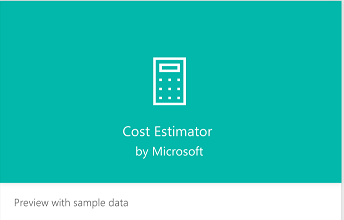
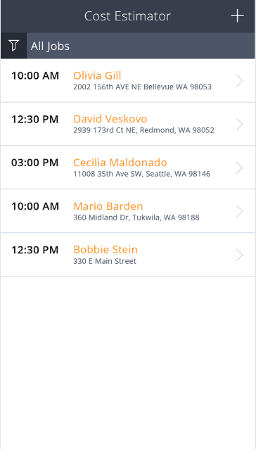
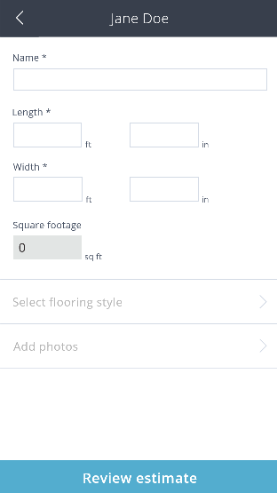

<properties
	pageTitle="Cost Estimator | Microsoft PowerApps"
	description="Step-by-step instructions for open and run Cost Estimator."
	services=""
	suite="powerapps"
	documentationCenter="na"
	authors="linhtranms"
	manager="darshand"
	editor=""
	tags=""/>

<tags
   ms.service="powerapps"
   ms.devlang="na"
   ms.topic="article"
   ms.tgt_pltfrm="na"
   ms.workload="na"
   ms.date="04/11/2016"
   ms.author="litran"/>

# Open and run Cost Estimator #

**Cost Estimator** is a simple app that let users capture details such as square footage, flooring type, images and create an estimate summary for their clients with discounts, and tax. Users can create jobs, close them or review open and closed jobs as well as email the estimate summary to their clients. 

1. From PowerApps web portal, browse for Sample PowerApps section. 

	 

2. Click on **Cost Estimator** app that marks with *Preview with sample data*. This opens up a model that gives you a brief description about the app and allow you to select the form factor you want to open the app as, phone or tablet. 

3. In this example, let's select **Phone**. This opens the **Cost Estimator** app in the web portal as how it would look on a phone. 

4. **Cost Estimator** app is pre-populated with sample data. On the first screen of the app, you will see a list of all jobs that we created for you. There is a filter at the top that let you quickly show open, closed or all jobs. The **+** button allows you to create a new job. 

	

5. Let's go ahead and click on **+** button to create a new job. 
	
	

6. Fill in the details and then click **Save job** to create this new job.

	

7. You will now be directed to the home screen for **Cost Estimator** app, where you can find the job you just created. 

	

8. To view details of a job, select one. In this example, let's select the one we just created **Jane Doe**.

	

9. In this screen, you will see the details of the job you just created including the client's name, phone number, address with map view of the address's location.
 
9. You have the option to delete the job if you wish by clicking the trash can icon at the top right corner.
	

10. You also have an option to select **Begin estimate** to create a new estimate for this job. Select **Begin Estimate**

	

11. Enter the required fields such as **Name**, **Length**, **Width**. 

	

12. Then **Select flooring style**

	

13. Select **Carpet** and pick a carpet style **Caserta Sky Grey**

	

14. Select **Take photos** to take some pictures of the room if needed. 

	

14. Click anywhere in the camera region to take photo. Once you are finished, click **Done**.

	**Note:** that you can take multiple photos by clicking multiple times on the screen. 

	

15. Now you are done entering information, click **Review Estimate**.

	

16. Enter any **Price adjustment**, if any for discount, and enter tax % amount, sign and click **Submit estimate**.

	

17. This will open up an email with your default mail client. If you have Outlook installed and set as default mail client, this will open up as a new Outlook email. 

	

18. After you are done with sending email, go back to PowerApps. The screen will show a message indicating that you have sent an email with the estimate to your customer.
 
	

19. Now, you should be directed back to the home page of **Cost Estimator**. You will see the job you just closed with its title in green (~Closed job). Click on it to see the details.

	

20. Now you have completed running a sample app with sample data from our web portal. Click on a few others to learn more. 

### Other sample apps with sample data ###

[Site Inspection](site-inspection.md)

[Budget Tracker](budget-tracker.md)

[Service Desk](service-desk.md)  