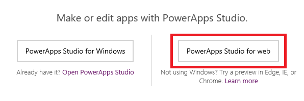

<properties
	pageTitle="Create or edit apps in a browser | Microsoft PowerApps"
	description="Create or edit apps in a browser."
	services=""
	suite="powerapps"
	documentationCenter="na"
	authors="sarafankit"
	manager="erikre"
	editor=""
	tags=""/>

<tags
   ms.service="powerapps"
   ms.devlang="na"
   ms.topic="article"
   ms.tgt_pltfrm="na"
   ms.workload="na"
   ms.date="07/28/2016"
   ms.author="ankitsar"/>

# Create or edit apps in a browser #
Learn how to create and edit apps in a browser with PowerApps Studio for web.

**Note**: PowerApps Studio for web is in preview and has certain limitations. You can also create and edit apps by [installing PowerApps Studio for Windows](https://web.powerapps.com/#/downloads) on a computer that's running Windows 8.1 or Windows 10.

**Prerequisites**

- [Sign up](signup-for-powerapps.md) for PowerApps.
- Microsoft Edge, Google Chrome, or Internet Explorer 11 on a computer that's running Windows or a Mac.

## Open PowerApps Studio for web ##
1. Sign in to [powerapps.com](http://go.microsoft.com/fwlink/p/?LinkId=708209).

1. In the lower-left corner, click or tap **New app**.

	

1. In the dialog box that appears, click or tap **PowerApps Studio for web**.

	

PowerApps Studio for web opens in a new tab in your browser, where you can create and edit apps in the same way as you can in PowerApps Studio for Windows.

## Next steps ##
- Automatically generate an app from your data in, for example, [Excel](get-started-create-from-data.md) or [SharePoint](app-from-sharepoint.md).
- Learn how to [add a control and set properties](add-configure-controls.md) that determine how it appears and behaves.
- Unleash your creativity by [creating an app from scratch](get-started-create-from-blank.md).

## Known limitations of the preview release ##
1. **Create a connection.**

	To [create a connection](add-manage-connections.md) to a data source that requires service authentication, use [powerapps.com](https://web.powerapps.com), and then [add the connection](add-data-connection.md) to an app in PowerApps Studio for web.

1. **Create an app from a template.**

	You can [create an app from a template](get-started-test-drive.md) in PowerApps Studio for Windows but not in a browser.

1. **Edit and save an app locally**.

	For best results, use PowerApps Studio for Windows to edit and save apps locally. In a browser, you can't save changes to a local app, or you must save a new file instead of replacing the file that you opened.

1. **Use signal functions.**

	**[Acceleration and Compass](functions/signals.md)** functions return accurate values in a published app, but those functions return zero values as you create or modify an app in a browser.

1. **Export and import data.**

	You can [export and import data](controls/control-export-import.md) in a published app but not as you create or modify an app in a browser.

1. **Add or modify a flow.**

	You can [add or modify a flow](using-logic-flows.md) in PowerApps Studio for Windows but not in a browser.

1. **Undo or redo a change.**

	You can undo and redo changes automatically in PowerApps Studio for Windows but not in a browser.

1. **Copy a control across two sessions.**

	You can't copy controls from one session of PowerApps Studio for web to another session of PowerApps Studio for web.
