<properties
   pageTitle="Create a card gallery | Microsoft PowerApps"
   description="Create a gallery in which users can scroll to show all data in an individual record, even if it contains more information than a screen can show at once."
   services=""
   suite="powerapps"
   documentationCenter="na"
   authors="aftowen"
   manager="dwrede"
   editor=""
   tags=""/>
<tags
   ms.service="powerapps"
   ms.devlang="na"
   ms.topic="article"
   ms.tgt_pltfrm="na"
   ms.workload="na"
   ms.date="11/20/2015"
   ms.author="anneta"/>

# Create a card gallery in PowerApps#
Show a set of data for which each [record](working-with-tables.md) contains more information than can appear at one time on the screen. For example, a product catalog might contain an image of each product, a description, quantity in stock, technical specifications, and enough other information that it can't all fit on a screen without scrolling. In a card gallery, you add sections that hold one or more types of information, and users can scroll through the sections to display it all.

[What is PowerApps?](http://aka.ms/pamktg)

**Prerequisites**
- [Install PowerApps](http://aka.ms/installpowerapps)
- Learn how to [configure a control](get-started-test-drive.md#configure-a-control) in PowerApps

## Create a card gallery ##
1. Open PowerApps, and then do one of the following:

	- [Add a screen](add-screen-context-variables.md) to an app.

	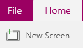

	- Create an app from scratch. (Select **New** in the **File** menu, and then select **Get started** under **Start from scratch**.)

	

1. On the **Insert** tab, select **Gallery**, and then select the **Portrait** option under **Card Galleries**.

	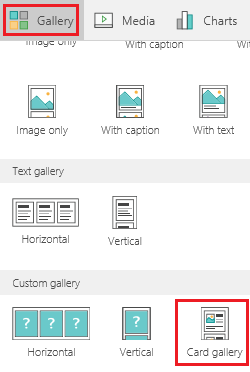

1. Resize the gallery to cover almost the entire screen, but leave enough room at the top for a label to identify the screen.

	

## Add sections and controls ##

1. Select **Add section** three times.

	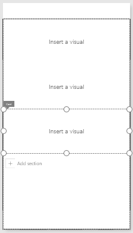

1. Select **Insert a visual** near the top of the screen, and then select **Quick tools** near the lower-left corner of the screen.

	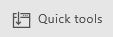

1. In the **Quick tools** pane, select the **Content** tab.

	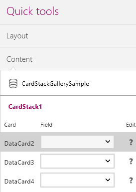

1. In the **Field** list for the first card, select **IsSample**, select the question mark (**?**) next to that list, and then select **Edit toggle**.

	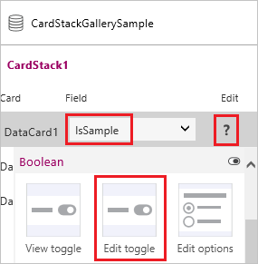

1. In the **Field** list for the second card, select **SampleImage**, select the question mark (**?**) next to that list, and then select **Add notes**.

	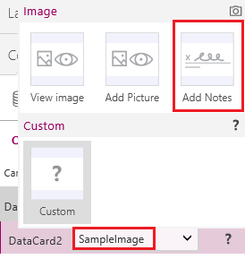

1. In the **Field** list for the third card, select **SampleText**, select the question mark (**?**) next to that list, and then select **Multi-line edit text**.

	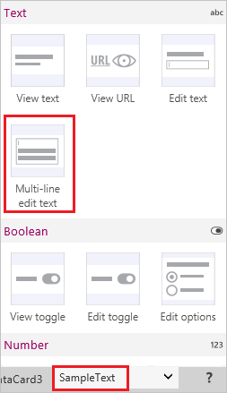

## Add a custom card ##

1. Select **Add section**, select **Label** on the **Insert** tab, and then configure the new label to show **My custom rating card**.

1. On the **Insert** tab, select **Controls,** select **Rating**, and then move the rating control so it appears under the label.

	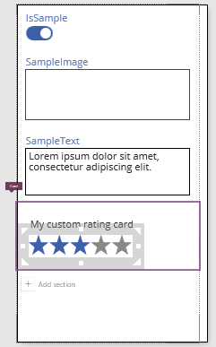

## Add or change a data source ##

1. Select the icon next to **CardStackGallerySample** or the name of the data source you're already using.

	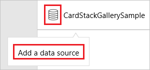

1. In the list of data sources, select the data source that you want to use, and then follow the prompts to specify the exact table that you want to use.

	For example, the data source for [creating an app from scratch](get-started-create-from-blank.md) is an Excel file in Dropbox. To connect to that data source, select **Dropbox**, select the file name (**eventsignup.xls**), select the table name (**Schedule**), and then select **Insert.**

1. If you add another data source (for example, named **Cast**), switch between them by selecting the icon next to the name of the data source you're using and then selecting the data source you want to use.

	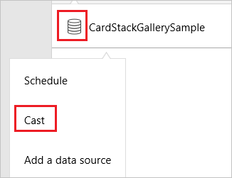
