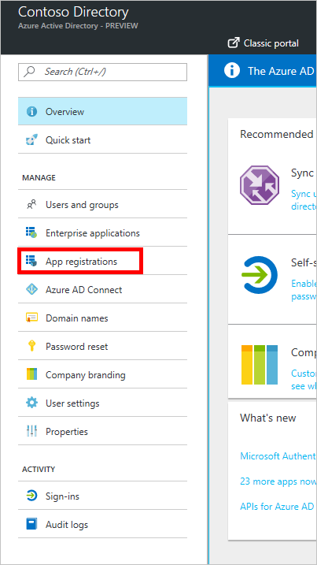
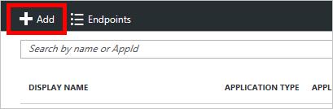
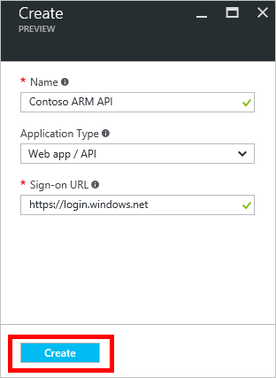
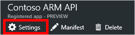
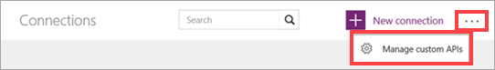
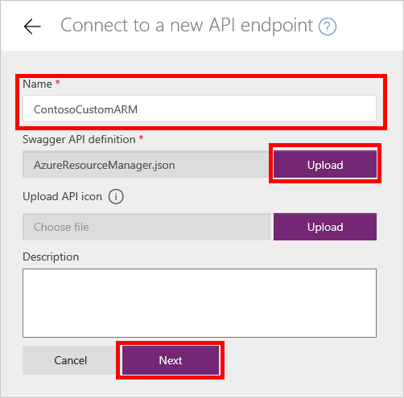
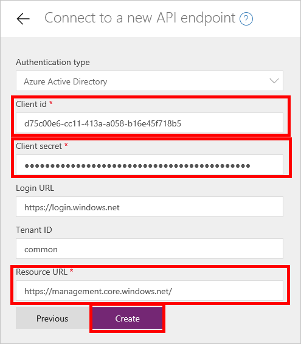

<properties
	pageTitle="Use Azure Active Directory with a custom connector | Microsoft PowerApps"
	description="Learn how to create a custom connector for Azure Resource Manager, with Azure Active Directory authentication."
	services=""
    suite="powerapps"
	documentationCenter=""
	authors="mgblythe"
	manager="anneta"
	editor=""/>

<tags
   ms.service="powerapps"
   ms.devlang="na"
   ms.topic="article"
   ms.tgt_pltfrm="na"
   ms.workload="na"
   ms.date="05/03/2017"
   ms.author="mblythe"/>

# Use Azure Active Directory with a custom connector in PowerApps

Azure Resource Manager (ARM) enables you to manage the components of a solution on Azure - components like databases, virtual machines, and web apps. This tutorial demonstrates how to enable authentication in Azure Active Directory, register one of the ARM APIs as a custom connector, then connect to it in PowerApps. This would be useful if you want to manage Azure resources directly from an app. For more information about ARM, see [Azure Resource Manager Overview](https://docs.microsoft.com/azure/azure-resource-manager/resource-group-overview).

## Prerequisites

- An [Azure subscription](https://azure.microsoft.com/free/).
- A [PowerApps account](https://powerapps.microsoft.com).
- The [sample OpenAPI file](http://pwrappssamples.blob.core.windows.net/samples/AzureResourceManager.json) used in this tutorial.

## Enable authentication in Azure Active Directory

First, we need to create an Azure Active Directory (AAD) application that will perform the authentication when calling the ARM API endpoint.

1. Sign in to the [Azure portal](https://portal.azure.com).  If you have more than one Azure Active Directory tenant, make sure you're logged into the correct directory by looking at your username in the upper-right corner.

    

2. On the left-hand menu, click **More services**.  In the **Filter** textbox, type **Azure Active Directory**, and then click **Azure Active Directory**.

    

    The Azure Active Directory blade opens.   

3. In the menu on the Azure Active Directory blade, click **App registrations**.

    

4. In the list of registered applications, click **Add**.

       

5. Type a name for your application, leave **Web app / API** selected, and then for **Sign-on URL** type `https://login.windows.net`.  Click **Create**.  

    

6. Click the new application in the list.

    

    The Registered app blade opens.  Make a note of the **Application ID**.  We'll need it later.

7. The Settings blade should have opened, as well.  If it didn't, click the **Settings** button.

    

8. In the Settings blade, click **Reply URLs**. In the list of URLs, add `https://msmanaged-na.consent.azure-apim.net/redirect` and click **Save**.

    

9. Back on the Settings blade, click **Required permissions**.  On the Required permissions blade, click **Add**.

    

    The Add API access blade opens.

10. Click **Select an API**. In the blade that opens, click the option for the Azure Service Management API and click **Select**.

    

11. Click **Select permissions**.  Under *Delegated permissions*, click **Access Azure Service Management as organization users**, and then click **Select**.

    

12. On the Add API access blade, click **Done**.

13. Back on the Settings blade, click **Keys**.  In the Keys blade, type a description for your key, select an expiration period, and then click **Save**.  Your new key will be displayed.  Make note of the key value, as we will need that later, too.  You may now close the Azure portal.

    

## Add the connection in PowerApps

Now that the AAD application is configured, let's add the custom connector.

1. In [powerapps.com](https://web.powerapps.com), in the left menu, select **Connections**. Select the ellipsis (**...**), then select **Manage custom connectors** in the upper right corner.

	 **Tip**: If you can't find where to manage custom connectors in a mobile browser, it might be under a menu in the upper left corner.

	  

2. Select **Create custom connector**.

	

3. Type a name for your connection, and then upload the [sample ARM OpenAPI file](http://pwrappssamples.blob.core.windows.net/samples/AzureResourceManager.json).  Click **Continue**.  

    

4. On the next screen, because the OpenAPI file uses our AAD application for authentication, we need to give PowerApps some information about our application.  Under **Client id**, type the AAD **Application ID** you noted earlier.  For client secret, use the **key**.  And finally, for **Resource URL**, type `https://management.core.windows.net/`.

    **Important**: Be sure to include the Resource URL exactly as written above, including the trailing slash.

    

5. Your custom connector is now registered and can be consumed within PowerApps or Microsoft Flow.

    

    **Note**: The sample OpenAPI does not define the full set of ARM operations and currently only contains the [List all subscriptions](https://msdn.microsoft.com/library/azure/dn790531.aspx) operation.  You can edit this OpenAPI file or create another OpenAPI file using the [online OpenAPI editor](http://editor.swagger.io/). This process can be used to access any RESTful API authenticated using AAD.

## Next steps

For more detailed information about how to create an app, see [Create an app from data](get-started-create-from-data.md).

For more detailed information about how to use a flow in an app, see [Start a flow in an app](using-logic-flows.md).

To ask questions or make comments about custom connectors, [join our community](https://aka.ms/powerapps-community).
