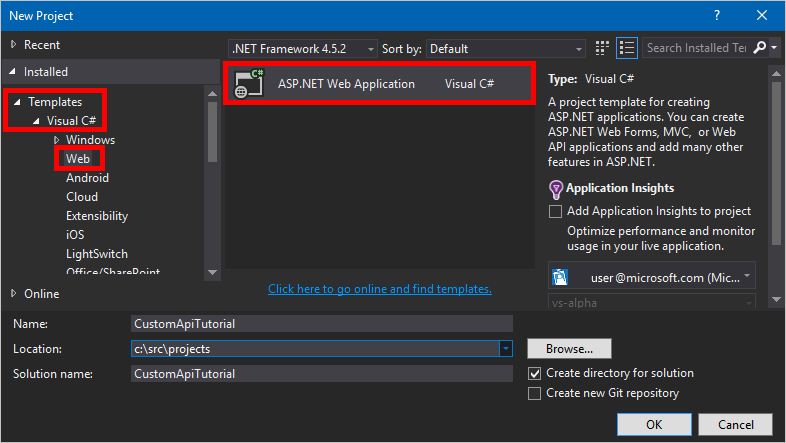
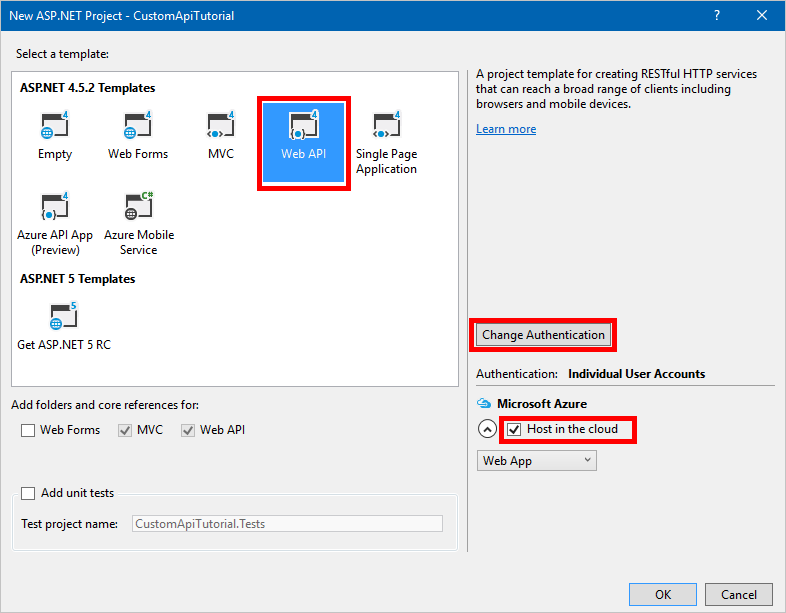
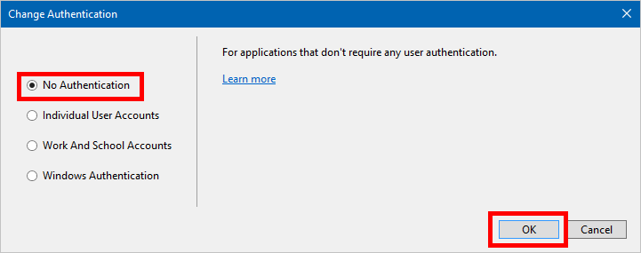
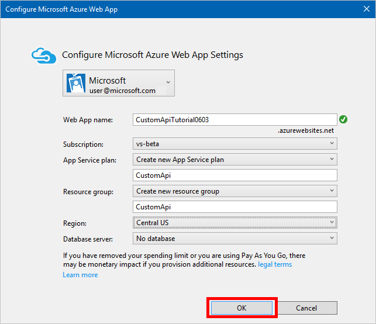

<properties
	pageTitle="Create a custom Web API for PowerApps | Microsoft PowerApps"
	description="Learn how to create an ASP.NET Web API with Azure Active Directory authentication in PowerApps"
	services=""
    suite="powerapps"
	documentationCenter=""
	authors="camsoper"
	manager="AFTOwen"
	editor=""/>

<tags
   ms.service="powerapps"
   ms.devlang="na"
   ms.topic="article"
   ms.tgt_pltfrm="na"
   ms.workload="na"
   ms.date="10/26/2016"
   ms.author="casoper"/>

# Create a custom Web API for PowerApps

This tutorial shows you how to create an ASP.NET Web API, host it on Azure Web Apps, enable Azure Active Directory authentication, and then register the ASP.NET Web API in PowerApps.  

## Prerequisites

- An [Azure subscription](https://azure.microsoft.com/en-us/free/).
- A [PowerApps account](https://powerapps.microsoft.com).
- [Visual Studio](https://www.visualstudio.com/vs/) 2013 or higher.

## Create an ASP.NET Web API and deploy it to Azure

1. In Visual Studio, click **File** > **New Project** to create a new C# ASP.NET web application.
    
    

2. Select the **Web API** template.  Leave **Host in the cloud** checked.  Click **Change Authentication**.
    
    

3. Select **No Authentication**, and then click **OK**.

    

4. Click **OK** on the **New ASP.NET Project** dialog.  The Configure Microsoft Azure Web App dialog appears.

    ]

    Select your Azure account, type a **Web App name** (or leave the default), and select your Azure **Subscription**.  Select or create an **App Service plan** (a collection of Web Apps within your subscription).  Select or create a **Resource group** (a grouping of Azure resources within your subscription).  Select the region where the Web App should be deployed.  If required for your Web API, select or create an Azure **Database server**.  Finally, click **OK**.

5. Create your Web API.

    >[AZURE.NOTE] To get started with ASP.NET Web API, you can try some of the [official tutorials](http://www.asp.net/web-api/overview/getting-started-with-aspnet-web-api/tutorial-your-first-web-api).

6. To connect our Web API to PowerApps, we'll need a [Swagger](http://swagger.io/) file that describes its operations.  You could write a Swagger of our own using the [online editor](http://editor.swagger.io/), but for this tutorial, you'll use an open-source tool named [Swashbuckle](https://github.com/domaindrivendev/Swashbuckle/blob/master/README.md).  Install the Swashbuckle Nuget package in your Visual Studio project by clicking **Tools** > **NuGet Package Manager** > **Package Manager Console**, and then, in the Package Managet Console, type the command `Install-Package Swashbuckle`.
    
    

    >[AZURE.TIP] When you run your Web API application after installing Swashbuckle, a Swagger file will now be generated at the URL `http://<your root URL>/swagger/docs/v1`.  A generated user interface is also available at `http://<your root URL>/swagger`.

7. When your Web API is ready, publish it to Azure. To publish from Visual Studio, right-click on the web project in Solution Explorer, click **Publish...**, and then follow the prompts in the Publish dialog.

8. Retrieve the swagger JSON by navigating to `https://<azure-webapp-url>/swagger/docs/v1`.  Save the content as a JSON file.  Depending on your browser, you may need to copy and paste the text into an empty text file.   

	>[AZURE.IMPORTANT] A Swagger document with duplicate operation IDs is invalid. If you are using the sample C# template, the operation ID `Values_Get` is repeated twice. You can correct this by changing one instance to `Value_Get` and re-publishing.
    >
    >You can also download a [sample Swagger](http://pwrappssamples.blob.core.windows.net/samples/webAPI.json) from this tutorial. Be sure to remove the comments (starting with `//`) before using it.

## Set up Azure Active Directory authentication

You will now create some Azure Active Directory (AAD) applications in Azure.  For an example of how to do this, see the [Azure resource manager tutorial](customapi-azure-resource-manager-tutorial.md#enable-authentication-in-azure-active-directory). You need two AAD applications for this tutorial.

>[AZURE.IMPORTANT] Both apps must be in the same directory.

### First AAD application: Securing the Web API

The first AAD application is used to secure the Web API. Name it **webAPI**.  Follow the above linked tutorial steps (just the section titled *Enable authentication in Azure Active Directory) with the following values:

- **Sign-on URL**: `https://login.windows.net`
- **Reply URL**: `https://<your-root-url>/.auth/login/aad/callback`
- There is no need for a client key.
- There is no need to delegate any permissions.
- **Important!** Note the application ID.  You will need it later.

### Second AAD application: Securing the custom API and delegated access

The second AAD application is used to secure the custom API registration and acquire delegated access to the Web API protected by the first application. Name this one **webAPI-customAPI** .

- Sign-on URL: `https://login.windows.net`
- Reply URL: `https://msmanaged-na.consent.azure-apim.net/redirect`
- Add permissions to have delegated access to Web API.
- You need the application ID of this application later as well, so note it.
- Generate a client key and store is somewhere safe. We need this key later.

## Add authentication to your Azure Web App

1. Sign in to the [Azure portal](https://portal.azure.com) and then find your Web App that you deployed in the first section.
2. Click **Settings**, and then select **Authentication / Authorization**.
3. Turn on **App Service Authentication** and then select **Azure Active Directory**.  On the next blade, select **Express**.  
4. Click **Select Existing AD App**, and select the **webAPI** AAD application you created earlier.

You should now be able to use AAD to authenticate your web application.

## Add the custom API to PowerApps

1. Modify your Swagger to add the `securityDefintions` object and AAD authentication used for the Web App. The section of your Swagger with the **host** property should look like this:

```javascript
// File header should be above here...

"host": "<your-root-url>",
"schemes": [
    "https"		 //Make sure this is https!
],
"securityDefinitions": {
    "AAD": {
        "type": "oauth2",
        "flow": "implicit",
        "authorizationUrl": "https://login.windows.net/common/oauth2/authorize",
        "scopes": {}
    }
},

// The rest of the Swagger follows...
```

2. Browse to [PowerApps](https://web.powerapps.com), and add a custom API as described in [What are custom APIs](register-custom-api.md).

3. Once you have uploaded your Swagger, the wizard auto-detects that you are using AAD authentication for your Web API.

4. Configure the AAD authentication for the custom API.  

  - **Client ID**: *Client ID of webAPI-CustomAPI*
  - **Secret**: *Client key of webAPI-CustomAPI*
  - **Login URL**: `https://login.windows.net`
  - **ResourceUri**: *Client ID of webAPI*

5. Click **Create** and creating a connection to the custom API.

## Next Steps

Walk through the [Azure Resource Manager tutorial](customapi-azure-resource-manager-tutorial.md) custom API.

For more detailed information about how to create an app, see [Create an app from data](get-started-create-from-data.md).

For more detailed information about how to use a flow in an app, see [Start a flow in an app](using-logic-flows.md).

To ask questions or make comments about custom APIs, [join our community](https://aka.ms/powerapps-community).